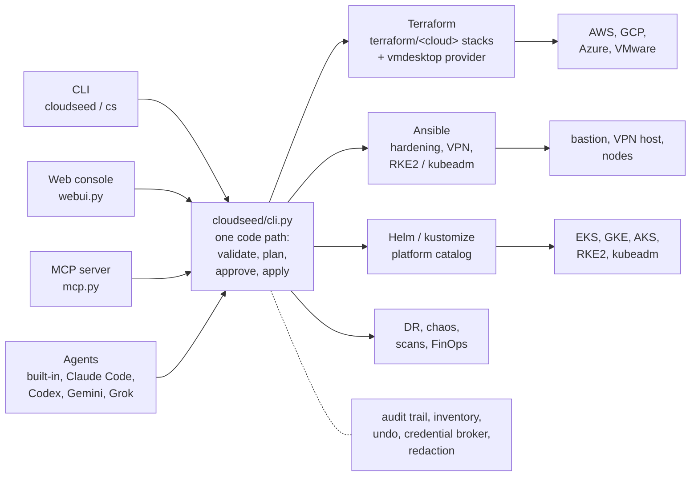

# Architecture

cloudseed is a deterministic CLI with a few thin layers on top. Everything, from a button in the web console to a tool
call from Claude, ends up as a `cloudseed ...` command, and every command goes through the same pipeline.

## The CLI

`bin/cloudseed` is a small launcher that checks for Python 3.9+ and calls `cloudseed/cli.py`. The package uses only
the Python standard library (about 44,000 lines), so there is nothing to `pip install` and it runs the same on a
laptop, in CI, inside the container image or as a PyInstaller single binary. `ui.py` gives the terminal its look:
boxed headers, arrow-key menus, output fitted to the terminal width, no colour when piped.

The CLI owns the wizard (questions come from each cloud adapter, with flags, environment variables and defaults as
answers), the validation (for example the `--allow-ip` rules) and every command.

## Cloud adapters

`cloudseed/clouds/{aws,gcp,azure,vmware}.py` describe each target: its setup questions and defaults, which variables
cloudseed sets itself, how to render the Terraform root, how to detect credentials, and what `doctor` checks. `base.py`
holds what they share. Adding a target means adding an adapter and a stack.

## Terraform stacks

Each target has a generic, checked-in stack under `terraform/<cloud>/` with modules for `network`, `bastion`,
`security-baseline`, `kubernetes` and `vpn` (plus `kms` on AWS and `names` on GCP), and a mocked `terraform test`
suite. VMware has `bastion`, `workloads` and `kubernetes`.

For each environment, cloudseed **renders** a small root, `<workdir>/stack/main.tf.json`, that calls the stack module
with that environment's variables, tags and backend. The checked-in Terraform stays generic; the per-environment part
is data. Remote state storage has its own roots (`terraform/<cloud>-bootstrap`), applied first.

`tf.py` drives the `terraform` binary (init, plan, apply after approval) and turns known failures into a diagnosis
with a fix. `reconcile.py` handles "already exists": it adopts a resource only when
its tags prove it belongs to this environment, and refuses a follow-up plan that would delete or replace anything the
approved plan did not.

## Ansible roles

After an apply, `provision.py` copies an allow-list of the repository to the bastion and VPN host (never
`~/.cloudseed`, and never keys or credential files a checkout may hold), installs Ansible there and runs a playbook:

| Playbook | Roles |
|---|---|
| `bastion.yml` | `common`, `hardening` (sshd, fail2ban, auditd, sysctl, nftables, updates), `tools`, `fips` |
| `vpn.yml` | `common`, `hardening`, `openvpn` (Easy-RSA PKI, per-user profiles) or `tailscale`, `fips` |
| `kubernetes.yml` | `hardening`, `fips`, `k8s_common`, `rke2` or `kubeadm`: run from your machine to build VMware clusters |
| `scan.yml` | `openscap`: CIS and STIG host scans |

## The vmdesktop provider

For the local target cloudseed ships its own Terraform provider, `providers/vmdesktop` (Go). It is built once on first
use into `~/.cloudseed/providers` and wired in through `~/.cloudseed/terraform.rc`.

| Resource | Does |
|---|---|
| `vmdesktop_network` | adopts VMware's host-only vmnet, or creates a dedicated one through `vmrest` |
| `vmdesktop_vm` | creates, resizes and deletes VMs with `vmrun` and `vmware-vdiskmanager` |
| data `vmdesktop_host` | the product (Fusion or Workstation), version and guest architecture |

`localvm.py` detects the host, downloads and verifies the official cloud images (converting qcow2 with qemu-img),
builds the cloud-init seed and configures `vmrest`. The result is that a local lab is planned, applied, changed and
destroyed exactly like a cloud environment.

## Platform catalog

`platform.py` holds the catalog: every item's upstream source (Helm repository, OCI registry, git or manifest URL), a
version pinned per cloudseed release, its group and tier, dependencies, values per target and distro, conflicts,
FIPS tier, architecture limits and cloud prerequisites. An install resolves dependencies, applies cloud prerequisites
through the environment's Terraform stack, then runs `helm upgrade --install` or `kubectl apply -k` in order.

`dr.py` (Velero), `chaos.py` (Chaos Mesh) and `scan.py` (kube-bench, kubescape, trivy, OpenSCAP, prowler and the FIPS
verifier) build on it and save reports with verdicts. `finops.py` estimates cost from the inventory and reads bills and
OpenCost; `managed.py` wraps the Databricks and Snowflake CLIs.

## Surfaces on one code path

| Surface | How it works |
|---|---|
| **Web console** | `webui.py` is a standard-library HTTP server on 127.0.0.1 with token auth, Host/Origin checks and a strict CSP. Its forms are generated from the same action registry the MCP server exposes; each click runs `cloudseed ...` as a child and streams the output over server-sent events. |
| **MCP server** | `mcp.py` speaks JSON-RPC over stdio or Streamable HTTP. One tool per feature, each validated against its schema, destructive ones gated by `confirm=true`, each run as a `cloudseed` child under the credential broker. |
| **Agents** | the built-in agent (`builtin_agent.py`) is a Claude API tool loop whose only tool runs `cloudseed`; external agents (Claude Code, Codex, Gemini, Grok) are launched by `agents.py` with the skills installed. `headliner.py` prepares the research brief. |

Because all three run the CLI, they cannot drift from it: the same validation, plans, approvals, logs and undo apply
everywhere.

## Cross-cutting pieces

| Piece | Role |
|---|---|
| `secrets.py` | strips credentials from agent processes, serves them to child commands over a per-session unix socket, and redacts output line by line |
| `creds.py` | the local 0600 credential vault |
| `audit.py` | writes every run to `audit.jsonl` and a redacted log, and keeps `inventory.json` |
| `undo.py` | the undo journal: every state-changing action records its inverse |
| `troubleshoot.py` | reads the audit trail, logs and inventory and checks the live environment |
| `help.py`, `explain.py` | help pages and explanations generated from the code (variables from `variables.tf`, the catalog from `platform.py`); the [reference](../reference/index.md) on this site is generated from the same data by `scripts/gen-docs.py` |

## Design principles

- **Deterministic first.** Commands do exactly what they say; agents are optional and use the same commands.
- **Plans before changes.** Nothing is created or destroyed without a plan you have seen and approved.
- **Secure defaults, no escape hatches by accident.** The bastion is never opened to the world, secrets never leave
  your machine, and dangerous flags are refused or need an explicit confirmation.
- **Everything re-runnable.** `setup`, `provision`, `platform install` and `node add` are idempotent.
- **Nothing hidden.** Every run is logged, every resource is inventoried, every change can be undone.
- **Docs from the code.** Help, explain and this site's reference come from the same source as the behaviour.
