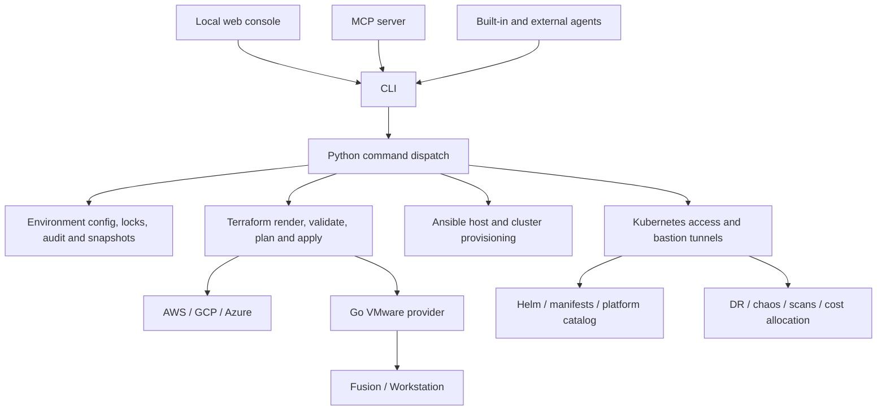

# End-to-end engineering review

The initial review on **2026-09-24** started from `a6c6e7c`. The follow-up implementation adds operational readiness
features for the next release; the table below separates completed implementation from remaining acceptance work.
The focus remains making existing capabilities easier to verify, safer to operate, and easier to understand before
adding more infrastructure targets.

This is a source and test review, not a new certification of live AWS, GCP, Azure or VMware deployments. The detailed reports record both implemented behavior and the limits of the evidence.

## Read the complete map

| Area | Coverage |
|---|---|
| [Application runtime audit](runtime-audit.md) | CLI dispatch, environment state, rendering, dependencies, credentials, local console, MCP, AI agents, Kubernetes access, platform installation, disaster recovery, chaos, scans, VPN, FinOps, undo and audit |
| [Infrastructure audit](infrastructure-audit.md) | All four targets and seven Terraform roots, ten Ansible roles, Go VMware provider, local/container/bundle runtimes, availability defaults, state backends and lifecycle risks |
| [CI diagnosis and repairs](ci-repair.md) | Failed run evidence, root causes, regression fixes and verification results |
| [Runtime acceptance coverage](acceptance.md) | Dependency review, source/container/binary checks, and the remaining live infrastructure acceptance requirements |
| [Operations verification](operations-verification.md) | Current operational feature and scenario checks, tested runtimes, and outstanding live cloud evidence |
| [Operational readiness guide](../guides/operations.md) | Shared health, network, profile, specification, guardrail, upgrade, recovery and acceptance workflows |
| [Command reference](../reference/commands.md) | Generated CLI command surface |
| [Platform catalog](../reference/platform-catalog.md) | Every catalog entry, group and dependency |
| [MCP reference](../reference/mcp-tools.md) | Tool schemas, resources and prompts |
| [Cloud reference](../reference/index.md) | Target variables, defaults and outputs generated from source |

External agent CLIs have their own tool execution and permissions. The diagram describes entry points; it does not imply that every action an external agent can take passes through cloudseed's built-in approval controls.

## Changes in this review

The failing Actions runs on `main` and unrelated dependency branches shared underlying failures. The accompanying fixes address full process-command detection for MCP stop/restart, loopback services waiting on reverse DNS, early VMware dependency checks, Azure scan authentication preflight, and preservation of useful GCP credential errors. Test fixtures now isolate host configuration, avoid real cluster probes in render tests, and send large JavaScript fixtures over stdin.

The workflows explicitly install Node for JavaScript checks, retain failure logs, and build documentation on pull requests before deployment. Pull-request documentation builds do not deploy Pages.

The Pages overhaul adds a white-and-blue documentation theme, an interactive four-target architecture preview, a concise workflow, console screenshot navigation, clearer guide entry points, and refreshed vector branding. It retains search, keyboard navigation, dark mode and the generated reference. Architecture previews are labeled illustrations; console images remain repository demo screenshots.

The follow-up dependency review adds real container/binary acceptance checks and repairs issues they exposed: detached binary services losing assets, framework-dependent NIC planning, VMware cleanup/capacity reporting, unavailable environment locking, and slow console readers retaining unbounded output. See [acceptance coverage](acceptance.md) for the evidence and live-test boundaries.

## Original proposals and current status

| Priority | Work | Implementation and remaining evidence |
|---|---|---|
| **1 — Lifecycle acceptance** | Live validation of the repaired VMware lifecycle; honest undo semantics | Verify the failure-path regressions against real Fusion/Workstation guests; restore/recreate limitations remain explicit and tested. |
| **1 — Agent and server boundaries** | Separate built-in agent guarantees from external adapters; bound MCP subprocess output while streaming | Implemented bounded MCP output, requests, batches and resource reads, plus a configurable finite call deadline. Console backlog is bounded. External agents still retain their own execution permissions; cloudseed cannot extend its built-in approval guarantees to arbitrary adapter actions. |
| **2 — Environment health report** | A shared report for CLI, console, MCP and skills | Implemented `cs ops health` and `network`, with local evidence, opt-in live checks and explicit unknown results. `drift` is a separate shared operation. Provider and cluster fixture tests do not establish a deployed environment's health. |
| **2 — Live release evidence** | Opt-in cloud acceptance runs and a dedicated VMware runner | Implemented an isolated acceptance harness with preflight, lifecycle stages and cleanup reporting. Recorded AWS/GCP/Azure runs still require sandbox accounts; a dedicated VMware CI runner remains future work. |
| **2 — Reproducible releases** | Release integrity, dependency inventory and provenance | Implemented checksums, SBOMs, manifest, native build checks and GitHub attestations in the version-tag workflow, plus artifact verification. Publishing and verifying an actual tagged release remains separate; the workflow alone proves neither publication nor byte-for-byte reproducibility. |
| **3 — Reliability presets** | Explicit lab/team/production topology choices | Implemented regional GKE, AKS tier/zones, AWS per-AZ NAT and multi-control-plane VMware settings, with cost omissions disclosed. Profiles require separate apply; saved backup retention is intent until scheduled. Local host failure tolerance and provider availability still require separate validation. |
| **3 — Drift and change review** | Saved plan summaries with policy and cost context | Implemented drift reports, portable spec validation/diff/import, reviewed upgrade plans, saved Terraform apply gates and explicit expiry cleanup. Unknown cost coverage is not a budget guarantee; no expiry scheduler is installed. |
| **3 — Baseline completion** | Azure VNet flow logs, GCP organization policies, ownership/adoption checks | Remaining work: add the optional controls, verify shared-setting ownership and adoption, and test conflicts with existing account/project/subscription configuration. |
| **4 — Maintenance and upgrades** | Guided upgrades and application recovery; smaller command modules | Implemented pinned Kubernetes upgrade plans with repeatable gates, selected-application restore tests, and measured recovery evidence. New operations use separate modules; splitting the entire existing CLI and proving workload-specific compatibility remain future work. |

The implemented workflows are documented in the [operations guide](../guides/operations.md) and
[scenarios 16–19](../scenarios/index.md#operational-readiness-walkthroughs), with concrete CLI, agent, MCP and console
routes. See [operations verification](operations-verification.md) for recorded checks and the
[roadmap](https://github.com/nimeshbuilds/cloudseed/blob/main/ROADMAP.md) for remaining work. New clouds, hypervisors
and additional catalog items should follow stronger evidence and lifecycle guarantees for the current support matrix.

## Verification boundaries

Local regression tests, strict documentation builds, browser checks and dry-run scenarios validate useful contracts, but do not establish live cloud availability or disaster recovery. No infrastructure was provisioned as part of this review. See the detailed reports and the pull request's check results for the exact checks performed and remaining coverage gaps.
