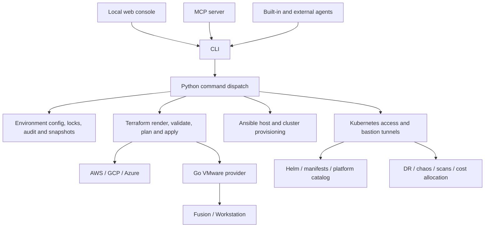

# End-to-end engineering review

Reviewed on **2026-09-24**, starting from `a6c6e7c`. cloudseed already has broad functionality. The next release should make its existing capabilities easier to verify, safer to operate, and easier to understand before adding more infrastructure targets.

This is a source and test review, not a new certification of live AWS, GCP, Azure or VMware deployments. The detailed reports record both implemented behavior and the limits of the evidence.

## Read the complete map

| Area | Coverage |
|---|---|
| [Application runtime audit](runtime-audit.md) | CLI dispatch, environment state, rendering, dependencies, credentials, local console, MCP, AI agents, Kubernetes access, platform installation, disaster recovery, chaos, scans, VPN, FinOps, undo and audit |
| [Infrastructure audit](infrastructure-audit.md) | All four targets and seven Terraform roots, ten Ansible roles, Go VMware provider, local/container/bundle runtimes, availability defaults, state backends and lifecycle risks |
| [CI diagnosis and repairs](ci-repair.md) | Failed run evidence, root causes, regression fixes and verification results |
| [Runtime acceptance coverage](acceptance.md) | Dependency review, source/container/binary checks, and the remaining live infrastructure acceptance requirements |
| [Command reference](../reference/commands.md) | Generated CLI command surface |
| [Platform catalog](../reference/platform-catalog.md) | Every catalog entry, group and dependency |
| [MCP reference](../reference/mcp-tools.md) | Tool schemas, resources and prompts |
| [Cloud reference](../reference/index.md) | Target variables, defaults and outputs generated from source |

External agent CLIs have their own tool execution and permissions. The diagram describes entry points; it does not imply that every action an external agent can take passes through cloudseed's built-in approval controls.

## Changes in this review

The failing Actions runs on `main` and unrelated dependency branches shared underlying failures. The accompanying fixes address full process-command detection for MCP stop/restart, loopback services waiting on reverse DNS, early VMware dependency checks, Azure scan authentication preflight, and preservation of useful GCP credential errors. Test fixtures now isolate host configuration, avoid real cluster probes in render tests, and send large JavaScript fixtures over stdin.

The workflows explicitly install Node for JavaScript checks, retain failure logs, and build documentation on pull requests before deployment. Pull-request documentation builds do not deploy Pages.

The Pages overhaul adds a white-and-blue documentation theme, an interactive four-target architecture preview, a concise workflow, console screenshot navigation, clearer guide entry points, and refreshed vector branding. It retains search, keyboard navigation, dark mode and the generated reference. Architecture previews are labeled illustrations; console images remain repository demo screenshots.

## What to add next

| Priority | Work | Concrete completion criteria |
|---|---|---|
| **1 — Lifecycle integrity** | VMware deletion and disk-growth failure handling; honest undo semantics | Failed cleanup keeps recoverable Terraform state; reported disk capacity matches successful operations; restore/recreate limitations are explicit and covered by regression tests. |
| **1 — Agent and server boundaries** | Separate built-in agent guarantees from external adapters; bound subprocess output while streaming | Each adapter documents its effective permissions; bounded output capture cannot grow indefinitely; cancellation and large-output behavior have tests. |
| **2 — Environment health report** | A shared `health --json` contract for CLI, console and MCP | One report shows configuration drift, reachability, cluster/node readiness, platform health, backup age, last scan and validation timestamp; missing evidence is shown as unknown. |
| **2 — Live release evidence** | Opt-in cloud acceptance runs and a dedicated VMware runner | Apply, access, platform install, backup/restore and destroy are exercised with cleanup checks; reports identify commit, versions, target and cost; dry runs remain clearly labeled. |
| **2 — Reproducible releases** | Signed bundles, checksums, SBOMs and a tested tool compatibility manifest | A release can be rebuilt from pinned inputs; downloaded tools and images have integrity checks; supported host combinations pass smoke tests. |
| **3 — Reliability presets** | Explicit lab/team/production topology choices | Setup shows availability and cost differences: regional GKE, AKS tier/zone options, AWS per-AZ NAT, local API failover, and backend retention. |
| **3 — Drift and change review** | Saved plan summaries with policy and cost context | Operators see what changed, what it costs, and which policy checks apply before approval; apply uses the reviewed plan. Build on the existing plan safeguards. |
| **3 — Baseline completion** | Azure VNet flow logs, GCP organization policies, ownership/adoption checks | Shared account/project/subscription settings have clear owners; opting into controls produces verifiable evidence and avoids conflicts with existing environments. |
| **4 — Maintenance and upgrades** | Guided Kubernetes/platform upgrades and smaller command modules | Compatibility and recovery are checked before upgrades; the large CLI dispatcher is split by domain while preserving command contracts. |

These are proposals, not shipped features. The existing [roadmap](https://github.com/nimeshbuilds/cloudseed/blob/main/ROADMAP.md) already includes several of them. New clouds, hypervisors and additional catalog items should follow stronger evidence and lifecycle guarantees for the current support matrix.

## Verification boundaries

Local regression tests, strict documentation builds, browser checks and dry-run scenarios validate useful contracts, but do not establish live cloud availability or disaster recovery. No infrastructure was provisioned as part of this review. See the detailed reports and the pull request's check results for the exact checks performed and remaining coverage gaps.
