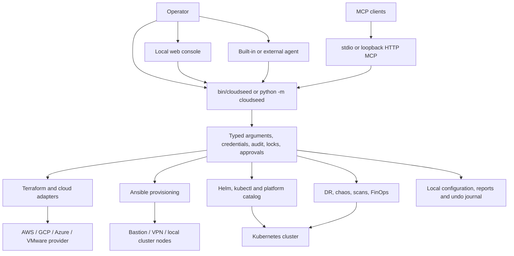

# Runtime and feature audit

Audit date: 2026-09-24. This is a source audit of the checked-out application, with local contract and lifecycle tests. It does not certify a cloud deployment, FIPS compliance, or the README's previously recorded live scenarios. No cloud infrastructure was created during this audit.

## What the project actually is

Cloudseed is a local infrastructure orchestrator. Its Python CLI renders and operates Terraform roots, provisions machines with Ansible, and manages Kubernetes software with Helm, kubectl, and a large catalog. A local web console, MCP server, and agent adapters wrap the same CLI. State, configuration, credentials, reports, jobs, and undo history live on the operator's machine; cloud resources and Kubernetes objects live in their respective providers.

This is significantly more than a landing-zone generator. The implementation includes an operational control plane for access, day-two changes, platform installation, scans, recovery drills, chaos experiments, and credentials. It is not a continuously running infrastructure reconciler or a shared team SaaS control plane.

The inspected registries contain:

- 43 top-level CLI names, including aliases such as `do` / `agentic`.
- Four targets: AWS, GCP, Azure, VMware desktop.
- 30 MCP tools, 39 web action registrations, four MCP prompts, ten bundled skills, and an explain resource template.
- 73 visible platform catalog items across ten groups, plus eight hidden dependency entries. The README's 73-item count is correct; `len(CATALOG)` is 81.
- Five agent adapters: the built-in Anthropic loop, Claude Code, Codex, Gemini CLI, and Grok CLI.
- Approximately 50,000 Python lines. `cli.py` alone has roughly 11,300 lines and `platform.py` roughly 4,500.

Registry counts were read from the Python objects, not inferred from README prose. A static test inventory found approximately 3,400 test methods across 99 files at the time of this audit; the collected/executed count can differ through imported test classes and concurrent additions.

## Execution architecture

`bin/cloudseed` and `cloudseed/__main__.py` check Python 3.9+ before importing the CLI. There is no pip-installable Python package manifest in the checkout: source installation creates executable links. The core CLI uses the standard library; optional runtimes and commands need substantial external software.

`cli.main()` starts an audit, `_dispatch()` normalizes aliases and parses arguments, rejects human-only operations in an agent session, prepares the home directory, restores brokered credentials, overlays the credential vault, loads settings, selects the runtime, and dispatches a handler. Mutable environment operations hold an environment lock. Errors are translated into actionable CLI output; unexpected failures get a saved traceback. Exit code 3 is used for operations requiring approval, and interrupt returns 130.

Sources: [launcher](https://github.com/nimeshbuilds/cloudseed/blob/main/bin/cloudseed), [CLI](https://github.com/nimeshbuilds/cloudseed/blob/main/cloudseed/cli.py), [paths](https://github.com/nimeshbuilds/cloudseed/blob/main/cloudseed/paths.py), [audit](https://github.com/nimeshbuilds/cloudseed/blob/main/cloudseed/audit.py).

### Every execution runtime

| Runtime | Implementation and behavior | Practical boundary |
| --- | --- | --- |
| Source / local | `scripts/install.sh`, `bin/cloudseed`, `deps.ensure_runtime`; tools resolved through `deps.path_env()` and `deps.find()` | Python itself is small; Terraform, SSH, cloud CLIs, Ansible, Helm, scanners, and other tools are separate dependencies as needed. |
| Auto | `deps.ensure_runtime` selects local if required tools exist; interactive missing-tool flow offers installation, container, or bundle | It is dependency negotiation, not an independent runtime or automatic remote execution service. |
| Docker / Podman | `container.build_run_command` builds an all-in-one image invocation, mounts Cloudseed home and custom workdirs, maps credential paths, forwards selected environment variables by name, and re-execs with local runtime inside the container | Runs tools as container root with host ownership repair / Podman user mapping. Mounted host credential directories and workdirs remain trust-sensitive. It is not a credential sandbox. |
| Single binary | `scripts/build-bundle.sh` uses PyInstaller, stages Terraform/Ansible/skills/provider source/templates/web/assets, embeds a verified Terraform archive; `paths.tf_root` persists a digest-addressed Terraform tree outside temporary extraction | Platform-specific artifact; most optional CLIs are still external or installed on demand. “Single binary” does not mean every optional tool is embedded. |
| VMware host | `localvm.py`, `clouds/vmware.py`, `providers/vmdesktop`; host hypervisor, vmrun/vmrest, image conversion, locally compiled Terraform provider | Explicit container runtime is ignored for VMware. Hypervisor operations must occur on the host. Fusion/Workstation and platform-specific tooling are additional requirements. |
| Local console service | `webui.py`, `cloudseed/web/*`; Python threaded HTTP server plus detached CLI jobs, launchd/systemd/background service options | Loopback-only, one local operator identity. Static GitHub Pages documentation is a separate site and cannot provision anything. |
| MCP stdio | `mcp.serve`; newline JSON-RPC, per-call subprocesses, cancellation, ordered response handling | Client owns server lifetime. Tool children use detached output files so client/server disappearance does not automatically break a Terraform apply. |
| MCP HTTP | `mcp.serve_http`; loopback HTTP, token, session handling, streamable HTTP and compatibility SSE paths | Token-authenticated local service, not a multi-user public API; server/client configuration is stored locally. |
| Built-in AI | `builtin_agent.py`; installs Anthropic SDK into a separate environment and runs a tool loop with one Cloudseed command tool | Requires agent credentials or documented Claude CLI fallback. Has its own explicit command parser and approval gate. |
| External AI | `agents.py`; command templates for Claude/Codex/Gemini/Grok; custom adapters in `agents.json` | Trust and permissions depend on each external CLI. They do not inherit the built-in agent's closed command-tool execution boundary. |

Sources: [dependencies](https://github.com/nimeshbuilds/cloudseed/blob/main/cloudseed/deps.py), [container](https://github.com/nimeshbuilds/cloudseed/blob/main/cloudseed/container.py), [bundle](https://github.com/nimeshbuilds/cloudseed/blob/main/scripts/build-bundle.sh), [local VMware](https://github.com/nimeshbuilds/cloudseed/blob/main/cloudseed/localvm.py), [agents](https://github.com/nimeshbuilds/cloudseed/blob/main/cloudseed/agents.py).

## End-to-end operational flows

### Setup, plan, apply, and destroy

1. Select a cloud and environment, validate names/flags and typed Terraform variables, choose a safe workdir, and acquire the environment lock before changing configuration.
2. Collect cloud questions, network ranges, SSH allow list and key, tags, provider-specific options, and state choice. Built-in managed variable names cannot be overridden through generic `--var` because that would diverge from provisioning/configuration.
3. The adapter prepares provider-specific prerequisites. GCP OS Login, VMware network/image/provider preparation, and FIPS preconditions make this more than string templating.
4. If remote state is selected, render a separate bootstrap root for the storage. A non-applying preview plans storage without creating it; a real approved apply creates it and records the backend.
5. Render the stack as Terraform JSON, initialize/migrate its backend, inspect previous state, and produce a plan. Singleton baseline reconciliation can adopt compatible account/project/subscription resources before the final plan.
6. Show the plan and require approval. Local node removals leave/drain the cluster before VM removal. Shared baseline resources designated to remain are removed from state without deleting the shared cloud resource.
7. Apply the reviewed plan, refresh output/inventory caches, record undo data, then provision hosts unless explicitly disabled.

Important command differences:

- `setup --dry-run` renders and runs `terraform init -backend=false` plus `validate`; it does not prove authentication, quota, actual resource creation, Ansible success, or workload availability. Initialization can still download providers. A fresh dry-run can leave a saved environment; an existing environment is rendered into its `dry-run/` directory.
- `setup --plan-only` can save a changed configuration for later apply. `setup --preview` is the stronger no-persist configuration preview and restores/removes its provisional configuration.
- `apply` performs Terraform lifecycle work and output refresh. It does **not** perform the automatic host provisioning that full `setup` does; run `provision` for that stage.
- `destroy` has targeted and full forms, plus distinct local purge and remote-state purge controls. It guards state reads, shared resources, cluster cleanup, and private artifacts. Remote state deletion is a distinct destructive decision.
- Undoing a destroy re-creates resources from saved configuration. It is not a VM disk snapshot or an automatic restoration of all workload data.

Sources: `cli.cmd_setup`, `_setup`, `_setup_dry_run`, `_bootstrap_state`, `cmd_apply`, `cmd_destroy`; [Terraform runner](https://github.com/nimeshbuilds/cloudseed/blob/main/cloudseed/tf.py), [singleton reconciliation](https://github.com/nimeshbuilds/cloudseed/blob/main/cloudseed/reconcile.py), [undo](https://github.com/nimeshbuilds/cloudseed/blob/main/cloudseed/undo.py).

### Host provisioning and private Kubernetes access

`provision.py` builds host inventory and SSH routing, runs Ansible through streaming/redacting subprocesses, handles host-key turnover, and records provisioning settings. It derives operator/VPN routes and validates private/local cluster CIDRs. VMware cluster provisioning supports RKE2 and kubeadm, stable join tokens, control-plane/worker counts, and node lifecycle operations.

`services.py` retrieves or refreshes provider/local kubeconfigs, verifies required exec authentication plugins, pins relevant FIPS token endpoints, opens SSH forwarding through the bastion for private APIs, rewrites only the private working kubeconfig, and tracks tunnel identity/PIDs. `k8s kubeconfig` can merge a context into the user's normal kubeconfig with a scoped undo. `kubectl`, `helm`, and `k9s` are actual tool passthroughs against that context.

VPN provisioning supports OpenVPN and Tailscale. OpenVPN includes client certificate issue/revoke, local profile management, certificate-expiry reporting, connect/disconnect/status, and privilege-aware client invocation. Local VMware environments use host networking rather than the cloud VPN workflow.

Sources: [provision](https://github.com/nimeshbuilds/cloudseed/blob/main/cloudseed/provision.py), [services](https://github.com/nimeshbuilds/cloudseed/blob/main/cloudseed/services.py), [network validation](https://github.com/nimeshbuilds/cloudseed/blob/main/cloudseed/netutil.py).

### Platform install and uninstall

`platform.py` is a data catalog plus an imperative deployment engine. It expands group/core items and dependency closure, resolves target/distro/architecture/FIPS compatibility and required input, reads installed state, computes cloud prerequisites, and executes Helm/OCI charts, manifests, kustomize, post-steps, or meta-items. It manages Pod Security namespace labels, pinned chart versions, retained user values, readiness checks, UI exposure, and password material.

`cli.cmd_platform` applies missing cloud prerequisites through Terraform before installing the platform item. Uninstall considers reverse dependencies, shared CRDs and their users, owned objects, namespaces, load balancer cleanup, and undo snapshots. Installing a group does not install every extra in that group. There are 48 visible core items and 25 visible extras before target filtering.

| Group | Visible items |
| --- | --- |
| basek8s | metrics-server, cert-manager, gateway-api, envoy-gateway, ingress-nginx, metallb, aws-load-balancer-controller, argocd, kube-prometheus-stack, loki, alloy, opentelemetry-operator, external-secrets, sealed-secrets, reloader, kyverno, cert-manager-issuer, local-path-provisioner, external-dns |
| scaling | keda, vpa, goldilocks, cluster-autoscaler, karpenter |
| data | minio, cloudnative-pg, strimzi, spark-operator, trino, starrocks, polaris, spark-history-server, airflow, clickhouse-operator |
| ai | kuberay, kubeflow-trainer, kubeflow-pipelines, kserve, jupyterhub, mlflow, vllm-stack, gpu-operator, ollama |
| agentic | agentgateway, kagent, kmcp, qdrant, langfuse, litellm, open-webui |
| finops | opencost, kube-green, kubecost-cost-analyzer |
| devsecops | gitlab, gitlab-runner, neuvector, trivy-operator, artifactory, nexus, harbor, sonarqube |
| security | istio, istio-gateway, kiali, falco, kyverno-policies, vault, kubescape-operator |
| resilience | velero, kured, descheduler |
| chaos | chaos-mesh, litmus |

Hidden implementation companions include CRD charts, the alternative ClickHouse operator implementation, and Istio component charts. They explain why raw catalog counts exceed the marketed count. Catalog `method` values cover 61 Helm entries, 12 OCI entries, three manifests, two post-only entries, two kustomize entries, and one meta entry.

Source: [platform engine and catalog](https://github.com/nimeshbuilds/cloudseed/blob/main/cloudseed/platform.py), especially `plan`, `Cluster`, `install`, `removal_plan`, `uninstall`, and `expose_uis`.

### Recovery, chaos, scanning, and cost

| Feature | Actual implemented flow | Scope of the result |
| --- | --- | --- |
| DR | Detect/install compatible Velero CLI/server, validate storage location, backup/restore/schedule, then optional automated drill | Drill creates a sample workload, backs it up, deletes it, restores, validates objects and optionally a random value written only onto its PVC. It reports restoration time and explicit verdicts. This proves the exercised workload/storage path, not whole-cloud or cross-region recovery. |
| Chaos | Ensure Chaos Mesh, deploy a canary or resolve an operator target, sample steady state, inject faults, confirm injection, clean up, measure recovery | Basic, network, stress, and full suites cover pod/container faults, delay/loss/partition/DNS, CPU/memory stress, and time skew. No injection must not become a false PASS; reports retain error/inconclusive outcomes. |
| CIS Kubernetes | Run kube-bench with profile/context checks and supplementary default-namespace analysis | A saved assessment of selected controls; cluster capabilities/profile limitations affect coverage. |
| Kubernetes / image scans | kubescape and trivy workflows | Tools are external dependencies. Their output is normalized into reports, not a compliance certification. |
| Host / STIG | Ansible/OpenSCAP over selected hosts and XCCDF result parsing | Requires reachable supported hosts and appropriate content; can change hosts by installing/running assessment dependencies. |
| Cloud scan | Prowler through an isolated Python/tool environment | Provider access and billing/identity configuration are still necessary. |
| FIPS scan | Inspect configured mode, host/kernel/SSH/keys, nodes, provider endpoints and relevant platform controls | Component/settings verification is not a blanket claim that every installed workload or cryptographic operation is certified. |
| FinOps estimate | Offline rates plus effective Terraform defaults/overrides and state resource counts | Approximation at reference-region list prices; explicitly excludes some usage charges and marks unpriced resources/lower bounds. |
| FinOps cloud | AWS Cost Explorer and Azure Cost Management queries | Current queries group by service across the account/subscription; they do not isolate this Cloudseed environment. GCP actual spend is not implemented beyond an export/configuration hint. |
| FinOps k8s | Port-forward to OpenCost, query allocation, save report | Kubernetes allocation for the chosen time window and grouping; not a complete cloud invoice. |

Sources: [DR](https://github.com/nimeshbuilds/cloudseed/blob/main/cloudseed/dr.py), [chaos](https://github.com/nimeshbuilds/cloudseed/blob/main/cloudseed/chaos.py), [scans](https://github.com/nimeshbuilds/cloudseed/blob/main/cloudseed/scan.py), [FinOps](https://github.com/nimeshbuilds/cloudseed/blob/main/cloudseed/finops.py).

## Complete CLI surface

| Area | Commands / subcommands |
| --- | --- |
| Infrastructure | `setup`, `plan`, `apply`, `destroy`, `status`, `output`, `inventory`, `list`, `update-ip`, `ssh`, `provision` |
| Environment selection | `env show/use/clear` |
| Nodes and Kubernetes | `node add/list/remove/scale`, `k8s info/kubeconfig/tunnel/untunnel`, `kubectl`, `helm`, `k9s` |
| VPN | `vpn status/add-user/revoke/users/connect/disconnect/provision` |
| Platform | `platform list/info/plan/install/uninstall/status/ui/template` |
| Recovery | `dr status/backup/restore/backups/schedule/test/describe/logs` |
| Chaos | `chaos run/list/status/stop/report` |
| Scans | `scan cis/kube/images/host/stig/cloud/fips/all/reports` |
| Costs | `finops estimate/cloud/k8s/report` |
| Managed services | `databricks`, `snowflake`: connect/test/status and official CLI passthrough |
| Diagnostics | `doctor`, `troubleshoot`, `explain`, `help` |
| Dependencies | `deps status/install/image/bundle/runtime`, `install` |
| Agent operation | `enable`, `disable`, `use`, `agents`, `model`, `agentic`, `do`, `skill list/install/show` |
| MCP management | `mcp setup/status/guide/connect/disconnect/tools/config/test/serve/start/stop/restart/logs/token/uninstall`; setup/status/destroy MCP aliases |
| Console management | `ui open/start/status/stop/restart/logs/token/serve`; `enable ui` / `disable ui` |
| Local recovery and secrets | `undo` with scope/list/drop/ID controls; `creds list/set/unset/clear` |

Databricks and Snowflake support is a profile-aware client integration, not a Terraform implementation that creates those platforms. Profiles live in `managed.json`; Snowflake gets a private generated CLI configuration. Passthrough commands can mutate those external platforms and need their own vendor credentials.

## API, web console, and agent contracts

### Local console

The backend is `webui.py`; the application is vanilla HTML/CSS/JavaScript under `cloudseed/web/`, with no Node build needed to run it. Its action registry starts with the MCP tool registry and adds local administrative/agent actions. Schema validation, destructive action classification, and CLI argument construction run before starting a job.

Read APIs include state, action definitions, reports, platform status, bounded environment report/log files, help/explain, job metadata and SSE output, and MCP connection guidance. Write APIs execute a registered action or guarded raw CLI arguments, cancel a job, edit the credential vault, or choose the active environment. There is deliberately no arbitrary URL/file/app-opening endpoint.

The console uses a private token, constant-time comparison, loopback host checks, Origin checks, a CSP, no-store responses, request size limits, and resolved-path containment for static assets and allowed report files. Token rotation is recognized by a running server. Startup supports user launchd/systemd definitions and background fallback, scoped to the selected Cloudseed home.

Jobs use their own process group and private metadata/log/exit-code files. Running jobs can survive the UI server restarting; restored jobs are correlated with live processes. Same-environment operations are prevented from overlapping. Displayed arguments and streamed output are redacted. The in-memory displayed log is bounded to head/tail lines, although subscriber queues need a separate bound, noted below.

### MCP

The server implements protocol versions `2025-06-18`, `2025-03-26`, and `2024-11-05` in source. It exposes discovery/lifecycle/access/cluster/platform/managed-service/operations/help/undo tools rather than every administrative CLI command. Install is intentionally human-gated, and global credential/agent/service reconfiguration is not offered as ordinary agent control.

Resources include `cloudseed://environments`, ten skill resources, and `cloudseed://explain/{query}`. Prompts are create-environment, review-environment, troubleshoot, and teardown. Client configuration writers support Claude Code/Desktop, Codex, Cursor, Windsurf, Gemini CLI, and VS Code; writes preserve unrelated client configuration and keep backups.

Tool invocation validates the schema, builds an argument array rather than a shell string, checks `confirm=true` when required, and launches the same CLI. Each invocation refreshes the credential session. Calls support progress and cancellation, with process-group SIGINT followed by escalation. JSON output/inventory responses are preserved as structured content when appropriate.

`confirm=true` is a caller assertion. The MCP server cannot prove that the remote model actually asked its human; the client is inside the approval trust boundary. This should be explicit in security documentation and any future remote/team deployment design.

### Built-in versus external agents

The built-in agent restricts calls to the Cloudseed parser, disables option abbreviation, refuses human-only commands, blocks arbitrary runtime/key-path overrides, and uses a conservative kubectl/Helm read classifier. Mutations and secret-bearing reads require an interactive approval; unattended destructive execution requires the explicit `CLOUDSEED_AGENT_ALLOW_DESTRUCTIVE` switch. Its output capture keeps bounded head/tail data.

External adapters launch independent agent CLIs, with distinct permission models. Claude/Gemini templates constrain some tool use; the Codex template explicitly requests `--sandbox danger-full-access`. Secret environment variables are removed, while a broker/session handle is passed so actual Cloudseed subprocesses can recover credentials. That handle authenticates the holder, not an attested Cloudseed executable: arbitrary same-user code that can use the handle can retrieve those credentials. The external CLI can also access ordinary same-user files unless its own sandbox blocks them.

This design reduces accidental exposure in model output; it must not be described as an isolation boundary against a compromised or adversarial external CLI. The built-in agent is the stronger constrained execution option in this codebase.

Sources: [web backend](https://github.com/nimeshbuilds/cloudseed/blob/main/cloudseed/webui.py), [MCP](https://github.com/nimeshbuilds/cloudseed/blob/main/cloudseed/mcp.py), [built-in agent](https://github.com/nimeshbuilds/cloudseed/blob/main/cloudseed/builtin_agent.py), [secret sessions](https://github.com/nimeshbuilds/cloudseed/blob/main/cloudseed/secrets.py).

## State, secrets, audit, and undo

The default root is `~/.cloudseed`, overridable with `CLOUDSEED_HOME`. `paths.Env` resolves default `envs/<cloud>-<name>` directories and a custom-workdir index. It prevents adopting unsafe/overlapping directories and validates environment ownership. Important artifacts include configuration, generated Terraform bootstrap/stack roots, SSH material, cached outputs/inventory, kubeconfig/tunnel metadata, platform state/secrets, VPN profiles, and reports.

Private writes generally use atomic replacement with mode 0600; directories use 0700. Terraform state and saved plans can contain secrets regardless of terminal redaction. The credential “vault” is permission-restricted plaintext JSON, not OS-keychain-backed or encrypted at rest. User exports take precedence over stored credentials. The vault rejects variables that could redirect execution, trust roots, proxies, endpoints, or internal safety flags.

Audit records include normalized arguments, user/host/origin, status, environment metadata, and redacted attached logs. Troubleshooting recognizes known error signatures and considers whether later successful actions supersede older failures. `explain.py` gives structured feature/variable/target/group/command explanations; `help.py` combines command information, parsed Terraform declarations, and skill documentation.

Undo is an inverse-operation journal: up to fifteen substantive changes per scope, with separate lighter report/info retention and per-kind limits. It can destroy newly created resources, restore configuration, recreate destroyed infrastructure, roll Helm releases, restore pre-change Velero backups, revert files/settings/credentials, reverse VPN access changes, or provide manual advice. Fingerprints protect newer file edits by retaining a copy. Some entries are advisory and some data is irrecoverable: the UI should describe the concrete inverse, not promise universal rollback.

## Source map covering the Python modules

| Modules | Responsibility |
| --- | --- |
| `__init__.py`, `__main__.py`, `cli.py` | Version, module entry point, argument/approval/runtime orchestration, command handlers |
| `clouds/__init__.py`, `clouds/base.py` | Target registry, typed questions, rendering/defaults and shared cloud interface |
| `clouds/aws.py`, `clouds/gcp.py`, `clouds/azure.py`, `clouds/vmware.py` | Target-specific validation, setup questions, Terraform variables, output/access behavior, credential and preparation logic |
| `tf.py`, `reconcile.py` | Terraform execution, caches/config, plan/apply/state, interruption, singleton ownership/adoption and retained baseline reconciliation |
| `localvm.py` | Desktop hypervisor installation/discovery, images, VM provider build, REST process/credentials, networking and cleanup |
| `provision.py`, `netutil.py` | Ansible/SSH, host and cluster provisioning, IP/CIDR/key validation and routing |
| `services.py` | Kubeconfig and tunnels, VPN clients/users/certificates |
| `platform.py` | Catalog, dependencies, cloud prerequisites, software install/uninstall, UI exposure, status |
| `dr.py`, `chaos.py`, `scan.py`, `finops.py` | Recovery, controlled fault experiments, assessments, estimates and spend/allocation reporting |
| `managed.py` | Databricks/Snowflake profiles and CLI wrapping |
| `deps.py`, `container.py` | Tool discovery/install/verification, credential checks, runtime choice, Docker/Podman execution |
| `paths.py`, `creds.py`, `secrets.py` | Local state layout, safe atomic files, environment locking, credential store, redaction and credential sessions |
| `audit.py`, `undo.py`, `troubleshoot.py` | Run evidence, inverse-operation history, actionable diagnostics |
| `agents.py`, `builtin_agent.py`, `headliner.py`, `skills.py` | Agent registry/execution, guarded model loop, task context brief, skill selection/install |
| `mcp.py`, `webui.py` | Agent protocol and local console services, schemas, jobs, transport/auth/client integration |
| `help.py`, `explain.py`, `ui.py` | CLI/reference explanation, structured feature documentation, terminal formatting/prompts |

## Findings and changes made during this audit

### Fixed: MCP stop/restart can miss a live server on a narrow Linux process listing

`mcp._cmdline` used `ps -o command= -p ...`. Under a narrow `COLUMNS` setting or long interpreter/checkout path, Linux can truncate the command before `mcp serve --http`. `_is_our_server` then fails its marker check; stop/restart/token rotation or a switch to stdio can leave the old server alive.

The process query now requests unlimited width using `-ww`, matching the console's existing approach. A subprocess regression uses a 2 KiB argument with `COLUMNS=80` and checks that the trailing marker remains visible. The real `MCPLifecycleTest` rotation, token mismatch/restart, lost-PID recovery, and stdio switch tests passed locally.

### Fixed: explicit malformed GCP credential files lose their diagnosis when gcloud is installed

`deps.live_credential_check` could return generic “ADC missing/expired,” causing `doctor` to skip the adapter's more useful static warning that the selected JSON file was cut short. The GCP live check now runs the adapter's selected-file validation first, returning that actionable error before attempting the live command. Well-formed files still proceed to live validation.

Regressions cover malformed and well-formed explicit files with gcloud present. Existing GCP CLI and environment-credential tests passed.

### Fixed: MCP loopback startup unnecessarily depends on reverse DNS

The inherited stdlib `HTTPServer.server_bind` performs `socket.getfqdn`. An unavailable or slow resolver can delay a local service past its startup deadline even though it only binds loopback. The MCP server now binds through `TCPServer` and records the literal socket address and port, including IPv6-compatible address handling. A regression makes reverse-DNS lookup raise and verifies local binding succeeds.

### Fixed: a console job can appear finished before its exit code is persisted

The full-suite run exposed a race in `webui.Job.finish`: it set the in-memory return code, released the job lock, and only then wrote metadata. A concurrent status reader could observe completion while `ui/jobs/<id>.json` still recorded `rc: null`. This was particularly visible when an adopted job was killed after a console restart.

Completion now holds the job lock through the metadata write, and `running` reads use the same lock. API snapshots and SSE subscription already use that lock. A deterministic regression delays the metadata write and verifies completion cannot be observed ahead of the saved terminal status. The existing adopted-job cancellation tests and the new regression passed. Disk-write errors remain best-effort under the existing persistence policy.

### Open: output and concurrency budgets are incomplete

In `mcp._spawn`, every chunk of child output is appended to a list and joined/redacted after exit; `MAX_OUTPUT` only clips the final response. A long Terraform/kubectl command can consume much more memory than the advertised returned-output limit. MCP tool workers and HTTP request threads also need an explicit concurrency budget. In `webui.Job.push` / `_stream`, the displayed history is bounded but each SSE subscriber has an unbounded queue.

Recommended fix: reuse a bounded head/tail capture for MCP, spill durable logs with byte/retention limits, put bounded queues or resumable offsets behind SSE, and use a semaphore plus overload responses for expensive operations. Verify with a noisy synthetic child and a stalled subscriber; do not use real cloud operations for this test.

### Open: environment locking silently falls back to no locking

`paths.Env._acquire` returns `None` when `fcntl` is unavailable, opening the lock file fails, or a filesystem rejects flock. This includes the Windows path. Mutating operations then proceed unlocked even though the normal CLI/UI/MCP design relies on serialization.

Recommended fix: implement a cross-platform lock primitive and make inability to acquire a supported mutation lock an explicit error. Test two independent subprocesses against one temporary environment on every supported OS. Terraform backend locks alone do not protect configuration, local VM files, provisioning, or platform state.

### Open: external-agent safety needs accurately scoped claims

The external Codex adapter's full-access sandbox and bearer-style credential broker are the key implementation evidence. Secret stripping, redaction, and a prompt/skill policy are useful safeguards, but do not isolate credentials from code running as the same OS user. This is a product/documentation issue and a future containment design decision, not evidence that secrets were exfiltrated in this audit.

Recommended fix: document the distinction prominently; default external integrations to tool-only MCP where feasible; scope credentials per target/operation; treat arbitrary external-agent execution as a trusted-local-code mode. OS-backed secret storage is useful separately, but does not by itself stop a same-user authorized credential client.

### Open: cost attribution and coverage

`finops.cloud_actuals` uses no environment tag filter in the AWS request and queries the Azure subscription. Its output should label that scope visibly. GCP actuals currently return a billing-export hint. Offline price tables have reference regions and exclusions but no automated freshness/source manifest.

Recommended fix: add explicit account/subscription/environment scope, consistent UID/tag attribution, a supported BigQuery export query, rate metadata, and unpriced/usage-charge coverage reporting. Avoid presenting account-wide totals as the environment's bill.

### Open: install reproducibility and catalog qualification

Chart versions are pinned in the catalog, and several downloads have checksum verification. However, tool/bundle bootstrap still resolves current releases or unpinned Python build dependencies in places. A version pin is not proof that every chart/distro/Kubernetes/architecture combination has passed a real install and uninstall.

Recommended fix: ship a tested dependency manifest with source URLs, versions, checksums/digests, Kubernetes compatibility, and release-test evidence. Add update automation that changes the manifest and verifies it, instead of implying every moving upstream version is covered by a historical scenario.

### Open: hardcoded agent models and large orchestration modules

`agents.DEFAULT_AGENTS` hardcodes model IDs/defaults; the local audit did not verify current availability with model providers. Add a visible capability/auth probe and a graceful model fallback, with provider-specific errors preserved. Do not silently fall back to a differently billed credential or model.

The CLI, MCP registry, web registry, and built-in approval classifier share pieces but still maintain overlapping policy logic. `cli.py` and `platform.py` are large enough that adding commands increases cross-surface drift risk. Gradually extract typed operation definitions, target selectors, effect classifications, and operation-result schemas; keep the public CLI stable.

## What to add next, in priority order

1. **Release confidence and visible support levels.** Keep mandatory tests and docs green; publish a support matrix separating rendered/validated, mocked integration, and live exercised combinations. Make the landing page and console tell users exactly what has been tested.
2. **A saved, reviewable environment specification.** Add schema-versioned export/import, validation without cloud calls, a human-readable diff, plan summaries, and an approved plan artifact tied to config/provider versions. This makes environments reproducible across operators and CI.
3. **A durable operation model.** Give a change one operation ID with target, steps, approvals, progress, outcome, and recovery instructions. Drive CLI/MCP/UI from it. Add safe resume only where a stage is proven idempotent; failed infrastructure mutation must never be blindly retried.
4. **Drift and upgrade readiness.** Read-only drift reports, unsupported-version detection, compatibility checks, node/cluster upgrade preflight, and an explicit reviewed repair action. Scheduled checks should remain opt-in and keep credentials on the operator's chosen runner.
5. **Cost scope and budgets.** Add environment attribution, GCP export support, missing-cost coverage, regional price metadata, and pre-apply budget policy. The current offline estimator is a useful starting point, not complete billing prediction.
6. **Recovery beyond a sample namespace.** Add selected-application drill specifications, external backup target checks, backup freshness alerts, documented application consistency hooks, and evidence bundles. Cross-cluster or cross-region restore should be a separately tested workflow.
7. **Credential and agent hardening.** Cross-platform locking, bounded service resources, OS-keychain options, short-lived cloud identities, operation-scoped agent capabilities, and explicit external-agent trust modes.
8. **A console that explains intent before execution.** Present environment health, next action, dependency/cost/permission impact, concrete Terraform changes, and recovery expectations together. Use the existing schema/explain/report infrastructure; the console does not need another independent command implementation.
9. **A catalog validation pipeline.** Test representative pinned chart dependencies on ephemeral clusters, render each supported target/distro combination, validate Kubernetes schemas, and exercise uninstall/reinstall and CRD ownership. Publish per-item evidence and resource expectations.
10. **Maintainability before more breadth.** Refactor by bounded feature areas, reduce test-file inheritance/cross-import coupling, and prefer behavior/contract tests over exact wording or source-string assertions. Add property tests for argument parsing, path containment, redaction, and effect classification where they exercise meaningful adversarial inputs.

These additions improve the existing core. Adding more cloud providers or dozens more charts before runtime contracts, reproducibility, and release evidence are stable would increase the support burden considerably.

## Validation performed and limits

- Imported the real parser, cloud definitions, MCP/web registries, catalog, resource list, and prompts to verify counts and discoverability without creating environments.
- Inspected the execution/control flow in all Python module areas listed above, including entry points, runtime negotiation, state/credentials, provider adaptation, host/Kubernetes/platform lifecycle, services, scans, recovery, cost, agents, MCP, and web jobs.
- Ran focused GCP/Deps tests: ten passed, including the existing cut-short-key CLI regression.
- Ran the new runtime regression module plus the real MCP lifecycle class: eleven passed locally in about nine seconds. These use local child processes and loopback ports only.
- After the broader suite exposed the console completion race, ran the job durability regression, runtime regressions, and existing console job tests: eleven passed.
- The broader repository suite, Terraform/Go/Ansible validation, GitHub Actions failures, and documentation UI verification are covered by the parallel infrastructure/pipeline/UI work, not claimed as completed by this report.
- No credentials were sent to clouds, no billable resources were provisioned, and no actual Kubernetes workload, VMware VM, or AI-provider request was launched by this audit.
