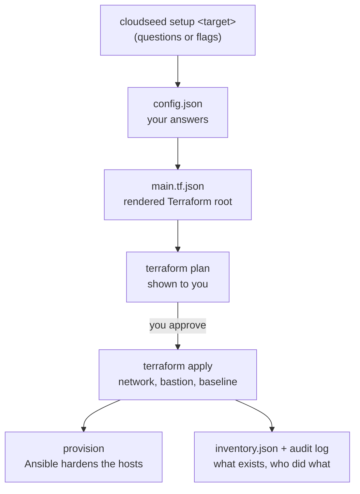

# Concepts

A handful of ideas explain almost everything cloudseed does. Read this once and the rest of the docs will feel
familiar.

## The flow of one `setup`



Your answers are saved, turned into a Terraform root that calls a generic, checked-in stack module, planned, shown to
you and applied only after you agree. Ansible then hardens the hosts. Every step is logged.

## Targets

A **target** is where an environment lives. All four build the same shape: a private network, a hardened bastion as
the only way in, egress through NAT, logging and a security baseline.

| Target | What `cloudseed setup <target>` builds | Reference |
|---|---|---|
| `aws` | VPC across 2+ AZs with public, private and isolated data subnets, NAT gateway, flow logs to KMS-encrypted CloudWatch, an Amazon Linux 2023 bastion (IMDSv2, encrypted disk, SSM), CloudTrail, GuardDuty, Access Analyzer, EBS encryption by default | [AWS](../reference/aws.md) |
| `gcp` | Custom VPC with Private Google Access, Cloud Router + Cloud NAT, logged deny-all firewall, a Shielded VM bastion with its own least-privilege service account, log retention and optional Data Access audit logs | [Google Cloud](../reference/gcp.md) |
| `azure` | VNet with default outbound disabled, NSGs ending in deny-all, NAT gateway, an Ubuntu 24.04 Trusted Launch bastion with a managed identity, Activity Log to Log Analytics, optional Defender | [Azure](../reference/azure.md) |
| `vmware` | A bastion VM on VMware Fusion or Workstation with a NAT NIC and a private host-only network it routes for, optional workload VMs and an RKE2 or kubeadm cluster | [VMware](../reference/vmware.md) |

Optional services are switched on with variables on the same `setup` command: a private Kubernetes cluster
(`--var enable_kubernetes=true`: EKS, GKE, AKS, or RKE2 / kubeadm on VMware), a VPN host
(`--var enable_vpn=true`: OpenVPN or Tailscale) and FIPS 140 mode (`--var fips_mode=true`).

## Environments

An **environment** is one deployment of a target, identified as `<cloud>-<env>`: `aws-dev`, `gcp-staging`,
`vmware-lab`. `--env` picks the name (default `dev`), and a cloud can have as many environments as you like.

- **Naming.** Every resource is called `<name>-<env>-<thing>`. `--name` sets the prefix (default `cloudseed`).
- **Tags.** Every resource is tagged or labelled `Project`, `Environment`, `Owner`, `ManagedBy=cloudseed`,
  `CloudseedEnv` and `CloudseedEnvId`, plus anything you add with `--tag key=value`. cloudseed uses its own tags to tell
  its resources from anyone else's, so they cannot be overridden.
- **Addresses.** The network CIDR defaults to the first free `10.N.0.0/16` across all your environments, so
  environments never overlap.
- **Access.** The bastion accepts SSH only from your public IP (detected, or `--allow-ip`). It is refused if you try
  `0.0.0.0/0`. When your IP changes, `cloudseed update-ip` fixes the rule.

## Idempotent by design

`setup` both creates and changes. Re-run it with a new flag and it shows a plan of just the difference:

```bash
cloudseed setup aws --env dev --var enable_kubernetes=true
```

Any stack variable can be set with `--var name=value` (`cloudseed help variables <cloud>` lists them all with their
defaults). Values are remembered, so the next run keeps them; `--var name=null` drops one. `cloudseed plan` previews,
`cloudseed apply` re-applies the saved configuration, and `cloudseed destroy` removes everything, or only what you pick
with `--select` or `--target`.

## The working directory

Each environment has a directory that holds everything about it: `~/.cloudseed/envs/<cloud>-<env>/` by default, or a
path you choose with `setup --workdir`.

| Path | What it holds |
|---|---|
| `config.json` | everything you answered: name, region, CIDR, allowed IPs, variables, tags, state backend |
| `ssh/` | the generated key pair (ed25519, or RSA-4096 in FIPS mode) and a per-environment `known_hosts` |
| `stack/` | the rendered Terraform root (`main.tf.json`), provider cache and local state |
| `bootstrap/` | the Terraform root that creates the remote state storage |
| `logs/` | `audit.jsonl` (who ran what, when, exit code) and one redacted log per command |
| `inventory.json` | every managed resource with its identifiers, plus the history of applies, destroys and changes |
| `outputs.json` | cached outputs used by `ssh`, `list` and the agents' brief |
| `k8s/`, `vpn/`, `platform/`, `finops/`, `scans/`, `chaos/`, `dr/` | kubeconfig, VPN profiles, platform secrets and reports, created as you use those features |

Nothing in `~/.cloudseed` ever leaves your machine: provisioning copies the repository to the hosts, never your state
or keys. Set `CLOUDSEED_HOME` to keep everything somewhere else.

## Terraform state

| Mode | Where | When |
|---|---|---|
| `remote` (cloud default) | a bucket or storage account cloudseed creates first in your account: S3 (versioned, SSE-KMS, TLS-only, native lock file), GCS (versioned, public access prevented) or Azure Storage (TLS 1.2, versioning, soft delete) | teams, CI, anything you want to keep |
| `local` | `<workdir>/stack/terraform.tfstate` | quick experiments; always used for `vmware` |

Switch any time with `setup --state local|remote`; the state is migrated. Remote state storage is deleted only when you
ask for it with `destroy --purge-state`. No secrets are stored in state or outputs.

## Provisioning

After Terraform applies, cloudseed copies the repository (never `~/.cloudseed`) to the bastion and the VPN host and runs
Ansible there: sshd hardening, a default-deny nftables firewall, fail2ban, auditd, sudo logging, unattended security
updates and the tools for that environment. On VMware, the Kubernetes play runs from your machine to build the cluster.
`cloudseed provision <cloud> --env <name>` re-runs it any time; it is idempotent.

## The current environment

Cluster commands (`node`, `platform`, `kubectl`, `helm`, `k9s`, `dr`, `chaos`, `scan`) act on "the environment you are
in": an explicit `<cloud> --env NAME`, else the one you picked with `cs env use`, else the only environment that has a
cluster.

```bash
cs env                   # which environments have a cluster, and which one is current
cs env use vmware-lab
cs kubectl get pods -A   # now acts on vmware-lab
```

`status`, `output`, `inventory`, `troubleshoot`, `plan`, `ssh`, `k8s` and `vpn` may also leave out the cloud:
`cs status` works when there is one environment or a current one. With several and none chosen, cloudseed asks at a
terminal and stops with the list in a script. It never guesses.

## Plans, approvals and exit codes

Nothing is created or destroyed without a plan you have seen. At a terminal you are asked; in scripts and CI, pass `-y`
(never prompt) and `--auto-approve` (apply without asking).

| Exit code | Meaning |
|---|---|
| `0` | success, or a plan with no changes |
| `1` | something failed: the message says what and how to fix it; also a FAIL verdict from `scan`, `chaos run` or `dr test` |
| `2` | a usage error, a refused command (for example a human-only command inside an agent session) or a missing tool in a `-y` run |
| `3` | a plan is waiting for approval: nothing was changed (add `--auto-approve`) |

## Deterministic first, agents optional

`cloudseed setup aws` runs exactly that command, every time. Everything else is built on top of the same commands:

- the **web console** (`cs enable ui`) turns each command into a form and a button;
- the **MCP server** (`cs setup mcp`) exposes each command as a tool for Claude Code, Claude Desktop, Codex, Cursor,
  VS Code and others;
- **agentic mode** (`cs agentic "..."`) lets an agent run cloudseed commands for you, with your credentials kept out of
  its reach.

They all run the same `cloudseed ...` commands, write to the same audit trail and share one undo journal. See
[Architecture](../about/architecture.md) for how the pieces fit.

## Learn anything in place

Two commands answer most questions without leaving the terminal:

```bash
cloudseed help setup      # every flag of a command, with examples
cloudseed explain bastion # how a feature is implemented: files, resources, controls, state, commands
```

[Explain everywhere](../guides/explain.md) shows how the same pages appear in the web console and over MCP.
