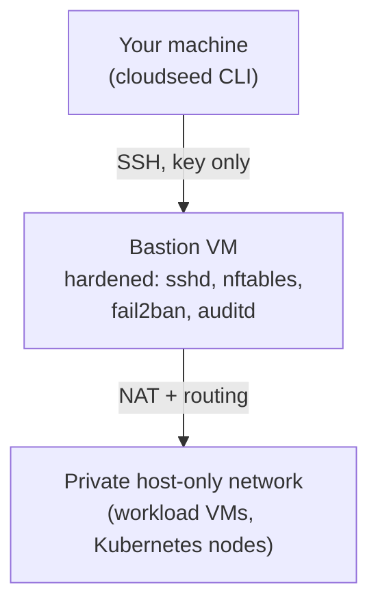

# Quickstart

Three commands take you from nothing to a working, hardened environment on your own machine: a bastion VM with a
private network behind it, built with Terraform and hardened with Ansible. It is the same shape cloudseed builds in AWS,
Google Cloud and Azure, so everything you learn here carries over.



!!! abstract "What you need"
    - **macOS or Linux** with **Python 3.9 or newer** (`python3 --version`). cloudseed uses only the standard library,
      so there is nothing to `pip install`.
    - **VMware Fusion Pro 13+** (macOS, Intel or Apple silicon) or **Workstation Pro 17+** (Linux). Both are free. If
      VMware is missing, `setup vmware` opens Broadcom's download page and installs it once you have downloaded it.
    - About **4 GB of free RAM** and **25 GB of free disk** for the bastion VM and its cloud image.
    - Terraform (1.10 or newer), Go and qemu-img are offered for install when they are missing. To install them up front,
      run `cloudseed install vmware` after step 2.

    No VMware? Jump to [Dry-run a cloud landing zone](#no-vmware-dry-run-a-cloud-landing-zone). It needs no cloud
    account either.

## 1. Get cloudseed

```bash
git clone https://github.com/nimeshbuilds/cloudseed.git
```

## 2. Put it on your PATH

```bash
cloudseed/scripts/install.sh
```

This links `cloudseed` and its short alias **`cs`** into `/usr/local/bin` (or `~/.local/bin` when that is not
writable). The links are all it installs: there is no daemon, no package and no global config. An existing `cs`
command that is not cloudseed's is left alone. See [Installation](installation.md) for the options.

## 3. Build the lab

```bash
cloudseed setup vmware --env lab
```

Press Enter to accept the recommended answers. cloudseed then:

1. detects Fusion or Workstation, its version and your CPU architecture (arm64 guests on Apple silicon);
2. builds its own Terraform provider for VMware once, into `~/.cloudseed/providers`;
3. downloads the official Ubuntu 24.04 cloud image and verifies its checksum;
4. shows the Terraform plan and asks **`Apply this plan? [y/N]`**. Type `y`;
5. creates the bastion VM, boots it with cloud-init, then hardens it with Ansible (sshd, nftables firewall, fail2ban,
   auditd, unattended security updates).

The first run takes about ten minutes, mostly for the image download and the provider build. Later runs take a
couple of minutes.

!!! tip "Unattended runs"
    `-y` never prompts and `--auto-approve` applies without asking:
    `cloudseed setup vmware --env lab -y --auto-approve`. Without `--auto-approve`, a non-interactive run stops after the
    plan with exit code 3, and nothing is changed.

## Check that it works

```bash
cloudseed status vmware --env lab      # configuration, resource count, outputs and the SSH command
cloudseed ssh vmware --env lab         # you are now on the hardened bastion (type exit to leave)
cloudseed inventory vmware --env lab   # every resource cloudseed manages, with its change history
```

`cloudseed list` shows all your environments. Each one has a working directory under `~/.cloudseed/envs/vmware-lab/`
with its config, SSH key, rendered Terraform, local state and a full audit log.

## Optional: add Kubernetes

Re-run `setup` with a variable. It is idempotent: it shows what changes and applies only that.

```bash
cloudseed setup vmware --env lab --var enable_kubernetes=true
cloudseed k8s kubeconfig vmware --env lab
cs kubectl get nodes
```

The defaults are RKE2, one control plane and two workers, each with 2 vCPUs, 4 GB and 40 GB. Short on memory? Add
`--var kubernetes_workers=0` so the control plane runs your workloads too. Then try the platform:
`cs platform install basek8s` gives you GitOps, observability, Gateway API and certificates
([Platform guide](../guides/platform.md)).

## Clean up

```bash
cloudseed destroy vmware --env lab
```

cloudseed shows what will be removed and asks you to type the environment id (`vmware-lab`). Only this environment's
VMs and files are touched. Add `--purge` to delete its working directory too. Changed your mind? `cs undo` re-creates
it.

## No VMware? Dry-run a cloud landing zone

`--dry-run` renders the complete Terraform for a cloud landing zone and runs `terraform validate`. It needs no cloud
credentials and creates nothing, so it is a safe way to see what cloudseed would build.

=== "AWS"

    ```bash
    cloudseed setup aws --env demo --dry-run
    ```

=== "Google Cloud"

    ```bash
    cloudseed setup gcp --env demo --project-id my-project --dry-run
    ```

=== "Azure"

    ```bash
    cloudseed setup azure --env demo --subscription-id 00000000-0000-0000-0000-000000000000 --dry-run
    ```

Then look at what you would pay:

```bash
cloudseed finops estimate aws --env demo
```

```text
  ╭─ Estimate · aws-demo  (month, 730h at on-demand list prices) ──────────────╮
  │ bastion t3.micro x1           $7.59                                        │
  │ NAT gateway x1                $32.85                                       │
  │ public IPv4 x2                $7.30                                        │
  │ KMS key x1                    $1.00                                        │
  │ CloudTrail + logs (low vol.)  $3.00                                        │
  │ GuardDuty (low volume)        $5.00                                        │
  │ block storage ~10 GB          $0.80                                        │
  │                                                                            │
  │ total / month                 $57.54                                       │
  │                                                                            │
  │ VPC flow logs (30-day retention) are billed per GB ingested and stored     │
  │   in CloudWatch: not included.                                             │
  │ Prices are us-east-1 on-demand list prices. Data transfer and NAT          │
  │   processing are not included.                                             │
  ╰────────────────────────────────────────────────────────────────────────────╯
```

The rendered roots are in the environment's working directory (the dry run prints the path). When you are ready to
build it for real, log in to the cloud (`aws configure`, `gcloud auth application-default login` or `az login`) and run
the same `setup` command without `--dry-run`. You see the plan before anything is created.

!!! note "How the cloud scenarios are verified"
    The VMware scenarios in these docs run live on VMware Fusion, and the agent and console scenarios on a local
    machine. The AWS, Google Cloud and Azure scenarios are checked with `--dry-run`, which renders and validates the
    Terraform, because the project's test machine has no cloud credentials. Run them with your own account to build
    for real.

## Where to go next

| You want to... | Go to |
|---|---|
| Understand environments, targets, state and the working directory | [Concepts](concepts.md) |
| Follow a complete, tested walk-through | [Scenarios](../scenarios/index.md), starting with [your first lab](../scenarios/01-first-lab-vmware.md) |
| Build a real AWS, GCP or Azure landing zone | [AWS](../scenarios/02-aws-landing-zone.md), [GCP](../scenarios/03-gcp-private-gke.md) and [Azure](../scenarios/04-azure-private-aks.md) scenarios |
| Click instead of type | [Web console](../guides/web-console.md): `cs enable ui` |
| Let Claude, Codex or Cursor drive it | [MCP server](../guides/mcp.md) and [agentic mode](../guides/agentic.md) |
| Look up any flag or variable | [CLI reference](../reference/commands.md) and `cs explain <anything>` |
