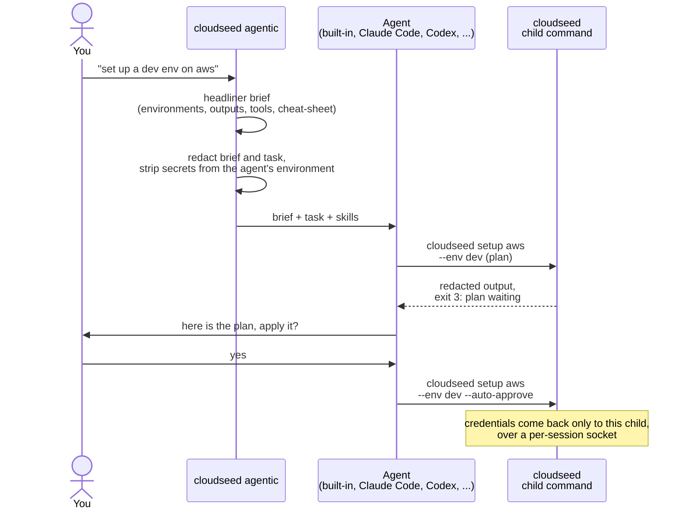

# Agentic mode

cloudseed is deterministic by default: `cs setup aws` runs exactly that. Agentic mode is an optional layer on top. You
describe a task in plain English and an agent carries it out with cloudseed commands, while cloudseed keeps your
credentials out of its reach and asks you before anything changes.

```bash
cs enable agentic
cs agentic "create a staging environment on gcp in europe-west1"
cs agentic "what environments exist and are their bastions reachable?"
cs do "install the observability stack on vmware-lab and tell me the Grafana URL"
```

`do` is an alias of `agentic`. Deterministic commands keep working exactly as before.

## How a task runs



## Choose an agent

| Agent | What it is | Log in with |
|---|---|---|
| `builtin` (default) | cloudseed's own agent loop on the Claude API, using the official Anthropic SDK (installed on first use into `~/.cloudseed/venv-agent`). Its only tool is "run a `cloudseed` command". | `ANTHROPIC_API_KEY` or `ant auth login`. Without either it falls back to your logged-in Claude Code. |
| `claude` | Claude Code CLI | your claude.ai subscription login, or `ANTHROPIC_API_KEY` |
| `codex` | OpenAI Codex CLI | `codex login` or `OPENAI_API_KEY` |
| `gemini` | Gemini CLI | log in with Google once (`gemini`) or `GEMINI_API_KEY` |
| `grok` | community Grok CLI | `GROK_API_KEY` |

```bash
cs agents                     # what each agent is, whether it is installed and logged in, and the exact fix
cs use claude                 # select an agent (installs its CLI after asking, plus the skills)
cs model                      # the selected agent's models; * marks the selected one
cs model claude-sonnet-5      # pick a model
cs agentic --agent codex "list my environments"    # override for one run
```

The built-in agent's models are `claude-opus-5` (default), `claude-opus-5-5`, `claude-fable-5-1` and
`claude-sonnet-5`. `cs model <id>` accepts any other id and remembers it as custom.

## The headliner brief

Before the task reaches the agent, cloudseed does the research itself: your environments and their outputs, tool and
credential status, and a command cheat-sheet. It prepends that as a compact brief, so the agent starts informed and
spends fewer tokens exploring.

```bash
cs agentic --show-prompt "list my environments"   # print the (redacted) prompt that is sent
cs agentic --no-headliner "list my environments"  # skip the brief for this run
cs disable headliner                              # skip it always (on by default)
```

## Skills: the agents' operating manuals

cloudseed ships ten skills in the Agent Skills format (`SKILL.md`) used by Claude Code, Codex, Gemini CLI and others:
the core `cloudseed` driver plus `aws`, `gcp`, `azure`, `vmware`, `destroy`, `platform`, `finops`, `managed` and
`architecture`. They tell an agent how to act safely: plan first, restate what a destroy removes, never read credential
files, hand human-only commands back to you.

```bash
cs skill list                                # the skills and where each agent keeps them
cs skill show destroy                        # print one
cs skill install --agent claude              # copy them where Claude Code looks
cs skill install aws destroy --agent codex   # some of them, for Codex
cs skill install --project                   # into ./.claude/skills of the current project
```

`cs enable agentic` and `cs use` install them for you. The built-in agent reads them straight from cloudseed: the core
skill and the ones a task needs go into its prompt, with an index of the rest. Grok cannot load skills from a
directory, so cloudseed sends them in each Grok prompt. All skills are listed in [Agent skills](../reference/skills.md).

## Approvals and human-only commands

The built-in agent can only run `cloudseed` commands: no shell, no file access.

- **Refused**, because they change your machine or need a terminal: `ssh`, `k9s`, `install`,
  `deps install|image|bundle|runtime`, `mcp`, `ui`, `creds`, `use`, `enable`, `disable`, `model`, `skill install` and
  `agentic`. The agent gets exit code 2 and the command for you to run.
- **Paused for your approval**: anything with `--auto-approve` or `--purge`, `provision`, scans (all but `fips` and
  `reports`), VPN user and connection changes, platform install and UI exposure, chaos runs, DR backups, schedules and
  drills, mutating `kubectl` / `helm`, reading cluster secrets, and Databricks / Snowflake commands other than status
  and test.
- **Previewed first**: `destroy`, `undo`, node changes, platform uninstall, `dr restore` and `chaos run --target` run
  once without `--auto-approve` (they stop at exit 3, nothing changed), so you approve once with the plan on screen.

Refused and unapproved calls are shown to you too. Without a terminal, approvals are refused unless
`CLOUDSEED_AGENT_ALLOW_DESTRUCTIVE` is `1`, `true`, `yes` or `on`.

In **every** agent session (the built-in agent, Claude Code, Codex, Gemini, Grok), cloudseed itself refuses the
human-only commands with exit code 2. Codex and Grok have a full shell, so for them this rule is advisory: the skills
tell them the same thing.

## Credentials never reach the agent

- **Stripped.** The agent process runs without credential variables (`AWS_SECRET_ACCESS_KEY`, `ARM_CLIENT_SECRET`,
  anything matching `*SECRET*`, `*TOKEN*`, `*PASSWORD*`, `*API_KEY*`, and every secret in the `cs creds` vault). The
  agent keeps only its own API key.
- **Brokered.** Child `cloudseed` commands get the credentials back from a per-session unix socket in a private
  temporary directory, protected by a random nonce. Nothing is written to disk, and an agent running `env` sees nothing.
  The session ends when the agent exits.
- **Redacted.** The brief, the task and every line of cloudseed output (including `cs kubectl`, `cs helm`,
  `cs databricks` and `cs snowflake`) pass through a redactor for AWS keys, private keys, JWTs, API keys and
  `password=` pairs.
- **Fenced.** Claude Code is launched with only `cloudseed` / `cs` commands pre-approved and cloudseed's secret files
  denied: the vault, tokens, the undo journal, every environment's `ssh/`, `k8s/`, `vpn/` and `platform/`, `*.tfstate`,
  `~/.aws`, `~/.config/gcloud`, `~/.azure`, `~/.ssh`, `~/.kube` and more.

!!! warning "Codex, Gemini and Grok can read your files"
    Unlike Claude Code, they run without file-deny rules: they can read any file you can, and only the skills tell
    them to stay away from credential and state files. Prefer the built-in agent or Claude Code for sensitive
    accounts.

## Custom agents

Add your own agent, or override a built-in template, in `~/.cloudseed/agents.json`. `{prompt}` and `{model}` are
replaced anywhere inside a word; without a model, a bare `{model}` and the option right before it are dropped. The
built-in templates live in `cloudseed/agents.py`.

## Turn it off

```bash
cs disable agentic
```

With agentic mode off, only deterministic commands run (`cs agentic --force "..."` still allows a one-off run).

Related: [MCP server](mcp.md) (your assistant calls cloudseed as tools),
[Scenario 14 - AI agents and MCP](../scenarios/14-ai-agents-and-mcp.md), `cs explain agentic`.
