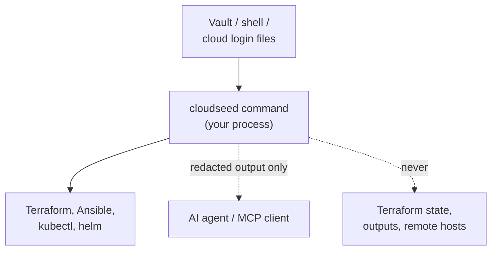

# Credentials

cloudseed works with the logins you already have: AWS profiles and SSO, Google application-default credentials,
`az login`, and the usual environment variables. When you would rather not export secrets in your shell, keep them in
cloudseed's **local credential vault**.

## The vault

```bash
cs creds set AWS_ACCESS_KEY_ID AWS_SECRET_ACCESS_KEY    # both are asked with hidden input
cs creds set AWS_PROFILE=prod                           # KEY=VALUE for non-secret settings
cs creds list                                           # secrets masked, settings shown
cs creds unset AWS_PROFILE
cs creds clear --forget                                 # empty the vault, keep no copy for undo
```

- Stored in `~/.cloudseed/credentials.json` with mode **0600**, never printed: `list` shows secrets as `••••••••`
  plus the last four characters of long ones.
- Injected as environment variables into every cloudseed command (CLI, web console, MCP server). A variable already
  exported in your shell **always wins**, and `list` marks it `from shell`.
- `set KEY` without a value prompts with hidden input, so the secret never lands in your shell history or the process
  list. It needs a terminal; without one it stops with exit code 2 and changes nothing.
- `KEY=VALUE` is for non-secret settings (profiles, project ids, paths); its value is masked in the audit log anyway.
  Paths are stored absolute, with `~` expanded.
- `cs undo --global` reverts `set`, `unset` and `clear`: an overwritten value comes back. `unset` and `clear` keep a
  copy of what they removed in the undo journal (0600) until five newer global actions push it out; `--forget` keeps
  none.

### What goes in it

| Purpose | Variables |
|---|---|
| AWS | `AWS_PROFILE`, `AWS_ACCESS_KEY_ID`, `AWS_SECRET_ACCESS_KEY`, `AWS_SESSION_TOKEN`, `AWS_DEFAULT_REGION` |
| Google Cloud | `GOOGLE_APPLICATION_CREDENTIALS` (a key file's path), or `GOOGLE_CREDENTIALS` (the key's JSON, pasted at the hidden prompt), `GOOGLE_PROJECT` |
| Azure | `ARM_SUBSCRIPTION_ID`, `ARM_TENANT_ID`, `ARM_CLIENT_ID`, `ARM_CLIENT_SECRET` |
| Agents | `ANTHROPIC_API_KEY`, `OPENAI_API_KEY`, `GEMINI_API_KEY`, `GROK_API_KEY` |
| Platform and hosts | `UBUNTU_PRO_TOKEN` (FIPS), `TS_AUTHKEY` (Tailscale), `GITLAB_RUNNER_TOKEN` (GitLab runner) |
| Data platforms | `DATABRICKS_TOKEN`, `SNOWFLAKE_PASSWORD` |

Any other variable works too, with one exception: names that change how programs start, which code they load, which
files or servers they trust, or where they send requests are refused (`PATH`, `HOME`, `LD_*` / `DYLD_*`, `PYTHON*`,
`ANSIBLE_*`, `OPENSSL_*`, `NODE_*`, `GIT_*`, `*_CONFIG`, `*_BASE_URL`, `*_ENDPOINT*`, proxies, `TF_LOG*`,
`CLOUDSEED_*` and similar). The vault's values reach every cloudseed process, so those belong in your shell if you
really need them.

The web console's **Credentials** view manages the same vault.

## Where secrets never go



- **Not to agents.** Agent processes run without credential variables; child cloudseed commands get them back from a
  per-session socket, and every line of output is redacted. See [Agentic mode](agentic.md#credentials-never-reach-the-agent).
- **Not to MCP clients.** Tool calls run cloudseed as a child under the same broker, with redacted output; state and
  credential files are never exposed as resources. See [MCP server](mcp.md#safety-model).
- **Not to your hosts.** Provisioning copies the repository, never `~/.cloudseed`, and leaves out private keys,
  kubeconfigs, `.env` files, `*.tfvars`, state and credential files a checkout may hold. A file whose content is a
  private key stops the copy.
- **Not to state.** The stacks keep no secrets in Terraform state or outputs; the bastion only gets your public key.
- **Not to logs.** Logs and the audit trail are redacted: AWS keys, private keys, JWTs, API keys and `password=` pairs
  are masked.

## Other secret files cloudseed keeps

All under `~/.cloudseed`, all private to your user:

| File | What |
|---|---|
| `envs/<cloud>-<env>/ssh/` | the environment's SSH key pair and `known_hosts` |
| `envs/<cloud>-<env>/k8s/`, `vpn/`, `platform/` | kubeconfig, `.ovpn` profiles, generated platform passwords (`platform/secrets.json`, 0600) |
| `managed.json` | Databricks / Snowflake connection profiles |
| `vmware.json` | the vmrest login cloudseed generated |
| `mcp/token`, `ui/token` | the MCP server's bearer token and the web console's token |
| `undo.json`, `undo/` | the undo journal and its backups |

SSH host keys are kept per environment, never in `~/.ssh/known_hosts`, because re-created hosts reuse the same
addresses.

## Related

- [Security model](security-and-fips.md#the-security-model)
- `cs help creds`, `cs explain ui`, `cs explain agentic`
