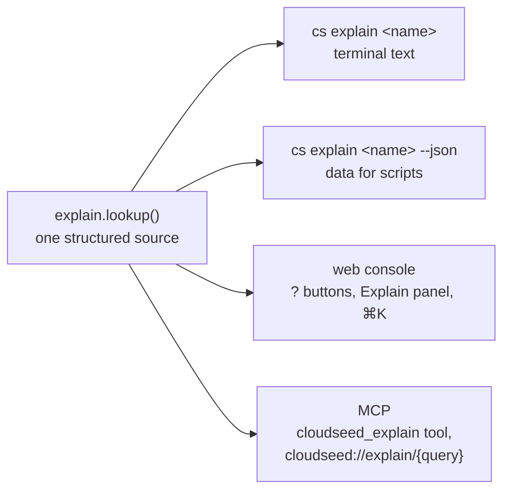

# Explain everywhere

`cloudseed explain` answers **how** something works: which files implement it, which cloud resources it creates, which
security controls apply, where its state and logs live and which commands drive it. The same pages are available in
every place you use cloudseed, from one source, so the terminal, the console and your AI assistant never disagree.



## In the terminal

```bash
cs explain                          # the index: everything that can be explained
cs explain bastion                  # a feature
cs explain vmware                   # a word with several meanings: feature first, then "also:" the others
cs explain target vmware            # pick one meaning explicitly
cs explain group security           # a platform group: every tool it brings
cs explain istio                    # a platform item: chart, version, namespace, dependencies, values per target
cs explain command destroy          # the full help page of a command
cs explain variables gcp            # every stack variable of a target
cs explain aws single_nat_gateway   # one setup variable, with its default and how to set it
```

A page looks like this:

```text
$ cs explain bastion
  ━━ bastion

  Single hardened jump host in the public subnet: SSH only from your IP(s)
  (update-ip when it changes), key-only auth, IMDSv2/Shielded VM/Trusted Launch,
  encrypted disk, SSM/OS-login options, then Ansible hardening after apply.

  Implemented in
    · terraform/<cloud>/modules/bastion
    · ansible/bastion.yml + roles/{common,hardening,tools}
    · cloudseed/provision.py

  Security controls
    · allowed_ssh_cidrs: IPv4 only, never 0.0.0.0/0 or anything wider than a /8
      (validated)
    · SSH sources enforced by the cloud firewall (SG / VPC firewall / NSG),
      which update-ip changes; host nftables default-deny
    · sshd hardening drop-in (no root, no passwords, MaxAuthTries 3, strong
      KEX/ciphers, AllowUsers)
    · fail2ban, unattended security updates, sysctl hardening, auditd rules,
      sudo logging
    · login banner

  Commands
    · cs ssh <cloud> --env X
    · cs update-ip <cloud> --env X
    · cs provision <cloud> --env X --host bastion
```

### What can be explained

| Kind | Examples | Namespaced form |
|---|---|---|
| Feature | `overview`, `network`, `bastion`, `state`, `kubernetes`, `vpn`, `fips`, `dr`, `chaos`, `scan`, `undo`, `ui`, `mcp`, `audit` | `cs explain feature vpn` |
| Target | `aws`, `gcp`, `azure`, `vmware` | `cs explain target aws` |
| Command | `setup`, `destroy`, `platform`, `undo`, ... | `cs explain command destroy` |
| Topic | `quickstart`, `security`, `envs`, `troubleshooting`, ... | `cs explain topic security` |
| Platform group | `basek8s`, `data`, `ai`, `security`, `resilience`, ... | `cs explain group security` |
| Platform item | `argocd`, `velero`, `istio`, `ollama`, ... | `cs explain item velero` |
| Setup variable | every stack variable and setup input of every target | `cs explain variable aws az_count` |

The full list is the [Explain index](../reference/explain-index.md).

A bare word that names several things is looked up in the order feature, target, platform group or item, then command
or topic, and an `also:` line names the other meanings. A typo gets a "did you mean" drawn from every name.

### As data

`--json` prints the same page as structured data, for scripts and tools:

```bash
cs explain vpn --json
```

```json
{
  "query": "vpn",
  "found": true,
  "kind": "feature",
  "name": "vpn",
  "title": "VPN: OpenVPN or Tailscale access host",
  "summary": "An OpenVPN server with per-user profiles, or a Tailscale subnet router, giving your machine a route into the private network.",
  "sections": [{"heading": "How it works", "format": "text", "lines": ["..."]}],
  "text": "...",
  "commands": [
    "cs setup <cloud> --var enable_vpn=true",
    "cs vpn add-user|users|revoke|connect|disconnect|status <cloud> --env X [name]"
  ],
  "also": [{"kind": "command", "name": "vpn", "query": "command vpn", "cli": "cs explain command vpn"}],
  "did_you_mean": [],
  "cli": "cs explain vpn",
  "error": ""
}
```

`text` is the full page as the terminal prints it, without colours or box drawing. The command exits `0` when it found a
page and `1` when nothing matched; `did_you_mean` then holds the suggestions.

## In the web console

- A **?** sits beside everything explainable: view titles, each cloud and every question of the create wizard (with the
  stack variable it sets), environment chips, platform groups and items, resilience cards, reports, agents, MCP,
  credentials and every action card and dialog.
- Hover or focus it for a one-line summary and the CLI command; click it for the **Explain panel**: headings, bullets,
  copyable commands, a Page | Terminal switch for the exact CLI text, links for related pages and suggestions, and
  Back.
- Press **`?`** to explain the view you are on; **⌘K** lists an "Explain: *name*" entry for everything explainable; the
  Help view has an "Explain anything" search.
- The panel reads `GET /api/explain?q=<query>` and `GET /api/explain/names` with the console's token. It is
  documentation only: answered at once, no job and no audit entry.

See the [Web console guide](web-console.md#explains-anything-in-place).

## Over MCP, for agents

MCP clients get the same pages two ways:

| Surface | How |
|---|---|
| Tool `cloudseed_explain` | argument `what` (`vpn`, `target vmware`, `variable aws az_count`; empty for the index) and `format`: `text` (default, the terminal page) or `json` (the structured page). Nothing found sets `isError` with the suggestions. |
| Resource template `cloudseed://explain/{query}` | the JSON page. `{query}` is what `cs explain` takes, URL-encoded or with `/` between words: `cloudseed://explain/vpn`, `cloudseed://explain/target%20vmware`, `cloudseed://explain/group/security`, `cloudseed://explain/variable/aws/single_nat_gateway`. `cloudseed://explain` alone is the index. |

The server's instructions, the bundled skills and the headliner brief all tell agents to look a thing up here before
guessing how it works. See [MCP server](mcp.md) and [Agentic mode](agentic.md).

## Explain vs help

| | `cs help <command>` | `cs explain <name>` |
|---|---|---|
| Answers | how to **use** it: synopsis, every flag, examples | how it **works**: files, resources, controls, state, commands |
| Covers | commands and topics | features, targets, commands, topics, platform groups and items, variables |
| Formats | terminal, [CLI reference](../reference/commands.md) | terminal, `--json`, web console, MCP |
