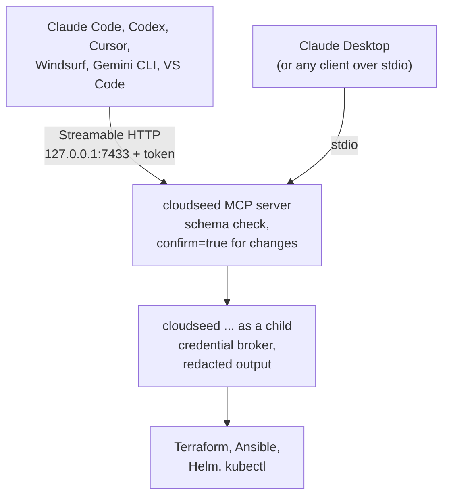

# MCP server

`cloudseed setup mcp` turns cloudseed into a [Model Context Protocol](https://modelcontextprotocol.io) server. Every
feature becomes a tool your AI assistant can call, with the same safety rails as the CLI: plans before changes, your
explicit confirmation for anything destructive, and credentials that never reach the model.

```bash
cs setup mcp
```

It deploys a local server, asks which of the MCP clients it found on your machine to connect, writes their configs
and prints a guide (also saved to `~/.cloudseed/mcp/CONNECT.md`).



## What your assistant gets

**30 tools**, one per feature area:

| Area | Tools |
|---|---|
| Discover | `cloudseed_list`, `cloudseed_doctor`, `cloudseed_status`, `cloudseed_output`, `cloudseed_inventory`, `cloudseed_env` |
| Build and change | `cloudseed_setup` (plan, apply or dry run), `cloudseed_plan`, `cloudseed_apply`, `cloudseed_update_ip`, `cloudseed_provision`, `cloudseed_install` |
| Kubernetes | `cloudseed_k8s`, `cloudseed_node`, `cloudseed_platform`, `cloudseed_kubectl`, `cloudseed_helm` |
| Access | `cloudseed_ssh`, `cloudseed_vpn`, `cloudseed_managed` (Databricks, Snowflake) |
| Cost and docs | `cloudseed_finops`, `cloudseed_troubleshoot`, `cloudseed_explain`, `cloudseed_help`, `cloudseed_skill` |
| Resilience | `cloudseed_dr`, `cloudseed_chaos`, `cloudseed_scan` |
| Undo and teardown | `cloudseed_undo`, `cloudseed_destroy` |

Plus **resources** (`cloudseed://environments`, the operating manuals `cloudseed://skills/<name>` and the explain pages
`cloudseed://explain/{query}`) and four **prompts**: `create-environment`, `review-environment`, `troubleshoot` and
`teardown`. Every tool, argument and resource is listed in the [MCP tools reference](../reference/mcp-tools.md), or
run `cs mcp tools`.

## Connect your clients

| Client | Name | How cloudseed connects it |
|---|---|---|
| Claude Code | `claude-code` | `claude mcp add -s user` |
| Claude Desktop | `claude-desktop` | `claude_desktop_config.json` (stdio: the app only launches commands) |
| OpenAI Codex CLI | `codex` | `~/.codex/config.toml`, with a 1-hour tool timeout |
| Cursor | `cursor` | `~/.cursor/mcp.json` |
| Windsurf | `windsurf` | `~/.codeium/windsurf/mcp_config.json` |
| Gemini CLI | `gemini` | `~/.gemini/settings.json`, with a 1-hour tool timeout |
| VS Code (Copilot agent mode) | `vscode` | `User/mcp.json` |

```bash
cs setup mcp -y --client all          # connect every detected client without asking
cs mcp connect codex cursor           # add clients later
cs mcp disconnect cursor              # remove one
cs mcp status                         # health, service and which clients are connected
cs mcp config                         # copy-paste snippets for any other MCP client
```

Anything else that speaks MCP (LangGraph, your own agent) works with the snippets from `cs mcp config`.

!!! tip "Long operations"
    `setup`, `apply` and `destroy` can take many minutes. Codex and Gemini CLI get a one-hour tool timeout
    automatically; start Claude Code with `MCP_TOOL_TIMEOUT=3600000` if long calls time out. Cancelling a call in the
    client interrupts the command, and Terraform stops cleanly and releases its lock.

## Try it

Ask your assistant things like:

- "List my cloudseed environments and tell me which bastions are reachable."
- "Plan a dev environment on AWS in us-west-2 with a private EKS cluster and show me the monthly estimate before
  applying."
- "Install the basek8s platform on vmware-lab and expose the UIs."
- "Run a DR drill on my cluster and summarise the result."
- "How does cloudseed's VPN work?" (answered from `cloudseed_explain`)

The assistant plans first and asks you before anything changes, because the server refuses destructive calls that do
not carry your confirmation.

## Transports

| Transport | How it runs | When to use |
|---|---|---|
| **Streamable HTTP** (default) | one shared server on `http://127.0.0.1:7433/mcp` (legacy SSE at `/sse`), started at login as a launchd or `systemd --user` service, protected by a bearer token in `~/.cloudseed/mcp/token` (0600) | most setups: one server for every client |
| **stdio** | each client launches `cloudseed mcp serve` itself: no port, no token | Claude Desktop; or credentials that exist only as shell variables |

```bash
cs setup mcp --transport stdio --client claude-desktop
cs mcp connect cursor --transport stdio
```

!!! note "Services do not see your shell"
    A launchd or systemd service can read credential **files** (`~/.aws`, gcloud application-default credentials,
    `az login`) but not variables you exported in a shell. If your credentials live only in environment variables,
    connect that client over stdio, or store them in the [credential vault](credentials.md).

## Safety model

- **Loopback only.** The server binds to 127.0.0.1, validates the `Origin` header (no DNS rebinding) and answers
  `401` without the bearer token. stdio has no port at all.
- **Off until you turn it on.** It refuses to start until `cs setup mcp` or `cs enable mcp`; `cs disable mcp` stops it.
- **Schema-checked calls.** Every call is validated against the tool's input schema (types, enums, required and
  unknown arguments) before anything runs.
- **Confirmation for changes.** Tools that change infrastructure, a host or a service carry `destructiveHint` and refuse
  to run unless the call has `confirm=true`, so the assistant must ask you first: setup with apply, apply, destroy,
  update-ip, provision, node changes, platform install/uninstall/ui, VPN user changes, SSH commands, installs,
  mutating kubectl/helm, scans (all but `fips` and `reports`), DR, chaos and undo. Reading Kubernetes Secrets or Helm
  release values needs `confirm=true` too, because they can print passwords.
- **No credentials to the model.** Tool calls run `cloudseed` as a child under the credential session broker, and
  every line of output is redacted. Terraform state and credential files are never exposed as resources.
- **Your settings stay yours.** Meta commands (agentic, enable/disable, use, model, mcp, ui, creds) are not tools, and
  `cloudseed_undo` only reverts environment actions: MCP, UI, credential and agent settings are undone by you, with
  `cs undo --global` or the web console.

## Operate the server

```bash
cs mcp status                 # health, transport, service, tools, clients
cs mcp guide                  # the connection guide again
cs mcp test --http            # protocol round-trip against the running server
cs mcp logs -n 100            # the server log
cs mcp restart
cs mcp token --rotate         # new bearer token; HTTP-connected clients are updated automatically
cs destroy mcp                # stop it, remove the service, the token and every client entry
```

`cs mcp test` without `--http` runs the round-trip over stdio: initialize, list the tools, read a skill and call
`cloudseed_list`. A `CLOUDSEED_HOME` other than `~/.cloudseed` gets its own service, so several homes can run side by
side.

Related: [Agentic mode](agentic.md) (agents driving the CLI directly),
[Scenario 14 - AI agents and MCP](../scenarios/14-ai-agents-and-mcp.md).
