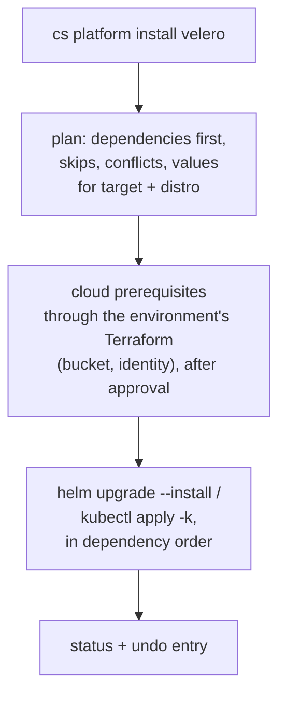

# Kubernetes platform

cloudseed takes you from a landing zone to a working platform in two steps: a private cluster with one variable, then
a curated catalog of open-source components with one command.

```bash
cs setup vmware --env lab --var enable_kubernetes=true   # or aws / gcp / azure
cs platform install basek8s                               # GitOps, observability, Gateway API, certificates, secrets
cs platform ui                                            # a URL and login for every installed UI
```

## 1. Get a cluster

`--var enable_kubernetes=true` on `setup` adds a cluster to the environment's private subnets.

| Target | Cluster | Defaults and security |
|---|---|---|
| AWS | **EKS** | private API endpoint, managed node group (AL2023), KMS envelope encryption of Secrets, control-plane logs to CloudWatch, core add-ons, IRSA; needs `az_count >= 2` |
| GCP | **GKE** | private nodes and endpoint, VPC-native, Dataplane V2, Workload Identity, shielded nodes, REGULAR channel, managed Prometheus, control-plane logs |
| Azure | **AKS** | private cluster, Azure CNI overlay, NAT-gateway egress, workload identity, control-plane logs in Log Analytics |
| VMware | **RKE2** (default) or **kubeadm** | control-plane and worker VMs on the private network, installed by Ansible from your machine; `kubernetes_distro`, `kubernetes_control_planes`, `kubernetes_workers` |

Sizes and versions are variables: `kubernetes_node_size`, `kubernetes_node_count` / `_min` / `_max` and
`kubernetes_version` in the cloud; `kubernetes_cpus`, `kubernetes_memory_mb`, `kubernetes_disk_gb` and
`kubernetes_cis_profile` (RKE2's CIS hardening) on VMware. The API is private by default
(`kubernetes_public_endpoint=false`).

```bash
cs setup aws --env dev --var enable_kubernetes=true --var kubernetes_node_size=t3.large
cs setup vmware --env lab --var enable_kubernetes=true --var kubernetes_distro=kubeadm --var kubernetes_workers=1
```

## 2. Reach it

A private API endpoint is not on the internet, so cloudseed brings the connection to you.

```bash
cs k8s info aws --env dev          # cluster name, endpoint and the kubeconfig command
cs k8s kubeconfig aws --env dev    # add it to ~/.kube/config and make it the current context
cs kubectl get nodes               # per-environment kubeconfig, SSH tunnel through the bastion when needed
cs helm list -A
cs k9s
```

- `cs kubectl`, `cs helm` and `cs k9s` need no setup: they use a kubeconfig kept per environment
  (`<workdir>/k8s/kubeconfig`) and open an SSH tunnel through the bastion to a private endpoint on demand.
  `cs k8s untunnel aws --env dev` closes it.
- With a [VPN](vpn.md) connected, your machine reaches the endpoint directly.
- On VMware the API is on the host-only network, reachable from your machine.
- A missing kubectl, helm, k9s or cloud CLI is installed after asking. GKE also needs `gke-gcloud-auth-plugin`.
- Mutating `kubectl` and `helm` calls take a Velero backup first when Velero is installed, so `cs undo` can roll them
  back.

### Which cluster am I talking to?

```bash
cs env                      # environments with a cluster; the current one is marked
cs env use aws-dev          # cluster commands now act on aws-dev
cs env clear
```

Cluster commands act on an explicit `<cloud> --env NAME`, else the current environment, else the only environment
with a cluster. With several and none chosen, cloudseed asks, or stops with the list in a script.

## 3. Scale nodes

```bash
cs node list
cs node add --count 2                       # VMware: new VMs join automatically; cloud: the pool grows
cs node remove cloudseed-lab-wk3            # a name from node list: drain it, then delete exactly that machine
cs node scale aws --env dev --count 3 --max 6   # EKS / GKE / AKS: pool size and autoscaler limits
```

| | Cloud (EKS, GKE, AKS) | VMware |
|---|---|---|
| `add` | raises the managed pool and its autoscaler minimum, waits for Ready nodes | Terraform creates the VM(s), Ansible joins them (RKE2 agent/server or kubeadm join) |
| `remove` | drains the node and deletes exactly that machine | drains, removes it from the cluster and, for the highest-numbered node, deletes its VM |
| `scale` | sets the pool size (`--count`) and limits (`--min`, `--max`) | not available: VMs are numbered, use `add` / `remove` |

`add --role control-plane` adds control planes on VMware. The saved configuration follows the live pool, so a later
`apply` keeps the new size. Every node change can be undone with `cs undo`.

## 4. Install the platform

The catalog holds about seventy pinned open-source components in ten groups. A group installs its core items; extras
are installed by name.

| Group | What it brings |
|---|---|
| `basek8s` | metrics-server, cert-manager + a cluster CA issuer, Gateway API + Envoy Gateway (private load balancer; MetalLB on VMware), Argo CD, kube-prometheus-stack, Loki 3 + Alloy, OpenTelemetry operator, External Secrets, Sealed Secrets |
| `scaling` | KEDA, VPA + Goldilocks, cluster-autoscaler; Karpenter on AWS (extra) |
| `data` | MinIO, CloudNativePG, Strimzi + a dev Kafka cluster, Spark operator + history server, Trino, StarRocks, Apache Polaris, Airflow |
| `ai` | KubeRay, Kubeflow trainer, KServe, JupyterHub, MLflow; extras: Kubeflow Pipelines, vLLM stack, GPU operator, Ollama |
| `agentic` | kagent, kmcp, agentgateway, Qdrant; extras: Langfuse, LiteLLM, Open WebUI |
| `finops` | OpenCost (+ Prometheus); extras: kube-green, Kubecost |
| `devsecops` | GitLab + runner, NeuVector, Trivy operator, Argo CD, Kyverno; extras: Harbor, Artifactory, Nexus, SonarQube |
| `security` | Istio (ambient by default, strict mTLS), Falco, Kyverno + baseline policies, cert-manager, External Secrets |
| `resilience` | Velero, kured, descheduler, driven by [`cs dr`](resilience.md) |
| `chaos` | Chaos Mesh (LitmusChaos extra), driven by [`cs chaos`](resilience.md#chaos-engineering) |

The [Platform catalog](../reference/platform-catalog.md) lists every item with its chart, pinned version, targets and
FIPS tier.

### Look before you install

```bash
cs platform list                  # the catalog, with what is installed on the current cluster
cs platform list --charts         # where every chart comes from
cs platform info basek8s          # every tool a group brings: core, shared, dependencies, extras
cs platform info velero           # chart, version, namespace, dependencies, values per target, notes
cs platform plan basek8s finops   # what would happen: installs, skips, conflicts, adjusted values
```

A plan works before the cluster exists too:

```text
$ cs platform plan basek8s vmware --env lab
  ● No cluster in vmware-lab yet: planning for target 'vmware' assuming nothing is installed (<cloud> --env NAME to change).

  ╭─ Plan for vmware-lab (vmware/rke2) ────────────────────────────────────────────────╮
  │ ✔ metrics-server         built into the distro - skip Resource metrics API…        │
  │       ↳ already provided by rke2 out of the box                                    │
  │ + gateway-api            install                      Kubernetes Gateway API…      │
  │ + cert-manager           install                      X.509 certificates for…      │
  │ + cert-manager-issuer    install                      Cluster CA issuer…           │
  │ + metallb                install                      LoadBalancer IPs on the…     │
  │ + envoy-gateway          install                      Envoy Gateway: the…          │
  │ + argocd                 install                      GitOps continuous delivery   │
  │ + kube-prometheus-stack  install                      Prometheus, Alertmanager…    │
  │ + alloy                  install                      Grafana Alloy: collects…     │
  │ + local-path-provisioner install                      Default StorageClass for…    │
  │ + loki                   install                      Log aggregation (Loki 3…     │
  │ + opentelemetry-operator install                      OpenTelemetry operator…      │
  │ + external-secrets       install                      Sync secrets from…           │
  │ + sealed-secrets         install                      Encrypt secrets so they…     │
  ╰────────────────────────────────────────────────────────────────────────────────────╯
```

### Install, change, remove

```bash
cs platform install basek8s
cs platform install data ai                        # several groups: shared items are installed once
cs platform install argocd trino --no-wait         # single items; do not wait for them to be ready
cs platform install security --set mode=sidecar    # a value for one item, remembered for later installs
cs platform install basek8s --upgrade              # re-apply installed items at cloudseed's pinned versions
cs platform status                                 # what is installed and healthy
cs platform uninstall airflow
```



What cloudseed takes care of:

- **Dependencies first, never twice.** cert-manager before the OpenTelemetry operator, MetalLB before a gateway on
  VMware. Installing several groups resolves shared items once.
- **Values per target and distro.** Private load balancers in each cloud, MetalLB on VMware, storage classes, IRSA or
  workload identity for items that call cloud APIs.
- **Cloud prerequisites through Terraform.** Velero gets a versioned, encrypted, private bucket and a least-privilege
  identity; Karpenter gets its roles, instance profile, EKS access entry, interruption queue and discovery tags. They
  are applied through the environment's own Terraform stack, with the plan shown and your approval, never by ad-hoc
  CLI calls.
- **Step-overs.** Components a distro already ships are skipped (RKE2: metrics-server; GKE and AKS: metrics-server and
  cluster-autoscaler). Items with the same role conflict, and the later one is skipped unless `--force`. Overlaps
  (Envoy Gateway and ingress-nginx, Falco and NeuVector) are allowed and flagged.
- **Architecture and FIPS.** Items published for amd64 only are skipped on all-arm64 clusters (Apple silicon VMware
  guests) unless `--force`. In a [FIPS environment](security-and-fips.md) items that are not FIPS-capable are refused
  unless `--force`.
- **Tokens.** kagent waits for `ANTHROPIC_API_KEY` or `OPENAI_API_KEY`, the GitLab runner for `GITLAB_RUNNER_TOKEN`:
  store them with `cs creds set NAME`.
- **Safe removal.** `uninstall` never removes shared dependencies, refuses an item another installed item still needs
  (unless `--force`) and keeps data: MinIO's volume and the Polaris database stay, and CloudNativePG stays while
  Postgres clusters exist.
- **Pinned and upstream.** Nothing is vendored. Each item records its upstream chart and a version pinned per cloudseed
  release; `--version V` overrides it for one item.

`install` exits 1 when nothing it was asked for can be installed (every item skipped for a reason: a missing token, a
conflict, the architecture or FIPS).

### Open the UIs

Gateways get **private** load balancers: reach the cloud ones over the [VPN](vpn.md) or the bastion; on VMware the
MetalLB pool is on the host-only network, reachable from your machine.

```bash
cs platform ui
```

It attaches an HTTPRoute on the shared Gateway for every installed UI (Grafana, Argo CD, MinIO, Airflow, JupyterHub,
kagent, OpenCost and more) and prints each URL and login. Certificates come from the cluster CA; `cs platform ui` tells
you how to trust it once. Generated passwords live in `<workdir>/platform/secrets.json` (mode 0600).

## A CI pipeline template

```bash
cs platform template gitlab-ci
```

Writes a `.gitlab-ci.yml` into the current directory with build, test, Trivy scan, release and Argo CD deploy stages,
to pair with the `devsecops` group.

## Managed data platforms: Databricks and Snowflake

Next to your clusters, cloudseed drives Databricks and Snowflake through their official CLIs, with one connection
profile per environment (stored 0600 in `~/.cloudseed/managed.json`, never handed to agents).

```bash
cs databricks connect host=https://acme.cloud.databricks.com   # then asks for the token (hidden input)
cs databricks test
cs databricks clusters list                                     # any Databricks CLI command, with this profile
cs snowflake connect --account myorg-acct --user me --role SYSADMIN --warehouse COMPUTE_WH
cs snowflake sql -q "select current_version()"
```

The CLIs are installed after asking (`cloudseed install databricks` or `cloudseed install snow`). Never put tokens or
passwords on the command line: `connect` asks for them with hidden input.

## Related

- [Resilience](resilience.md): backups, DR drills, chaos engineering and scans on this cluster
- [FinOps](finops.md): what the cluster costs, by namespace, with OpenCost
- Scenarios: [local Kubernetes](../scenarios/05-local-kubernetes.md),
  [platform in one command](../scenarios/06-platform-in-one-command.md),
  [data and AI stack](../scenarios/07-data-and-ai-stack.md)
- `cs help platform`, `cs help node`, `cs explain platform`
