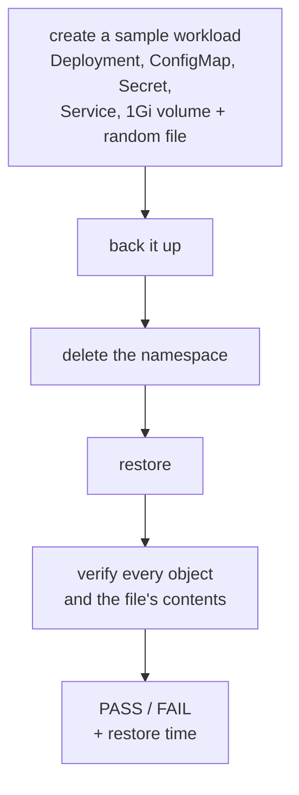

# Resilience: backups, DR drills and chaos

Backups you have never restored and failover you have never tested are hopes, not plans. cloudseed gives you both
halves with verdicts: `cs dr test` proves a restore works end to end, and `cs chaos run` proves your workloads survive
faults.

## Disaster recovery with Velero

```bash
cs platform install velero      # or let the first cs dr command install it
cs dr test                      # the automated drill: PASS or FAIL, with the measured restore time
```

### What gets installed

`velero` is part of the `resilience` group (with kured for safe node reboots and the descheduler). Before the chart is
installed, cloudseed creates what Velero needs in your cloud **through the environment's own Terraform stack**, with
the plan shown and your approval:

| Target | Backup storage | Identity |
|---|---|---|
| AWS | S3 bucket: versioned, encrypted, private | IRSA role for the velero service account |
| GCP | GCS bucket | GKE Workload Identity |
| Azure | Blob storage | Azure workload identity + a snapshot role |
| VMware | the in-cluster MinIO | - |

Volumes are backed up by Velero's node agent (file-system backup). On local clusters the local-path StorageClass
creates volumes the node agent can back up.

### Back up, schedule, restore

```bash
cs dr status                                          # Velero, backup location, schedules
cs dr backups                                         # the backups that exist
cs dr backup before-upgrade --namespaces shop,payments
cs dr schedule nightly --cron "0 2 * * *" --ttl 720h  # 02:00 UTC every night, kept 30 days
cs dr restore before-upgrade
```

- Cron expressions are evaluated by Velero in **UTC**; `--ttl` is a Go duration (`720h` = 30 days, the default).
- `--no-wait` returns right away instead of waiting for Velero to finish.
- Names are Kubernetes names: lower-case letters, digits, `-` and `.`.
- `dr status` and `dr backups` need no Velero CLI. The other commands use the Velero CLI matching the server's
  version, fetched into `~/.cloudseed/bin` only on your own run, never from an agent session.
- `cs undo` deletes a backup or schedule you just created, and rolls a restore back to the backup taken just before it.

### The DR drill

```bash
cs dr test
```



The drill passes only when every object came back and the random file on the volume is intact, with Completed
PodVolumeBackups and PodVolumeRestores. It exits 1 on FAIL and saves its report to
`<workdir>/dr/drill-<run>.json` and `.md`. Afterwards it deletes its namespace and backup.

| Flag | Effect |
|---|---|
| `--keep` | keep the drill namespace and its backup for inspection |
| `--no-volume` | skip the volume |
| `--volume` | require the volume test (needs a default StorageClass or an unclassed PersistentVolume of 1Gi+) |

## Chaos engineering

```bash
cs chaos list          # every experiment with its steady-state hypothesis
cs chaos run           # the basic suite against a canary cloudseed deploys for you
cs chaos report        # the last verdict table
```

Chaos Mesh is installed on first use (after asking; `--auto-approve` to skip the question). `run` deploys a canary
(3 replicas, a PodDisruptionBudget, a Service and a probe pod) or targets your own Deployment, then runs the
experiments one by one.

### Suites and experiments

| Suite | Experiments | What must hold |
|---|---|---|
| `basic` | `pod-kill`, `pod-failure`, `container-kill` | a Deployment replaces or restarts pods |
| `network` | `network-delay`, `network-loss`, `network-partition`, `dns-error` | requests survive latency and loss; outages recover |
| `stress` | `cpu-stress`, `memory-stress`, `time-skew` | pods keep serving under pressure |
| `full` | all of the above | |

Every experiment has a **steady-state hypothesis**: availability is sampled from the probe pod while the fault is
injected, the fault is lifted, and the time to full recovery is measured. For example, `pod-kill` needs at least 50%
availability during the fault and full recovery within 90 seconds. `cs chaos list` shows every threshold.

### Verdicts you can trust

- An experiment **PASSes** only when both the availability floor and the recovery bound hold.
- A fault Chaos Mesh never actually injected is an **ERROR**, never a pass.
- The run is **PASS** only when every experiment ran and passed, **FAIL** when one failed or errored, otherwise
  **INCONCLUSIVE**. The exit code is 0 only for PASS.
- The verdict table is printed and saved to `<workdir>/chaos/report-<run>.json` and `.md`.

### Target your own workload

```bash
cs chaos run basic --target shop/api:8080       # namespace/deployment[:port]; pods WILL be killed, so it asks first
cs chaos run network-loss cpu-stress --duration 2m
cs chaos stop                                    # stop everything and remove the canary
```

| Flag | Effect |
|---|---|
| `--duration T` | fault time per experiment: `45s` (default), `2m`, from 15 seconds to 1 hour |
| `--replicas N` | canary replicas, 2 to 20 (default 3) |
| `--keep` | keep the canary namespace afterwards (`cs chaos stop` removes it) |
| `--auto-approve` | do not ask before faulting your own workload, and install Chaos Mesh when missing |

!!! warning "Faults are real"
    `--target` kills pods and degrades the network of a real Deployment. Run it where that is acceptable, and read
    the plan before you approve.

## In the web console

The **Resilience** view has the same actions as buttons: *Run DR drill*, *Backup now*, *Restore*, *Schedule*, the chaos
suites, *My workload*, *Stop all*, and every scan. Reports appear under **Reports**. See the
[Web console guide](web-console.md).

## Related

- [Security, scans and FIPS](security-and-fips.md): CIS, STIG, vulnerability, cloud and FIPS scans
- [Well-Architected assessments](well-architected.md): saved configuration, recovery evidence and explicit unknowns
- Scenarios: [backups you can trust](../scenarios/08-backups-you-can-trust.md),
  [chaos engineering](../scenarios/09-chaos-engineering.md)
- `cs help dr`, `cs help chaos`, `cs explain dr`, `cs explain chaos`
