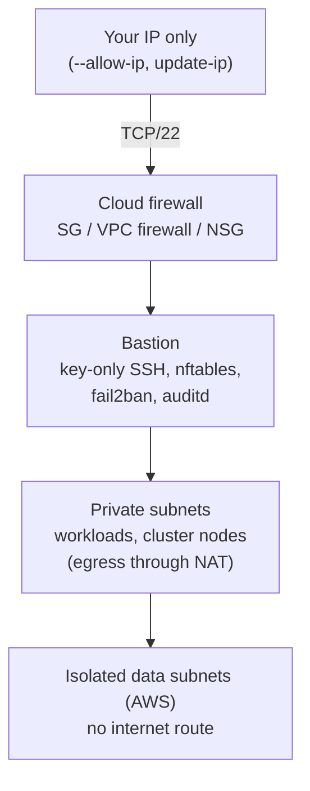

# Security, scans and FIPS

Secure defaults are the point of cloudseed. Every environment follows the same rules, every scan saves a report with
a verdict, and FIPS 140 mode is one switch for the whole environment.

## The security model



| Layer | What cloudseed does |
|---|---|
| **Network** | Only the bastion (and an optional VPN host) has a public address. The cloud firewall admits SSH from `--allow-ip` only: IPv4, never `0.0.0.0/0`, nothing wider than a /8 and at most two /8s. Workloads live in private subnets behind NAT; AWS adds an isolated data tier with no internet route. Default security groups are stripped (AWS); GCP and Azure end in explicit deny-all rules. |
| **Hosts** | Key-only SSH, no root login or passwords, latest LTS images, encrypted disks. AWS: IMDSv2 and SSM Session Manager. GCP: Shielded VM with its own least-privilege service account, project SSH keys blocked. Azure: Trusted Launch (secure boot + vTPM) and a managed identity. |
| **Provisioning** | Ansible hardens sshd (strong ciphers, `AllowUsers`, `MaxAuthTries`), installs fail2ban, auditd rules, sudo logging, kernel sysctls, unattended security updates and a default-deny nftables firewall. |
| **Logging** | VPC or subnet flow logs, NAT and firewall logs (AWS, GCP), Activity Log to Log Analytics (Azure), auditd on the hosts, and cloudseed's own audit trail of every command. |
| **Baseline** | AWS: CloudTrail (multi-region, validated, KMS), S3 account public-access block, IAM password policy, GuardDuty, Access Analyzer, EBS encryption by default, optional Security Hub. GCP: log retention and optional Data Access audit logs. Azure: optional Defender for Servers / Storage. |
| **State** | Remote state is versioned, encrypted, private and TLS-only. No secrets in state or outputs. |
| **Agents** | Credentials are stripped from agents and redacted from their output ([Agentic mode](agentic.md)). |

`cs help security` prints the full model; `cs explain bastion`, `cs explain network` and
`cs explain security-baseline` show exactly how each part is implemented.

### Keep SSH access current

When your public IP changes, SSH to the bastion times out. One command re-detects it and changes only the SSH rule:

```bash
cs update-ip aws --env dev
cs update-ip azure --env dev --allow-ip 198.51.100.4,203.0.113.0/24 --auto-approve
```

### Re-run the host hardening

Provisioning runs after every `setup` and is idempotent, so you can re-apply it any time, for example after changing
something by hand on a host:

```bash
cs provision aws --env dev                   # the bastion (and the VPN host)
cs provision aws --env dev --host vpn        # only the VPN host
cs provision vmware --env lab --host k8s     # the Kubernetes nodes of a local cluster
cs provision aws --env dev --no-firewall     # without the nftables host firewall (and remove an earlier one)
```

`--no-harden`, `--no-firewall` and `--no-tools` leave out a role; the first two also take back what an earlier run
installed. Supported host images: Amazon Linux 2023, Debian 12, Ubuntu 22.04 and 24.04 (including Ubuntu Pro FIPS).

### Baselines are singletons

Some settings belong to the whole account, project or subscription, so only one environment should manage them:

| Cloud | Setting | For the second environment |
|---|---|---|
| AWS | account-wide half: CloudTrail, S3 public-access block, password policy | `--var enable_account_baseline=false` |
| AWS | regional half: GuardDuty, Access Analyzer, EBS default encryption, Security Hub | one per account **and** region; an environment alone in another region adds `--var enable_regional_baseline=true` |
| GCP | `_Default` log retention, Data Access audit logs | `--var enable_project_baseline=false` |
| Azure | Defender plans | enable Defender in one environment only |

An existing GuardDuty detector or Security Hub is never adopted: pass `--var enable_guardduty=false` or
`--var enable_security_hub=false`. The [target references](../reference/aws.md) list every variable.

## Compliance and vulnerability scans

One command per scanner, each with a saved report and a verdict:

| Command | Scanner | What it checks |
|---|---|---|
| `cs scan cis` | kube-bench | CIS Kubernetes Benchmark with the right profile per distro (EKS, GKE, AKS, RKE2, kubeadm) |
| `cs scan kube` | kubescape | NSA and MITRE ATT&CK frameworks by default (add `--framework cis-v1.10.0`, `soc2`, ...) with a compliance score |
| `cs scan images` | trivy | vulnerabilities in running workloads: trivy-operator reports when installed, else a one-off scan |
| `cs scan host` | OpenSCAP + SCAP Security Guide | CIS level 1/2 server profile (or `--profile stig`) on the bastion, the VPN host and local Kubernetes nodes |
| `cs scan stig` | OpenSCAP, kube-bench | DISA STIG on Ubuntu 24.04, Ubuntu 22.04 with Ubuntu Pro and RHEL 8/9 hosts; EKS Kubernetes STIG |
| `cs scan cloud` | prowler | the newest CIS benchmark for your account, project or subscription |
| `cs scan fips` | cloudseed | end-to-end FIPS 140 verification (N/A on a non-FIPS environment) |
| `cs scan all` | all of the above | everything applicable, then a summary |

```bash
cs scan all
cs scan kube --framework nsa,mitre,cis-v1.10.0
cs scan host vmware --env lab --host bastion,k8s
cs scan stig aws --env prod --host vpn     # the Ubuntu VPN host (the AL2023 bastion has no STIG content)
cs scan cloud gcp --env prod
cs scan reports --last 5
```

- Reports go to `<workdir>/scans/<kind>-<run>.json` and `.md`, raw tool output to `<workdir>/scans/raw/`, and they
  show up in the web console's **Reports** view.
- The exit code is **1** when a verdict is FAIL or `scan all` could not run one of its scans, else 0, so scans can
  gate a CI pipeline.
- Hosts without content for a profile report n/a rather than failing: the Amazon Linux 2023 bastion and the Debian 12
  GCP bastion have no STIG content, and managed GKE / AKS / EKS nodes are not SSH-reachable (use `cis` there).
- kube-bench's policy checks run with a temporary read-only ClusterRole that cannot read Secrets, removed when the scan
  ends.
- Scanners (kubescape, trivy) are installed on first use.
- For continuous scanning, install the operators: `cs platform install trivy-operator kubescape-operator`.

## FIPS 140 mode

```bash
cs setup aws --env gov --region us-east-1 --var fips_mode=true
cs scan fips aws --env gov
```

FIPS mode is chosen **when the environment is created** (the SSH key type depends on it) and cannot be toggled later.
Everything cloudseed puts into the environment must then be FIPS-capable, or setup and install refuse it.

| Target | What changes |
|---|---|
| AWS | the provider and the S3 state backend use FIPS endpoints (so only us-east-1/2, us-west-1/2 and GovCloud); EKS nodes run Bottlerocket FIPS AMIs; the Amazon Linux 2023 bastion runs `fips-mode-setup --enable` and reboots; the Ubuntu VPN host attaches Ubuntu Pro and enables `fips-updates` |
| GCP | the bastion and VPN host use the Ubuntu Pro FIPS image (metered, no token needed); GKE nodes stay on Container-Optimized OS |
| Azure | the bastion and VPN host use the Ubuntu Pro FIPS marketplace image; the AKS node pool is created with `fips_enabled` |
| VMware | every VM attaches Ubuntu Pro and enables `fips-updates`, then reboots; the guest OS must be Ubuntu and Kubernetes must be RKE2 |
| All hosts | sshd and OpenVPN offer only FIPS-approved algorithms; environments get an RSA-4096 SSH key instead of ed25519 |

!!! warning "Refused in FIPS mode"
    kubeadm, Tailscale (WireGuard / ChaCha20) and ed25519 keys are refused. VMware, AWS with a VPN host and a GCP
    bastion on a plain Ubuntu image need `UBUNTU_PRO_TOKEN` (free for personal use): export it or store it with
    `cs creds set UBUNTU_PRO_TOKEN` before setup applies. A setup that would apply stops without it; `--dry-run` and
    `--plan-only` only warn.

### Platform items in a FIPS environment

| Tier | Items | Behaviour |
|---|---|---|
| compatible | controllers and services that terminate no user TLS with their own crypto | installed |
| tls-restricted | Envoy Gateway, ingress-nginx | installed with TLS 1.2+ and FIPS cipher suites; flagged by `cs scan fips` because the proxy crypto is not a validated module |
| crypto-restricted | cert-manager, sealed-secrets, velero, cloudnative-pg | installed (the platform needs them) and flagged |
| the rest | application stacks that ship their own crypto | refused unless `--force`, and listed by `cs scan fips` |

The [Platform catalog](../reference/platform-catalog.md) shows each item's tier. `cs scan fips` verifies the whole chain:
configuration, SSH key type, kernel `fips_enabled` and sshd / OpenSSL algorithms on every host, FIPS endpoints and node
images, the RKE2 build, the TLS policy on the shared Gateway and the FIPS capability of every installed item.

## Related

- Scenarios: [compliance scans](../scenarios/10-compliance-scans.md), [FIPS 140 mode](../scenarios/11-fips-140-mode.md)
- [Credentials](credentials.md): how cloudseed keeps secrets local
- `cs help security`, `cs help fips`, `cs help scan`, `cs explain fips`, `cs explain scan`
