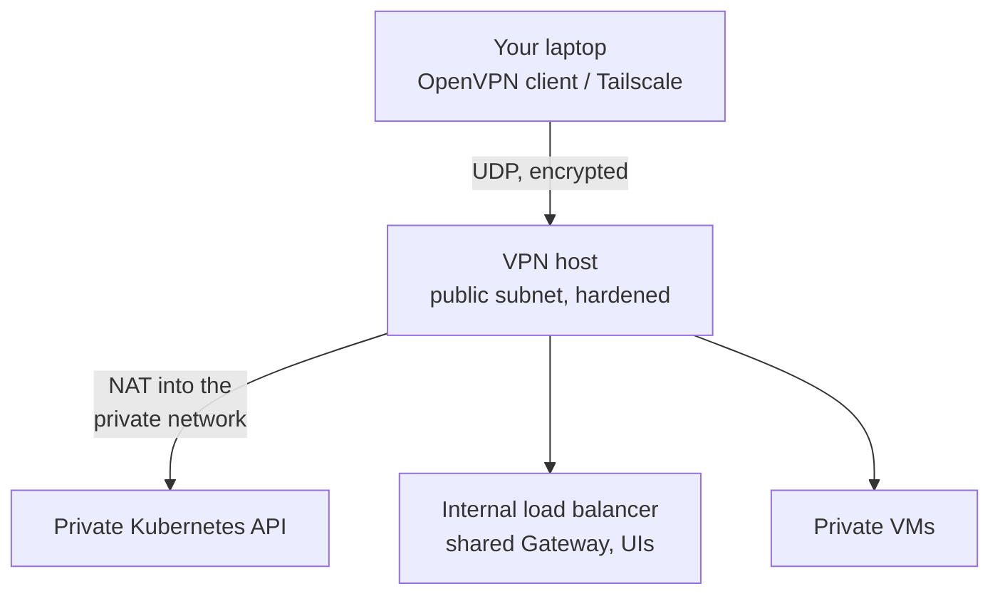

# Private access with a VPN

The bastion gives you SSH. A VPN gives your whole machine a route into the private network: private Kubernetes API
endpoints, internal load balancers and the platform UIs, as if you were inside the VPC.



The VPN host is available on the cloud targets (AWS, GCP, Azure). On VMware the private network is already reachable
from your machine, so no VPN is needed.

## Add a VPN host

```bash
cs setup aws --env dev --var enable_vpn=true                          # OpenVPN (default)
cs setup gcp --env dev --var enable_vpn=true --var vpn_type=tailscale # Tailscale subnet router
```

Like the bastion, the VPN host sits in the public subnet and is hardened by Ansible. Its firewall admits the VPN port
from anywhere (so clients can roam; only holders of a valid profile or tailnet key get in) and SSH only from your
allowed IPs and the bastion. Provisioning installs the VPN server.

## OpenVPN: self-contained

Ansible builds an Easy-RSA PKI on the host (EC keys, `tls-crypt`, a CRL). You issue one profile per person or device.

```bash
cs vpn add-user aws --env dev alice      # issue a certificate and download alice.ovpn
cs vpn users aws --env dev               # who has a profile
cs vpn connect aws --env dev             # start the OpenVPN client here (creates a profile if none exists)
cs vpn status aws --env dev
cs vpn disconnect aws --env dev
cs vpn revoke aws --env dev alice        # revoke the certificate: the profile stops working
```

- Profiles are written to `<workdir>/vpn/<name>.ovpn` with mode 0600. Any OpenVPN app can import them.
- `connect` installs the OpenVPN client after asking (with `-y`, run `cloudseed install openvpn` first or set
  `CLOUDSEED_AUTO_INSTALL=1`).
- `cs undo` after `add-user` revokes the new certificate; after `revoke` it issues it again.
- In FIPS mode, OpenVPN is restricted to AES-GCM suites.

## Tailscale: join your tailnet

With `vpn_type=tailscale` the host joins your tailnet as a **subnet router** advertising the environment's network.

1. Create an auth key in the Tailscale admin console and store it: `cs creds set TS_AUTHKEY`.
2. Run `setup` with `--var enable_vpn=true --var vpn_type=tailscale`.
3. Approve the advertised route in the Tailscale admin console.
4. Connect: `cs vpn connect gcp --env dev` (it runs `tailscale up --accept-routes`).

`add-user`, `users` and `revoke` are OpenVPN's: with Tailscale you manage devices in the tailnet. Tailscale's
coordination plane is a hosted service; the traffic itself is end-to-end encrypted. Tailscale is refused in FIPS mode.

## Reach private things

With the VPN connected:

```bash
cs k8s kubeconfig aws --env dev   # the private API endpoint answers directly, no SSH tunnel
cs kubectl get nodes
cs platform ui                    # URLs of the UIs on the internal Gateway
```

EKS: VPN users reach the cluster API with their own IAM identity, which needs an EKS access entry. Without a VPN,
`cs kubectl` still works: it tunnels through the bastion automatically.

## Operate

```bash
cs vpn provision aws --env dev           # re-run the VPN host's Ansible play
cs provision aws --env dev --host vpn    # the same, through provision
cs scan stig aws --env prod --host vpn   # DISA STIG scan of the Ubuntu VPN host
```

To remove the VPN host, run `setup` again with `--var enable_vpn=false`.

## Related

- [Scenario 12 - private access with a VPN](../scenarios/12-private-access-vpn.md)
- `cs help vpn`, `cs explain vpn`
