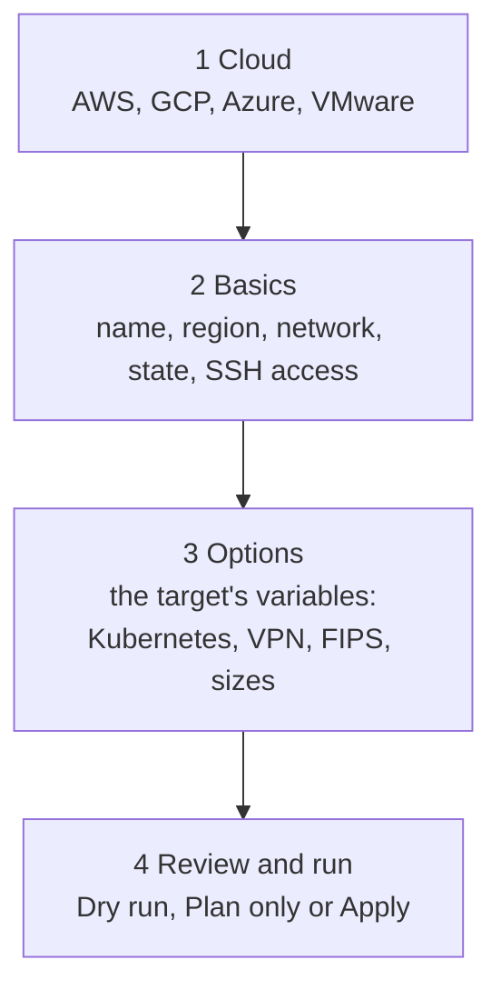

# Web console

One command starts a local, branded console where everything the CLI does is a form or a button:

```bash
cs enable ui
```

It opens `http://127.0.0.1:7434/` in your browser. The console runs as a user service (launchd on macOS,
`systemd --user` on Linux) so it survives terminal sessions, and it has no CDN, no telemetry and no external calls.

!!! info "Same commands, same logs"
    Every click runs the same `cloudseed ...` command you would type. Its output streams live into the **Activity**
    drawer, and it lands in the same audit trail and undo journal. Nothing the console does is invisible to the CLI,
    or the other way round.

## Start, reopen, stop

```bash
cs enable ui                 # start the service and open the console
cs enable ui --no-open       # start it without opening a browser
cs enable ui --port 7440     # use another port
cs ui                        # open it again (starts it if needed)
cs ui token                  # print the link with the access token
cs ui status                 # enabled? URL, health, service, log
cs ui logs -n 50             # the last lines of the server log
cs disable ui                # stop it and remove the user service
```

## Tour

The left rail holds ten views; the number keys `1` to `0` switch between them.

| View | What you do there |
|---|---|
| **Overview** (1) | Counters for environments, clusters, resources in state, running jobs, MCP and agent status; a card per environment with Status, Outputs and Troubleshoot. |
| **Create** (2) | The environment wizard: pick a cloud, answer the basics, set options, review and run. A live preview shows the exact command it will run. |
| **Environments** (3) | Each environment's card with Manage: Plan, Change settings, Update my IP, Re-provision, SSH command, Kubernetes, VPN user, Inventory, Cost, Use in terminal, Destroy. |
| **Platform** (4) | The whole catalog by group, with filters: install, plan or uninstall a group or a single item, read the status from the cluster, expose UIs, list and add nodes, run kubectl and helm. |
| **Resilience** (5) | Disaster recovery (DR drill, backup now, restore, schedules), chaos engineering (suites, your own workload, stop all) and security scans (everything, CIS, NSA / MITRE, vulnerabilities, host CIS, STIG, cloud CIS, FIPS). |
| **All actions** (6) | Every action as a card with a form: search it, fill it in, run it. The cards say whether an action is read-only or changes things. |
| **Reports** (7) | The DR drill, chaos and scan reports of the selected environment with their verdicts, plus the logs of its setup, apply and destroy runs. |
| **Agents & MCP** (8) | Turn agentic mode and the headliner brief on or off, pick the agent and model, run a task; deploy the MCP server, connect or disconnect each detected client, self-test, read the connection guide. |
| **Credentials** (9) | The local credential vault: set, replace or remove cloud keys and API tokens (masked, never shown back). |
| **Help** (0) | The CLI's help topics and the Explain search. |

The top bar holds the **⌘K search**, the **environment selector** (the environment the Platform, Resilience and
Reports views act on), **Undo**, the theme switch and the **Activity** drawer.

## Create an environment

The Create view is a four-step wizard built from each cloud's own setup questions, so it always matches the CLI.



- **Dry run** renders and validates the Terraform, **Plan only** shows the plan; both are always safe.
- **Apply** creates billable resources, so it needs the tick *"I understand Apply creates billable cloud resources"*.
- Your answers are kept while you look at other views; **Start over** clears them.
- Open an existing environment's **Change settings** and the same wizard edits it instead.

## Manage environments

On an environment card, **Manage** opens its actions. Read-only ones (Status, Outputs, Inventory, Cost,
Troubleshoot, Plan) run straight away. Anything that changes infrastructure or a host opens a dialog showing the
command that will run, and asks for an explicit tick before it starts. **Destroy** can also delete the remote state
storage and the local directory, each with its own checkbox.

**Use in terminal** makes that environment the CLI's current one (`cs env use`), so `cs kubectl` and friends act on it.

## Activity, undo and search

- **Activity** (the `` ` `` key) streams every job's output live, one tab per job. Closing the drawer does not stop a
  job.
- **Undo** lists the undo history with what each entry reverts. Undo the newest entry of a scope, or **Discard** a
  step that can never succeed. It is the same journal as `cs undo`, including global entries (agents, MCP, UI,
  credentials), which only you can undo.
- **⌘K** (Ctrl+K) searches actions, environments, catalog items and views, and every explainable name.

## "?" explains anything in place

A small **?** sits beside what the console shows: each view's title, every cloud, field and question of the wizard
(with the stack variable it sets), an environment's target, bastion, Kubernetes, VPN and FIPS chips, every platform
group and item, the resilience cards, reports, agents, MCP, credentials and every action card and dialog.

Hover or focus it for a one-line summary and the `cs explain ...` command. Click it to open the **Explain panel**: the
page `cs explain` prints, laid out as headings, bullets and copyable commands, with a Page | Terminal switch for the
exact CLI text. Related pages and "did you mean" suggestions are links (Back returns), and the footer copies the CLI
command or opens the page full width in Help. Press `?` to explain the view you are on. See
[Explain everywhere](explain.md).

## Keyboard

| Key | Action |
|---|---|
| ⌘K / Ctrl+K | search actions, environments, catalog items, views and explanations |
| `?` | explain the page you are on |
| `1` ... `0` | switch views |
| `` ` `` | show or hide Activity |
| ⌘B / Ctrl+B | collapse the sidebar |
| Esc | close the explanation, a dialog or the search |
| Alt+← | back, inside the Explain panel |

## Security model

The console is meant for you, on your machine:

- It listens on **127.0.0.1 only**.
- It is **token-protected**. The token arrives in the link (`cs ui token`) and is kept only in that browser tab: no
  cookie. API calls send it in the `X-CS-Token` header.
- The server checks the `Host` and `Origin` headers and forbids framing (`frame-ancestors 'none'`), which blocks DNS
  rebinding and clickjacking.
- It serves only environment logs and reports, never state files or keys.
- Credentials typed into the Credentials view go to the local vault (`~/.cloudseed/credentials.json`, mode 0600) and
  are only ever injected into cloudseed processes. Variables exported in your shell always win.
- Destructive actions need an explicit tick, and every action is in the audit trail.

!!! warning "Keep it local"
    Do not expose the port through a tunnel or reverse proxy. The token grants everything cloudseed can do on your
    machine, including destroying environments.

## Troubleshooting the console

| Symptom | Fix |
|---|---|
| "This console link is no longer valid" | the token changed: `cs ui token` prints the current link |
| The page does not load | `cs ui status`, then `cs ui logs -n 100`; `cs ui` restarts it if needed |
| Port 7434 is taken | `cs enable ui --port 7440` |
| An action fails | its output is in Activity and in the environment's log; `cs troubleshoot <cloud> --env <name>` explains it |

Related: [Scenario 15 - web console and FinOps](../scenarios/15-web-console-and-finops.md),
[`cs help ui`](../reference/commands.md#cloudseed-ui).
