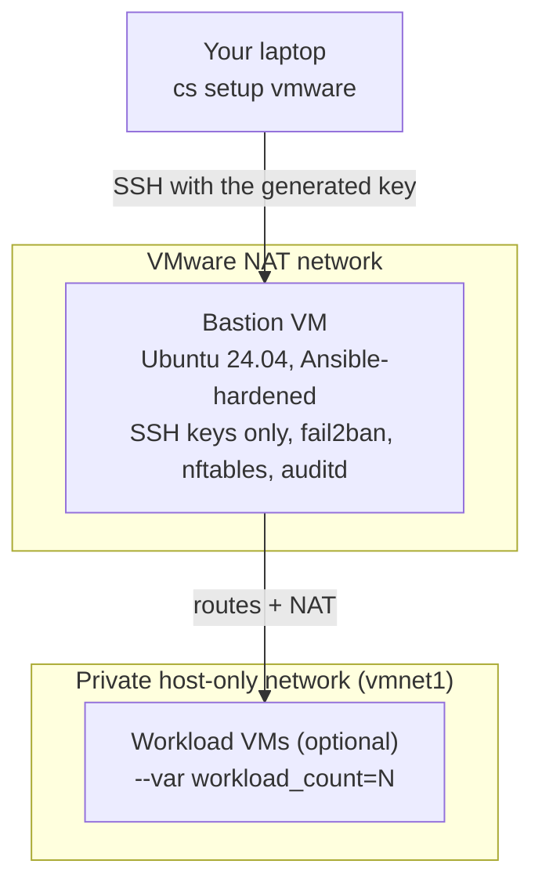

# 01 · Your first lab on your laptop

**Outcome:** a hardened bastion VM and a private network on your own machine in about ten minutes, built the same way
cloudseed builds a cloud landing zone. No cloud account, no bill.

!!! success "Verified live on VMware Fusion 13.6"
    Every command on this page is run end to end by
    [`tests/scenarios/01-first-lab-vmware.sh`](https://github.com/nimeshbuilds/cloudseed/blob/main/tests/scenarios/01-first-lab-vmware.sh)
    with `CLOUDSEED_LIVE=1`. Without it, the script runs the dry-run equivalent (render + `terraform validate`, no VMs).

| :material-clock-outline: Time | :material-cash: Cost | :material-signal-cellular-1: Level | :material-laptop: Runs on |
|---|---|---|---|
| ~15 min (first run downloads a ~600 MB cloud image) | $0, local | Beginner | macOS + Fusion Pro 13+, Linux + Workstation Pro 17+ |

## What you'll build



cloudseed renders a Terraform root for the environment, drives VMware through its own Terraform provider
(`providers/vmdesktop`), boots an official Ubuntu cloud image with cloud-init, then hardens the bastion with the same
Ansible roles it uses on AWS, GCP and Azure.

## Before you start

- **VMware Fusion Pro 13+** (macOS, Intel or Apple silicon) or **Workstation Pro 17+** (Linux). Both are free.
  Missing? `cs install vmrun` opens Broadcom's download page and installs the file you download.
- **cloudseed** on your `PATH` ([Installation](../getting-started/installation.md)): `./scripts/install.sh` links
  `cloudseed` and the short alias `cs`.
- About **2 vCPUs, 2 GB RAM and 20 GB disk** free for the bastion.
- Terraform, Go (builds the VMware provider once) and `qemu-img` are installed for you on first use, or up front with
  `cs install vmware`.

## Step 1: Check your machine

```bash
cs --version
cs doctor vmware
```

??? example "Expected output (abbreviated)"
    ```text
    cloudseed 0.2.0

      ━━ VMware Fusion / Workstation (local) ━━━━━━━━━━━━━━━━━━━━━━━━━━━━━━━━━━━━━━━━━━━━━━━━
        ✔ terraform    1.16.1                 /opt/homebrew/bin/terraform
        ✔ ssh-keygen   ok                     /usr/bin/ssh-keygen
        ✔ vmrun        installed              /Applications/VMware Fusion.app/Contents/Library/vmrun
        ✔ go           1.27.1                 /opt/homebrew/bin/go
        ✔ qemu-img     installed              /opt/homebrew/bin/qemu-img
      ✔ fusion 13.6.4 on darwin/arm64 (guests: arm64)
        ○ provider     not built              cloudseed install vmware-provider
    ```

A `○` line is fine: optional tools and the provider are installed when they are first needed. The overview of every
command is one keystroke away:

```bash
cs help
cs help quickstart
cs help vmware
```

## Step 2: Preview the environment (nothing is created)

`-y` takes the recommended default for every question, and `--dry-run` saves the configuration, renders the
Terraform root and runs `terraform validate`. No VM is created.

```bash
cs setup vmware -y --env first --dry-run
```

??? example "Expected output (abbreviated)"
    ```text
      ╭─ Environment vmware-first ─────────────────────────────────────────────╮
      │ Cloud               VMware Fusion / Workstation (local)                 │
      │ Infra name          cloudseed                                           │
      │ Network CIDR        VMware host-only vmnet (resolved at apply)          │
      │ SSH allowed from    this machine only (host-only/NAT)                   │
      │ State               local  ~/.cloudseed/envs/vmware-first/stack/...     │
      │ guest_os            ubuntu-24.04                                        │
      │ workload_count      0                                                   │
      │ bastion_cpus        2                                                   │
      │ bastion_memory_mb   2048                                                │
      ╰─────────────────────────────────────────────────────────────────────────╯
    $ terraform validate -no-color
    Success! The configuration is valid.

      ✔ Dry run complete. Rendered root(s): ~/.cloudseed/envs/vmware-first/stack
    ```

## Step 3: Build it

=== "Interactive"

    ```bash
    cs setup vmware --env first
    ```

    cloudseed asks each question (Enter keeps the recommended default), shows the Terraform plan and waits for your
    `yes`.

=== "Unattended (scripts, CI)"

    ```bash
    cs setup vmware -y --env first --auto-approve
    ```

    `-y` never prompts; `--auto-approve` applies the plan. Without it a non-interactive run stops after the plan
    with exit code 3.

What happens, in order: the provider is built once into `~/.cloudseed/providers`, the Ubuntu 24.04 cloud image is
downloaded and checksum-verified into `~/.cloudseed/images`, VMware's REST service (`vmrest`) is configured, Terraform
creates the bastion VM, cloud-init creates your user with the generated SSH key, and Ansible hardens the host
(sshd, fail2ban, unattended security updates, sysctls, auditd, a default-deny nftables firewall). Ansible runs on the
bastion itself, which is why its recap names `localhost`.

??? example "Expected output (abbreviated)"
    ```text
    Apply complete! Resources: 8 added, 0 changed, 0 destroyed.

      ╭─ vmware-first is ready ─────────────────────────────────────────╮
      │ ssh      cs ssh vmware --env first                               │
      │ status   cs status vmware --env first                            │
      │ change   cs setup vmware --env first --var key=value             │
      │ destroy  cs destroy vmware --env first                           │
      ╰──────────────────────────────────────────────────────────────────╯
    PLAY RECAP *********************************************************
    localhost                  : ok=...  changed=...  unreachable=0  failed=0
    ```

!!! tip "Want private workload VMs too?"
    Add `--var workload_count=2` (and optionally `--var guest_os=debian-12`). They live only on the private network
    and are reachable through the bastion. Re-running `setup` with new values updates the environment in place.

## Step 4: Look around

```bash
cs list
cs status vmware --env first
cs output vmware --env first
```

??? example "Expected output (addresses differ on your machine)"
    ```text
      ENV           NAME       REGION  STATE  BASTION IP     UPDATED (UTC)
      vmware-first  cloudseed  local   local  172.16.12.130  2026-09-24 19:11:06

      ╭─ State ─────────────────────────────────────╮
      │ Resources in state  8                        │
      │ Last change         apply  2026-09-24 19:21  │
      │ Provisioned         bastion (2026-09-24)     │
      ╰──────────────────────────────────────────────╯
      ╭─ Outputs ───────────────────────────────────╮
      │ bastion_public_ip    172.16.12.130           │
      │ bastion_private_ip   172.16.56.2             │
      │ private_cidr         172.16.56.0/24          │
      │ private_vmnet        vmnet1                  │
      │ ssh_user             you                     │
      ╰──────────────────────────────────────────────╯
    ```

For scripts, every output is also available as JSON:

```bash
cs output vmware --env first --json
```

## Step 5: SSH in

```bash
cs ssh vmware --env first
```

You land on the bastion as your own user, authenticated with the key cloudseed generated in
`~/.cloudseed/envs/vmware-first/ssh/`. Host keys are pinned per environment, never in `~/.ssh/known_hosts`.
A one-off remote command goes after `--`:

```bash
cs ssh vmware --env first -- uptime
cs ssh vmware --env first -- sudo sshd -T | grep -E '^(passwordauthentication|permitrootlogin) '
```

??? example "Expected output"
    ```text
    cloudseed bastion - authorized access only. All activity is logged.
     19:32:10 up 9 min,  1 user,  load average: 0.02, 0.05, 0.03
    cloudseed bastion - authorized access only. All activity is logged.
    permitrootlogin no
    passwordauthentication no
    ```

## Use an agent, MCP or the UI

Follow the same numbered steps and verification/cleanup conditions through your chosen interface. Start with the
[interface setup and coverage guide](interfaces-and-coverage.md); replace account/project/subscription and SSH
placeholders before any live request.

**Agent prompt:** “Create and inspect the VMware first lab from this walkthrough. Preview setup, show the planned resources, then use only the changes I authorize. Verify SSH access and inventory; keep destruction separate.”

**MCP starter:** `cloudseed_setup` with:

```json
{
  "cloud": "vmware",
  "env": "first",
  "dry_run": true
}
```

Use the matching tool for each remaining step in this page; the [command-to-tool map](interfaces-and-coverage.md#command-to-interface-map)
lists the tool family. Keep `vmware-first` selected. Preview first; add `confirm:true` only to the specific change
you have authorized. Host bootstrap, provider login and interactive applications retain their documented human steps.

**UI:** Create → VMware: use environment first and choose Dry run. Follow the numbered steps with Environments → first → status, output and inventory. Use All actions → SSH for noninteractive commands; an interactive login needs your terminal. Review Destroy separately.

## Verify it worked

```bash
cs inventory vmware --env first
cs troubleshoot vmware --env first
```

- `inventory` lists every managed resource with its identifiers and a history of the apply and the provisioning run.
- `troubleshoot` reads the audit log and the last failure (if any), checks that the bastion answers on port 22, the
  SSH key, the provisioning status, VMware, `vmrest` and free disk, and prints a finding per problem. A healthy lab
  ends with no red findings.
- The two `sshd -T` lines above prove the hardening ran: password logins and root logins are off.

## Clean up

=== "Interactive"

    ```bash
    cs destroy vmware --env first
    ```

    Shows the destroy plan and asks you to type the environment id (`vmware-first`).

=== "Unattended"

    ```bash
    cs destroy vmware -y --env first --purge --auto-approve
    ```

    `--purge` also removes the working directory. The audit trail and the final inventory are kept in
    `~/.cloudseed/logs/purged/vmware-first/`, and the configuration and keys stay in the undo journal, so
    `cs undo` could re-create the lab.

Only this environment's VMs and files are removed; the built-in host-only network (`vmnet1`) is kept for the next lab.

## What just happened

- **One environment = one working directory**: `~/.cloudseed/envs/vmware-first/` holds `config.json`, the SSH key,
  the rendered Terraform root (`stack/main.tf.json`), local state, VM files (`vms/`), logs and `inventory.json`.
- **Same shape as the cloud**: a bastion in front of a private network, reachable only from your machine, hardened by
  the Ansible roles used for cloud bastions. `cs explain vmware` shows how it is implemented, file by file:

```bash
cs explain vmware
cs explain provisioning
```

- Learn more: [Concepts](../getting-started/concepts.md) · [CLI guide](../guides/cli.md) ·
  [VMware reference](../reference/vmware.md) · [Troubleshooting](../guides/troubleshooting.md) ·
  [Explain index](../reference/explain-index.md)

## Next steps

- [02 · Secure AWS landing zone](02-aws-landing-zone.md): the same shape in the cloud, with remote state.
- [05 · Kubernetes on your laptop](05-local-kubernetes.md): add RKE2 control-plane and worker VMs to a lab.
- [15 · Web console and FinOps](15-web-console-and-finops.md): do all of this from a browser.
