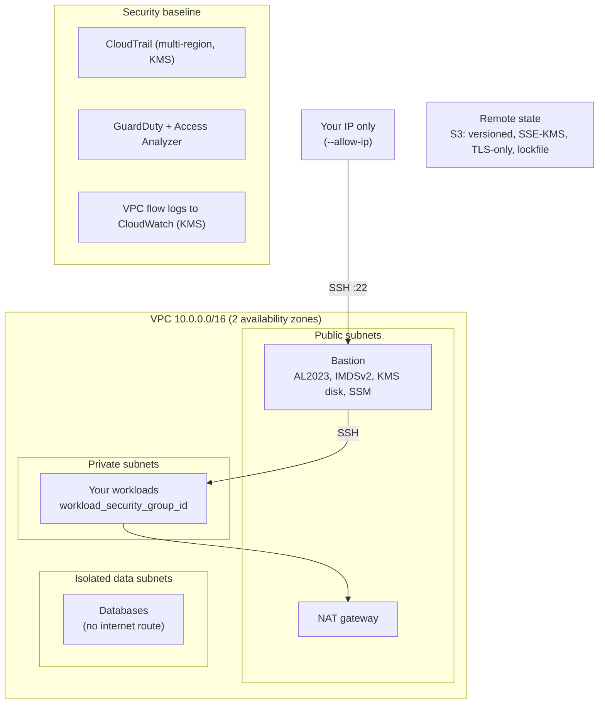

# 02 · Secure AWS landing zone

**Outcome:** a multi-AZ AWS VPC with public, private and isolated data subnets, a NAT gateway, encrypted flow logs, a
hardened bastion reachable only from your IP, an account security baseline (CloudTrail, GuardDuty, Access Analyzer)
and remote Terraform state in a hardened S3 bucket. Then you change it, update your IP, remove one part and tear it
all down.

!!! info "Verified with --dry-run (Terraform render + validate); run for real with cloud credentials"
    [`tests/scenarios/02-aws-landing-zone.sh`](https://github.com/nimeshbuilds/cloudseed/blob/main/tests/scenarios/02-aws-landing-zone.sh)
    runs every command below that works without an AWS account (render, `terraform validate`, estimate, status,
    targeted and full destroy of the rendered environment) and checks that the credentialed ones stop with a clear
    message. `--plan-only`, the apply, `ssh` and `update-ip` need your AWS credentials.

| :material-clock-outline: Time | :material-cash: Cost | :material-signal-cellular-2: Level | :material-cloud-outline: Needs |
|---|---|---|---|
| ~25 min (apply ~10 min) | ≈ $58 / month on-demand list prices (`cs finops estimate`), mostly the NAT gateway | Intermediate | An AWS account |

## What you'll build



## Before you start

- An **AWS account** and a way to log in: `aws configure`, `aws sso login`, or a named profile.
- **Terraform >= 1.10**. Step 1 shows three ways to get it.
- The account baseline (CloudTrail, S3 public-access block, IAM password policy) is a singleton: if another
  environment in this account already owns it, add `--var enable_account_baseline=false`
  ([AWS reference](../reference/aws.md)).

## Step 1: Get the tools (three ways)

=== "Install locally"

    ```bash
    cs deps install terraform aws
    cs deps status
    ```

    Homebrew when present; otherwise Terraform's official release (SHA256-verified) into `~/.cloudseed/bin` and the
    AWS CLI from AWS's installer. `cs deps install all` adds gcloud and az.

=== "Container (nothing installed)"

    ```bash
    cs deps image
    cs --runtime container setup aws -y --env prod --region us-west-2 --allow-ip 203.0.113.7 --dry-run
    cs deps runtime container
    ```

    Builds `cloudseed:local` (Terraform, aws, gcloud, az, kubectl, helm) with Docker or Podman. `--runtime container`
    runs one command in it; `deps runtime container` makes it the default. `CLOUDSEED_HOME`, `~/.aws`,
    `~/.config/gcloud` and `~/.azure` are mounted. Back to local tools: `cs deps runtime auto`.

=== "Single binary"

    ```bash
    cs deps bundle
    ```

    Builds `dist/cloudseed-<os>-<arch>`: the CLI, every Terraform module and a verified Terraform release in one file,
    for machines with nothing installed.

## Step 2: Log in and check

```bash
aws sso login --profile prod
cs creds set AWS_PROFILE=prod
cs doctor aws
```

`cs creds` is cloudseed's local vault (`~/.cloudseed/credentials.json`, 0600): its values are injected into every
cloudseed command, the web console and the MCP server, and never shown to AI agents. A variable exported in your shell
always wins.

??? example "Expected output (abbreviated)"
    ```text
      ✔ AWS_PROFILE stored in ~/.cloudseed/credentials.json

      ━━ Amazon Web Services ━━━━━━━━━━━━━━━━━━━━━━━━━━━━━━━━━━━━━━━━━━━━━━━━━━━━━━━━━━
        ✔ terraform              1.16.1                 /opt/homebrew/bin/terraform
        ✔ ssh-keygen             ok                     /usr/bin/ssh-keygen
        ✔ aws                    aws-cli/2.36.40        /opt/homebrew/bin/aws
    ```

## Step 3: See every knob

```bash
cs help variables aws
cs help outputs aws
cs explain state
```

Every variable of the stack can be set with `--var name=value` (`az_count`, `single_nat_gateway`,
`bastion_instance_type`, `enable_security_hub`, `enable_kubernetes`, `enable_vpn`, ...). The list is generated from
`terraform/aws/variables.tf`, so it is always current.

## Step 4: Preview offline with a dry run

Replace `203.0.113.7` with your public IP (or leave `--allow-ip` out: cloudseed detects it).

```bash
cs setup aws -y --env prod --region us-west-2 --allow-ip 203.0.113.7 --dry-run
```

??? example "Expected output (abbreviated)"
    ```text
      ╭─ Environment aws-prod ─────────────────────────────────────────────────────╮
      │ Cloud                     Amazon Web Services                               │
      │ Region                    us-west-2                                         │
      │ Network CIDR              10.0.0.0/16                                       │
      │ SSH allowed from          203.0.113.7/32                                    │
      │ State                     remote  (storage created on the first apply)      │
      │ enable_account_baseline   true                                              │
      │ az_count                  2                                                 │
      │ single_nat_gateway        true                                              │
      │ bastion_instance_type     t3.micro                                          │
      │ Tags                      Project=cloudseed, Environment=prod, Owner=you,   │
      │                           ManagedBy=cloudseed, CloudseedEnv=aws-prod, ...   │
      ╰─────────────────────────────────────────────────────────────────────────────╯
    $ terraform validate -no-color
    Success! The configuration is valid.

    $ terraform validate -no-color
    Success! The configuration is valid.

      ✔ Dry run complete. Rendered root(s): ~/.cloudseed/envs/aws-prod/stack, ~/.cloudseed/envs/aws-prod/bootstrap
    ```

Two roots are validated: `bootstrap` (the S3 state bucket, created first on apply) and `stack` (everything else).

## Step 5: Know the bill before you apply

```bash
cs finops estimate aws --env prod
```

??? example "Expected output"
    ```text
      ╭─ Estimate · aws-prod  (month, 730h at on-demand list prices) ─────────────╮
      │ bastion t3.micro x1           $7.59                                        │
      │ NAT gateway x1                $32.85                                       │
      │ public IPv4 x2                $7.30                                        │
      │ KMS key x1                    $1.00                                        │
      │ CloudTrail + logs (low vol.)  $3.00                                        │
      │ GuardDuty (low volume)        $5.00                                        │
      │ block storage ~10 GB          $0.80                                        │
      │                                                                            │
      │ total / month                 $57.54                                       │
      ╰────────────────────────────────────────────────────────────────────────────╯
    ```

## Step 6: Plan against your account, then apply

```bash
cs setup aws -y --env prod --region us-west-2 --allow-ip 203.0.113.7 --plan-only
```

A first `--plan-only` with remote state plans the state storage and the stack and creates nothing. When the plan looks
right, apply:

=== "Interactive"

    ```bash
    cs setup aws --env prod --region us-west-2 --allow-ip 203.0.113.7
    ```

=== "Unattended"

    ```bash
    cs setup aws -y --env prod --region us-west-2 --allow-ip 203.0.113.7 --auto-approve
    ```

The S3 state bucket (versioned, SSE-KMS, TLS-only, native lockfile) is created first, then the stack, then the
bastion is provisioned: the repository is copied over SSH and Ansible hardens it.

## Step 7: Look around

```bash
cs status aws --env prod
cs output aws --env prod --json | jq -r '.private_subnet_ids[]'
cs ssh aws --env prod
```

Put workloads in the private subnets and attach `workload_security_group_id`: it accepts SSH only from the bastion.

## Step 8: Your IP changed? One command

```bash
cs update-ip aws --env prod
cs update-ip aws --env prod --allow-ip 198.51.100.4,203.0.113.0/24 --auto-approve
```

Only the SSH-source change is applied; other pending changes stay untouched. Afterwards cloudseed checks that the
bastion answers again.

## Step 9: Change it, remove a part, bring it back

```bash
cs setup aws --env prod --var single_nat_gateway=false
cs plan aws --env prod
cs destroy aws --env prod --select
cs destroy aws --env prod --target module.stack.module.bastion
cs apply aws --env prod
```

- Re-running `setup` with a new `--var` updates the environment in place (here: one NAT gateway per AZ), always
  showing the plan first.
- `destroy --select` lists modules and resources as a numbered list; `--target` takes Terraform addresses. A partial
  destroy keeps the configuration, so `cs apply` re-creates what was removed.

## Use an agent, MCP or the UI

Follow the same numbered steps and verification/cleanup conditions through your chosen interface. Start with the
[interface setup and coverage guide](interfaces-and-coverage.md); replace account/project/subscription and SSH
placeholders before any live request.

**Agent prompt:** “Follow the AWS landing-zone walkthrough for prod in my approved region and account. Preview setup, estimate cost and show baseline ownership. After approval deploy, verify private routing and inspect the plan before any targeted deletion.”

**MCP starter:** `cloudseed_setup` with:

```json
{
  "cloud": "aws",
  "env": "prod",
  "region": "us-west-2",
  "allow_ip": "203.0.113.7/32",
  "dry_run": true
}
```

Use the matching tool for each remaining step in this page; the [command-to-tool map](interfaces-and-coverage.md#command-to-interface-map)
lists the tool family. Keep `aws-prod` selected. Preview first; add `confirm:true` only to the specific change
you have authorized. Host bootstrap, provider login and interactive applications retain their documented human steps.

**UI:** Create → AWS: enter prod, your region and real SSH source; choose Dry run first. Use Environments → prod for plan, status, IP update and destroy. Use All actions → FinOps for the estimate. Provider login and runtime installation are host bootstrap steps.

## Verify it worked

```bash
cs inventory aws --env prod
cs troubleshoot aws --env prod
```

- `inventory` lists every managed resource (VPC, subnets, NAT gateway, bastion, KMS key, CloudTrail, GuardDuty, ...)
  with its IDs, plus the history of applies and provisioning runs.
- `troubleshoot` checks credentials, that your current IP is still allowed and that the bastion answers on port 22.
- In the AWS console: CloudTrail shows the multi-region trail, GuardDuty is enabled, and every resource carries
  `ManagedBy=cloudseed` and `CloudseedEnv=aws-prod` tags.

## Clean up

```bash
cs destroy aws --env prod --purge-state --purge
```

A full destroy shows the plan and asks you to type `aws-prod`. `--purge-state` also deletes the S3 state bucket,
`--purge` the working directory (the audit trail is kept in `~/.cloudseed/logs/purged/aws-prod/`). The account-wide
S3 public-access block, IAM password policy and EBS default encryption stay in place: they protect the whole account.
Unattended: add `-y --auto-approve`.

## What just happened

- cloudseed rendered two Terraform roots from `terraform/aws-bootstrap` and `terraform/aws` into
  `~/.cloudseed/envs/aws-prod/`, created the state storage first, then the stack.
- Everything is named `cloudseed-prod-*` and tagged, so `reconcile` can tell this environment's resources from anyone
  else's (`cs explain reconcile`).
- Learn more: [Concepts](../getting-started/concepts.md) · [AWS reference](../reference/aws.md) ·
  [Dependencies and runtimes](../guides/dependencies-and-runtimes.md) · [Credentials](../guides/credentials.md) ·
  [Security and FIPS](../guides/security-and-fips.md) · [Explain index](../reference/explain-index.md)

```bash
cs explain reconcile
cs explain security-baseline
```

## Next steps

- [03 · GCP landing zone with private GKE](03-gcp-private-gke.md) and [04 · Azure with private AKS](04-azure-private-aks.md).
- [12 · Private access with OpenVPN or Tailscale](12-private-access-vpn.md): reach the private subnets from your laptop.
- [11 · FIPS 140 mode](11-fips-140-mode.md): the same landing zone with FIPS endpoints and a FIPS bastion.
