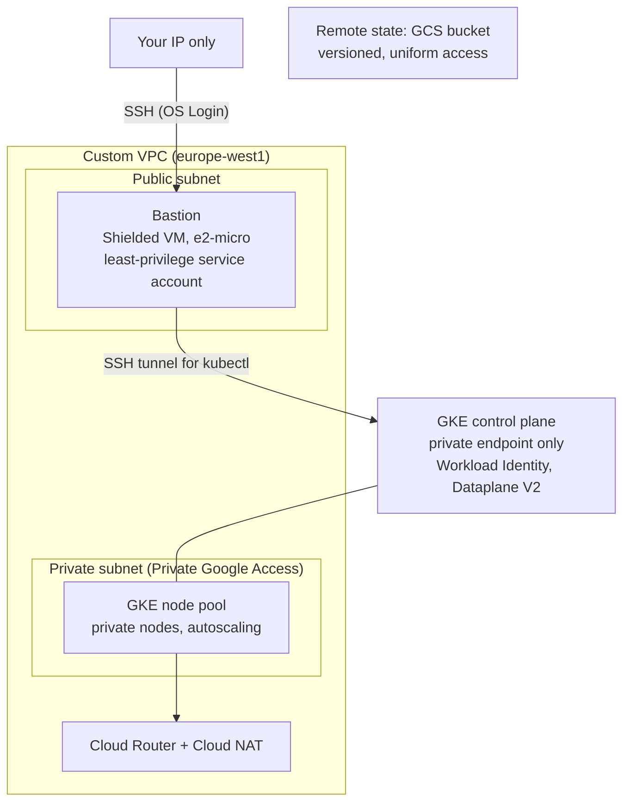

# 03 · GCP landing zone with a private GKE cluster

**Outcome:** a Google Cloud landing zone (custom VPC, Cloud NAT, logged firewall, a Shielded VM bastion that uses
OS Login) plus a private GKE cluster whose nodes and API endpoint have no public address. You reach the cluster
through an SSH tunnel that cloudseed opens for you, and scale its node pool with one command.

!!! info "Verified with --dry-run (Terraform render + validate); run for real with cloud credentials"
    [`tests/scenarios/03-gcp-private-gke.sh`](https://github.com/nimeshbuilds/cloudseed/blob/main/tests/scenarios/03-gcp-private-gke.sh)
    renders and validates the whole environment (state bucket + stack with GKE), checks the estimate, and checks
    that every cluster command stops with a clear message before the cluster exists. The apply and the cluster
    steps need a GCP project with billing.

| :material-clock-outline: Time | :material-cash: Cost | :material-signal-cellular-2: Level | :material-cloud-outline: Needs |
|---|---|---|---|
| ~30 min (GKE takes ~10 min) | ≈ $197 / month list price (`cs finops estimate`); the GKE free tier credits one zonal cluster | Intermediate | A GCP project with billing |

## What you'll build



## Before you start

- A **GCP project** with billing enabled. The examples use `my-gcp-project`: replace it with your project ID.
- The **gcloud CLI** with the GKE auth plugin, logged in twice: application-default credentials (Terraform) and your
  user login (OS Login registers the bastion's SSH key with your Google account).
- Your public IP for `--allow-ip` (`203.0.113.7` below), or leave the flag out and cloudseed detects it.

## Step 1: Install gcloud and log in

```bash
cs install gcloud gke-gcloud-auth-plugin
gcloud auth login
gcloud auth application-default login
cs doctor gcp
```

## Step 2: Read what you are about to build

```bash
cs help gcp
cs help variables gcp
cs explain kubernetes
```

`cs help gcp` is the GCP reference: the APIs it enables, the firewall rules, the bastion's service account, the GKE
defaults, and the gotchas (project-wide log retention, OS Login vs metadata keys, network tags).

## Step 3: Dry run with OS Login and GKE

```bash
cs setup gcp -y --env prod --project-id my-gcp-project --region europe-west1 --allow-ip 203.0.113.7 --var enable_os_login=true --var enable_kubernetes=true --dry-run
```

??? example "Expected output (abbreviated)"
    ```text
      ╭─ Environment gcp-prod ─────────────────────────────────────────────────────╮
      │ Cloud                          Google Cloud                                 │
      │ Region                         europe-west1                                 │
      │ Network CIDR                   10.0.0.0/16                                  │
      │ SSH allowed from               203.0.113.7/32                               │
      │ State                          remote  (storage created on the first apply) │
      │ project_id                     my-gcp-project                               │
      │ zone                           europe-west1-b                               │
      │ enable_os_login                true                                         │
      │ bastion_machine_type           e2-micro                                     │
      │ enable_kubernetes              true                                         │
      │ kubernetes_node_size           e2-standard-2                                │
      │ kubernetes_node_count          2                                            │
      │ kubernetes_public_endpoint     false                                        │
      ╰─────────────────────────────────────────────────────────────────────────────╯
    $ terraform validate -no-color
    Success! The configuration is valid.

    $ terraform validate -no-color
    Success! The configuration is valid.

      ✔ Dry run complete. Rendered root(s): ~/.cloudseed/envs/gcp-prod/stack, ~/.cloudseed/envs/gcp-prod/bootstrap
    ```

`europe-west1` has no `-a` zone, so cloudseed picks `europe-west1-b` for the bastion and the zonal cluster.

## Step 4: Check the monthly estimate

```bash
cs finops estimate gcp --env prod
```

??? example "Expected output"
    ```text
      ╭─ Estimate · gcp-prod  (month, 730h at on-demand list prices) ──────────╮
      │ bastion e2-micro x1        $6.13                                        │
      │ Cloud NAT (2 VMs)          $2.04                                        │
      │ Cloud NAT IP x1            $3.65                                        │
      │ GKE cluster fee (zonal)    $73.00                                       │
      │ GKE node e2-standard-2 x2  $97.82                                       │
      │ static external IP x1      $3.65                                        │
      │ block storage ~110 GB      $11.00                                       │
      │                                                                         │
      │ total / month              $197.30                                      │
      │                                                                         │
      │ The GKE free tier credits one zonal cluster per billing account          │
      │ ($74.40/month).                                                         │
      ╰─────────────────────────────────────────────────────────────────────────╯
    ```

## Step 5: Create it

=== "Interactive"

    ```bash
    cs setup gcp --env prod --project-id my-gcp-project --region europe-west1 --allow-ip 203.0.113.7 --var enable_os_login=true --var enable_kubernetes=true
    ```

=== "Unattended"

    ```bash
    cs setup gcp -y --env prod --project-id my-gcp-project --region europe-west1 --allow-ip 203.0.113.7 --var enable_os_login=true --var enable_kubernetes=true --auto-approve
    ```

The GCS state bucket comes first, then the APIs, network, bastion and cluster. With OS Login on, cloudseed registers
the environment's SSH key with your Google account (and removes it again on destroy when nothing else uses it).

## Step 6: Talk to the private cluster

```bash
cs k8s info gcp --env prod
cs kubectl gcp --env prod get nodes -o wide
cs k8s kubeconfig gcp --env prod
```

The API endpoint is private, so `cs kubectl` / `cs helm` open an SSH tunnel through the bastion on demand, with a
kubeconfig kept per environment. `k8s kubeconfig` adds the cluster to `~/.kube/config` and makes it the current
context (`cs undo` takes it out again). To keep a tunnel open for other tools:

```bash
cs k8s tunnel gcp --env prod
cs k8s untunnel gcp --env prod
```

## Step 7: SSH and scale

```bash
cs ssh gcp --env prod
cs node list gcp --env prod
cs node scale gcp --env prod --count 3 --max 5
```

`node scale` resizes the managed node pool through the GKE API and sets the autoscaler limits; `config.json` follows
the live pool, so a later `setup` keeps it.

## Verify it worked

```bash
cs status gcp --env prod
cs troubleshoot gcp --env prod
```

- `status` lists the outputs: `kubernetes_cluster_name`, `kubernetes_endpoint` (a private address),
  `workload_network_tag`, the bastion IP.
- `cs kubectl gcp --env prod get nodes` shows Ready nodes with no external IP.
- In the console, the cluster shows *Private cluster: enabled*, *Workload Identity: enabled*, *Dataplane V2*.

## Clean up

```bash
cs destroy gcp --env prod --purge-state --purge
```

Before GKE goes, cloudseed deletes what Kubernetes created in the cloud (load balancers of Gateways, Ingresses and
LoadBalancer Services, volumes with reclaim policy Delete), so nothing is billed after the destroy. Enabled APIs stay
on, and the project-wide `_Default` log retention stays at the value cloudseed set. Unattended: add
`-y --auto-approve`.

## What just happened

- The stack comes from `terraform/gcp` (modules `network`, `bastion`, `security-baseline`, `kubernetes`), the state
  bucket from `terraform/gcp-bootstrap`, both rendered into `~/.cloudseed/envs/gcp-prod/`.
- Private GKE plus a bastion tunnel means the Kubernetes API never has a public address, yet `cs kubectl` works from
  your laptop.
- Learn more: [GCP reference](../reference/gcp.md) · [Platform guide](../guides/platform.md) ·
  [Credentials](../guides/credentials.md) · [Explain index](../reference/explain-index.md)

```bash
cs explain target gcp
```

## Next steps

- [06 · A production platform in one command](06-platform-in-one-command.md): the same commands install ArgoCD,
  observability and Gateway API on GKE.
- [12 · Private access with a VPN](12-private-access-vpn.md): reach the private endpoint without a tunnel.
- [04 · Azure with private AKS](04-azure-private-aks.md).
