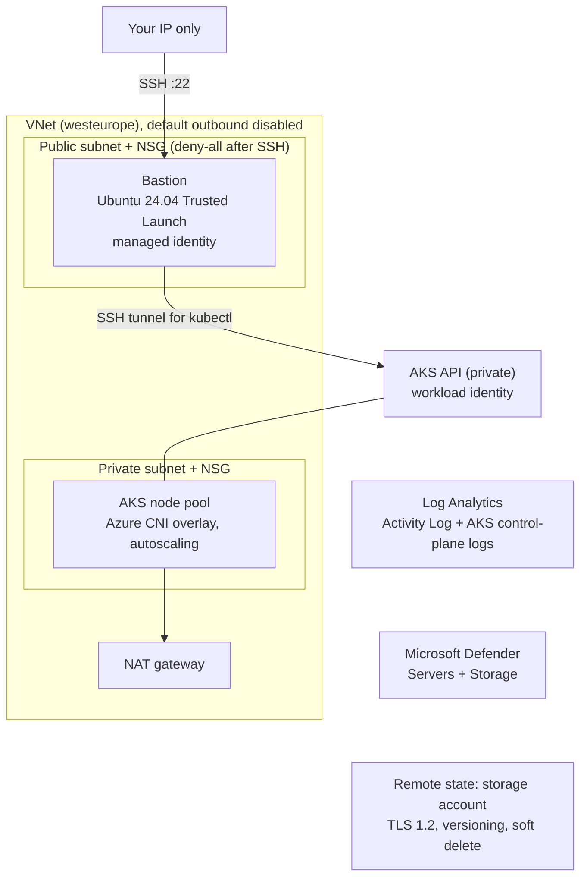

# 04 · Azure landing zone with private AKS

**Outcome:** an Azure VNet whose subnets have default outbound access disabled, deny-all NSGs, a NAT gateway, a
Trusted Launch bastion open only to your IP, the Activity Log in Log Analytics, Microsoft Defender for Servers and
Storage, and a private AKS cluster (Azure CNI overlay, workload identity, control-plane logs). Then you resize its
node pool and run a CIS scan of the subscription.

!!! info "Verified with --dry-run (Terraform render + validate); run for real with cloud credentials"
    [`tests/scenarios/04-azure-private-aks.sh`](https://github.com/nimeshbuilds/cloudseed/blob/main/tests/scenarios/04-azure-private-aks.sh)
    renders and validates both roots (state storage account + stack with AKS), checks the estimate, and checks that
    every cluster, node and scan command stops with a clear message before anything exists. The apply and the
    cluster steps need an Azure subscription.

| :material-clock-outline: Time | :material-cash: Cost | :material-signal-cellular-2: Level | :material-cloud-outline: Needs |
|---|---|---|---|
| ~30 min (AKS takes ~10 min) | ≈ $150 / month list price (`cs finops estimate`), Defender included | Intermediate | An Azure subscription |

## What you'll build



## Before you start

- An **Azure subscription** (the examples use the placeholder `00000000-0000-0000-0000-000000000000`: use yours from
  `az account show`).
- The **Azure CLI** logged in (`az login`); the azurerm provider reads that login. A service principal in `ARM_*`
  variables works too.
- Defender pricing is **subscription-wide**: turn it on in one environment per subscription only.

## Step 1: Install az and log in

```bash
cs install az
az login
az account show --query id -o tsv
cs doctor azure
```

## Step 2: Read the Azure reference

```bash
cs help azure
cs help variables azure
```

## Step 3: Dry run with AKS and Defender

```bash
cs setup azure -y --env prod --subscription-id 00000000-0000-0000-0000-000000000000 --region westeurope --allow-ip 203.0.113.7 --var enable_kubernetes=true --var enable_defender=true --dry-run
```

??? example "Expected output (abbreviated)"
    ```text
      ╭─ Environment azure-prod ───────────────────────────────────────────────────╮
      │ Cloud                       Microsoft Azure                                 │
      │ Region                      westeurope                                      │
      │ Network CIDR                10.0.0.0/16                                     │
      │ SSH allowed from            203.0.113.7/32                                  │
      │ State                       remote  (storage created on the first apply)    │
      │ subscription_id             00000000-0000-0000-0000-000000000000            │
      │ admin_username              azureuser                                       │
      │ bastion_vm_size             Standard_B1s                                    │
      │ enable_activity_log         true                                            │
      │ enable_defender             true                                            │
      │ enable_kubernetes           true                                            │
      │ kubernetes_node_size        Standard_B2s                                    │
      │ kubernetes_node_count       2                                               │
      │ kubernetes_public_endpoint  false                                           │
      ╰─────────────────────────────────────────────────────────────────────────────╯
    $ terraform validate -no-color
    Success! The configuration is valid.

    $ terraform validate -no-color
    Success! The configuration is valid.

      ✔ Dry run complete. Rendered root(s): ~/.cloudseed/envs/azure-prod/stack, ~/.cloudseed/envs/azure-prod/bootstrap
    ```

## Step 4: Check the monthly estimate

```bash
cs finops estimate azure --env prod
```

??? example "Expected output (abbreviated)"
    ```text
      │ bastion Standard_B1s x1          $7.59     │
      │ NAT gateway                      $32.85    │
      │ AKS node Standard_B2s x2         $60.74    │
      │ public IPv4 x2                   $7.30     │
      │ Log Analytics (low volume)       $5.00     │
      │ Defender for Servers P2 x1       $14.60    │
      │ Defender for Storage x1 account  $10.00    │
      │ block storage ~158 GB            $11.85    │
      │                                            │
      │ total / month                    $149.93   │
    ```

## Step 5: Create it

=== "Interactive"

    ```bash
    cs setup azure --env prod --subscription-id 00000000-0000-0000-0000-000000000000 --region westeurope --allow-ip 203.0.113.7 --var enable_kubernetes=true --var enable_defender=true
    ```

=== "Unattended"

    ```bash
    cs setup azure -y --env prod --subscription-id 00000000-0000-0000-0000-000000000000 --region westeurope --allow-ip 203.0.113.7 --var enable_kubernetes=true --var enable_defender=true --auto-approve
    ```

## Step 6: Use the private cluster

```bash
cs k8s info azure --env prod
cs kubectl azure --env prod get nodes
cs helm azure --env prod list -A
```

The AKS API is private: `cs kubectl` and `cs helm` tunnel through the bastion automatically, with a kubeconfig kept
per environment.

## Step 7: Resize the node pool

```bash
cs node list azure --env prod
cs node add azure --env prod --count 1
cs node scale azure --env prod --count 3 --max 5
cs node remove aks-default-30114873-vmss000002 azure --env prod
```

- `add` raises the pool (and its autoscaler minimum) and waits for the new node to be Ready.
- `scale` sets the size and the autoscaler limits.
- `remove` drains the node you name (take it from `node list`) and deletes exactly that machine.

Every node change is an undo point: `cs undo azure --env prod` scales the pool back.

## Verify it worked

```bash
cs status azure --env prod
cs scan cloud azure --env prod
```

- `status` shows `kubernetes_cluster_name`, the private `kubernetes_endpoint`, `nat_public_ip` and the bastion IP.
- `scan cloud` runs prowler's newest CIS benchmark against the subscription and saves JSON and Markdown reports under
  `~/.cloudseed/envs/azure-prod/scans/`.
- In the portal: Defender for Cloud shows the *Servers* and *Storage* plans on, and the Activity Log flows into the
  environment's Log Analytics workspace.

## Clean up

```bash
cs destroy azure --env prod --purge-state --purge
```

Defender plans and the Ubuntu Pro FIPS image terms are subscription-wide and stay in place (no longer managed). AKS
keeps what Kubernetes created in its own node resource group, which goes with the cluster. Unattended: add
`-y --auto-approve`.

## What just happened

- Two roots rendered from `terraform/azure-bootstrap` and `terraform/azure` into `~/.cloudseed/envs/azure-prod/`.
- Subnets are created with default outbound access disabled, so the only way out is the NAT gateway; the NSGs end
  with deny-all rules.
- Learn more: [Azure reference](../reference/azure.md) · [Security and FIPS](../guides/security-and-fips.md) ·
  [Resilience and scans](../guides/resilience.md) · [Explain index](../reference/explain-index.md)

```bash
cs explain target azure
cs explain scan
```

## Next steps

- [10 · Compliance scans](10-compliance-scans.md): CIS, NSA/MITRE, CVEs, STIG and FIPS on your cluster and hosts.
- [08 · Backups you can trust](08-backups-you-can-trust.md): on AKS, Velero gets a Blob container and a workload
  identity created for it.
- [13 · Day-2 operations](13-day-2-operations.md).
