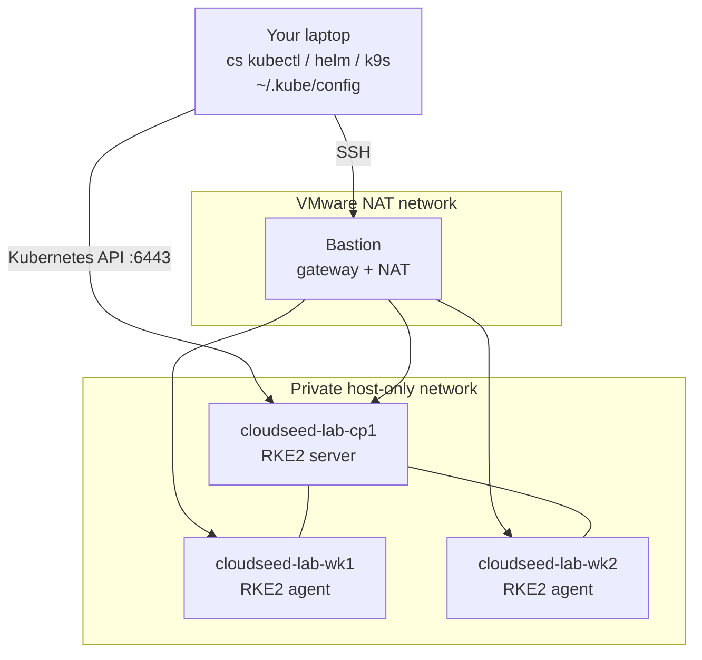

# 05 · Kubernetes on your laptop

**Outcome:** a three-node Kubernetes cluster (RKE2: one control plane, two workers) on private VMs behind a hardened
bastion, on your own machine; your kubeconfig pointing at it; `cs kubectl`, `cs helm` and `cs k9s` working against it;
and a first workload running. Scenarios 06 to 10 and 13 build on this cluster.

!!! success "Verified live on VMware Fusion 13.6"
    [`tests/scenarios/05-local-kubernetes.sh`](https://github.com/nimeshbuilds/cloudseed/blob/main/tests/scenarios/05-local-kubernetes.sh)
    runs every command below with `CLOUDSEED_LIVE=1`. Without it, it renders and validates the cluster (RKE2 and
    kubeadm), and checks that each cluster command says the cluster is not created yet.

| :material-clock-outline: Time | :material-cash: Cost | :material-signal-cellular-2: Level | :material-laptop: Runs on |
|---|---|---|---|
| ~35 min (the cluster itself ~25 min) | $0, local | Intermediate | ~8 vCPUs, 14 GB RAM, 60 GB disk free |

## What you'll build



The VMs are named `<name>-<env>-cp1`, `-wk1`, ... (with the default name: `cloudseed-lab-cp1`). They sit on VMware's
host-only network, which your machine reaches directly, so the API needs no tunnel.

## Before you start

- Everything from [01 · Your first lab](01-first-lab-vmware.md), and no other VMware environment holding VMs:
  every environment without `--cidr` shares the built-in host-only network, one at a time.
- Resources: bastion 2 vCPU / 2 GB, each node 2 vCPU / 4 GB / 40 GB (thin-provisioned). Change them with
  `--var kubernetes_cpus=4 --var kubernetes_memory_mb=8192`.

## Step 1: Install the Kubernetes tools

```bash
cs doctor vmware
cs install kubernetes
cs install k9s
```

`install kubernetes` is kubectl + helm. Anything missing later is also offered on first use.

## Step 2: Preview the cluster

```bash
cs help variables vmware
cs setup vmware -y --env lab --var enable_kubernetes=true --dry-run
```

??? example "Expected output (abbreviated)"
    ```text
      ╭─ Environment vmware-lab ───────────────────────────────────────────────╮
      │ enable_kubernetes          true                                         │
      │ kubernetes_distro          rke2                                         │
      │ kubernetes_version         (not set)                                    │
      │ kubernetes_cis_profile     false                                        │
      │ kubernetes_control_planes  1                                            │
      │ kubernetes_workers         2                                            │
      │ kubernetes_cpus            2                                            │
      │ kubernetes_memory_mb       4096                                         │
      │ kubernetes_disk_gb         40                                           │
      ╰─────────────────────────────────────────────────────────────────────────╯
    $ terraform validate -no-color
    Success! The configuration is valid.

      ✔ Dry run complete. Rendered root(s): ~/.cloudseed/envs/vmware-lab/stack
    ```

## Step 3: Build the cluster

=== "RKE2 (default)"

    ```bash
    cs setup vmware --env lab --var enable_kubernetes=true
    ```

=== "RKE2, unattended"

    ```bash
    cs setup vmware -y --env lab --var enable_kubernetes=true --auto-approve
    ```

=== "kubeadm instead"

    ```bash
    cs setup vmware -y --env lab --var enable_kubernetes=true --var kubernetes_distro=kubeadm --dry-run
    cs setup vmware --env lab --var enable_kubernetes=true --var kubernetes_distro=kubeadm
    ```

    Upstream kubeadm with containerd and Flannel (it needs 2 vCPUs and 2048 MB per node). Choose the distro when
    you create the cluster.

Terraform creates the bastion and the node VMs; then Ansible, run from your machine
(`ansible/kubernetes.yml`, installed into `~/.cloudseed/venv-ansible` on first use), installs RKE2 on the control
plane, joins the workers, writes the kubeconfig to `~/.cloudseed/envs/vmware-lab/k8s/kubeconfig` and waits until
every node is Ready (at most 10 minutes), so the cluster is usable when the command ends. RKE2's stable
channel is used unless you pin `--var kubernetes_version=v1.36.4+rke2r1`; `--var kubernetes_cis_profile=true` turns on
RKE2's CIS hardening profile.

## Step 4: Make it the current environment

```bash
cs env use vmware-lab
cs env
```

Cluster commands (`node`, `platform`, `kubectl`, `helm`, `k9s`, `dr`, `chaos`, `scan`) now act on this cluster
without `vmware --env lab`. `cs env clear` forgets the choice.

## Step 5: Connect your tools

```bash
cs k8s info vmware --env lab
cs k8s kubeconfig vmware --env lab
kubectl get nodes -o wide
cs kubectl get pods -A
cs helm list -A
cs k9s
```

- `k8s kubeconfig` merges the cluster into `~/.kube/config` and makes it the current context, so plain `kubectl`
  works too (`cs undo` takes the entries out again and restores your previous context).
- `cs kubectl` / `cs helm` / `cs k9s` always use the environment's own kubeconfig, whatever your current context is.

??? example "Expected output of `kubectl get nodes` (the version is RKE2's current stable release)"
    ```text
    NAME                STATUS   ROLES                       AGE   VERSION
    cloudseed-lab-cp1   Ready    control-plane,etcd          14m   v1.36.4+rke2r1
    cloudseed-lab-wk1   Ready    <none>                      11m   v1.36.4+rke2r1
    cloudseed-lab-wk2   Ready    <none>                      11m   v1.36.4+rke2r1
    ```

## Step 6: Run a first workload

This small web app is what scenarios 08 (backup and restore) and 09 (chaos against your own workload) use.

```bash
cs kubectl create namespace shop
cs kubectl -n shop create deployment web --image=nginxinc/nginx-unprivileged:1.27-alpine --replicas=3 --port=8080
cs kubectl -n shop expose deployment web --port=8080
cs kubectl -n shop rollout status deployment/web --timeout=180s
cs kubectl -n shop get pods -o wide
```

Everything after `cs kubectl` goes to kubectl as typed. Mutating calls are recorded as undo points: a create is
undone by deleting exactly what it created.

## Verify it worked

```bash
cs node list
cs troubleshoot vmware --env lab
```

- `node list` shows `cloudseed-lab-cp1`, `-wk1`, `-wk2` as Ready, with their roles and private IPs.
- `kubectl -n shop get pods` shows three `web-...` pods Running, spread over the workers.
- `troubleshoot` ends without red findings.

## Clean up

Keep the cluster if you continue with scenarios 06 to 10 and 13. When you are done:

```bash
cs destroy vmware --env lab
cs env clear
```

Unattended: `cs destroy vmware -y --env lab --purge --auto-approve`.

## What just happened

- `enable_kubernetes=true` added the `kubernetes` module of `terraform/vmware` (control-plane and worker VMs at fixed
  private IPs: control planes from `.20`, workers from `.40`).
- Ansible's Kubernetes play hardened the nodes and installed RKE2 (Canal CNI) or kubeadm (containerd + Flannel).
  Nodes are deliberately not auto-updated: upgrades are yours to schedule.
- One kubeconfig per environment, merged on request: several clusters never step on each other.
- Learn more: [Platform guide](../guides/platform.md) · [VMware reference](../reference/vmware.md) ·
  [CLI guide](../guides/cli.md) · [Explain index](../reference/explain-index.md)

```bash
cs explain kubernetes
cs help k8s
```

## Next steps

- [06 · A production platform in one command](06-platform-in-one-command.md) on this cluster.
- [13 · Day-2 operations](13-day-2-operations.md): add and remove nodes.
- [03 · Private GKE](03-gcp-private-gke.md): the same commands against a managed cluster.
