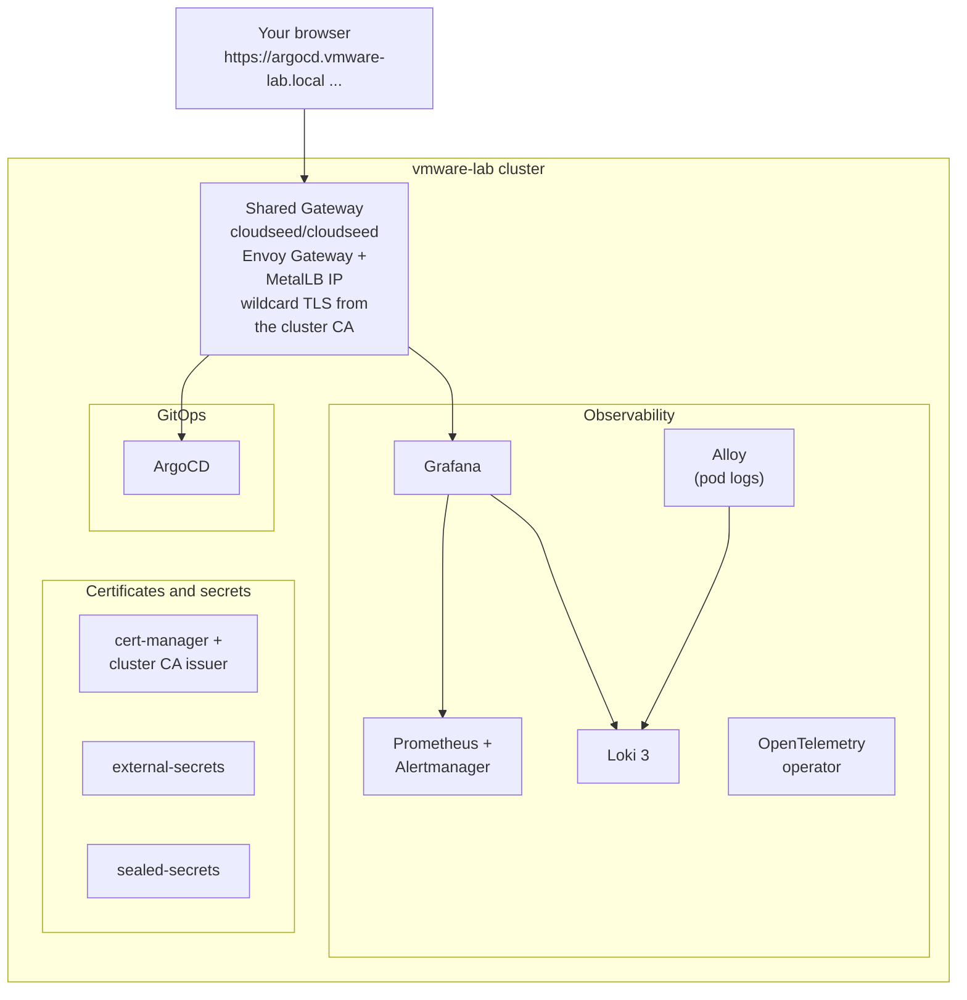

# 06 · A production platform in one command

**Outcome:** the `basek8s` group on your cluster: GitOps (ArgoCD), metrics and dashboards (kube-prometheus-stack),
logs (Loki 3 + Alloy), OpenTelemetry, Gateway API with Envoy Gateway behind a private load balancer, cert-manager
with a cluster CA, external-secrets and sealed-secrets. Every web UI reachable over TLS, a CI pipeline template, and
an uninstall you can undo.

!!! success "Verified live on VMware Fusion 13.6"
    [`tests/scenarios/06-platform-in-one-command.sh`](https://github.com/nimeshbuilds/cloudseed/blob/main/tests/scenarios/06-platform-in-one-command.sh)
    installs `basek8s` on the scenario 05 cluster with `CLOUDSEED_LIVE=1`. Without it, it renders the cluster, runs
    the catalog commands that work offline (`list`, `info`, `plan`, `template`) and checks the rest say the cluster
    is not created yet.

| :material-clock-outline: Time | :material-cash: Cost | :material-signal-cellular-2: Level | :material-kubernetes: Needs |
|---|---|---|---|
| ~30 min (the install ~15 min) | $0 on the local cluster | Intermediate | The cluster from [05](05-local-kubernetes.md) (or EKS / GKE / AKS) |

## What you'll build



On a cloud cluster the same group gets an internal load balancer instead of MetalLB, and items that need cloud
identities (external-secrets, external-dns, the AWS load balancer controller) get them from the environment's
Terraform stack automatically.

## Before you start

- A cluster managed by cloudseed and selected as current: [05 · Kubernetes on your laptop](05-local-kubernetes.md)
  ends with `cs env use vmware-lab`.
- `kubectl` and `helm` (`cs install kubernetes`).

## Step 1: Browse the catalog

```bash
cs platform list
cs platform list --charts
cs platform info basek8s
cs platform info kube-prometheus-stack
cs explain platform
```

`list` shows every group and item with its install state; `--charts` adds where each one comes from (Helm repo,
OCI registry, manifest URL) and the version pinned for this cloudseed release. Nothing is vendored.

## Step 2: Plan before touching the cluster

```bash
cs platform plan basek8s
```

??? example "Expected output (abbreviated)"
    ```text
      ╭─ Plan for vmware-lab (vmware/rke2) ────────────────────────────────────────────╮
      │ ✔ metrics-server         built into the distro - skip  Resource metrics API     │
      │       ↳ already provided by rke2 out of the box                                 │
      │ + gateway-api            install   Kubernetes Gateway API CRDs (experimental…   │
      │ + cert-manager           install   X.509 certificates for in-cluster services…  │
      │ + cert-manager-issuer    install   Cluster CA issuer (cert-manager) for TLS on… │
      │ + metallb                install   LoadBalancer IPs on the private network…     │
      │ + envoy-gateway          install   Envoy Gateway: the cluster's Gateway API…    │
      │ + argocd                 install   GitOps continuous delivery                   │
      │ + kube-prometheus-stack  install   Prometheus, Alertmanager, Grafana, node/kube…│
      │ + alloy                  install   Grafana Alloy: collects every pod's logs…    │
      │ + local-path-provisioner install   Default StorageClass for local clusters…     │
      │ + loki                   install   Log aggregation (Loki 3, single binary…      │
      │ + opentelemetry-operator install   OpenTelemetry operator (collectors…          │
      │ + external-secrets       install   Sync secrets from AWS/GCP/Azure secret…      │
      │ + sealed-secrets         install   Encrypt secrets so they can live in git      │
      ╰─────────────────────────────────────────────────────────────────────────────────╯
    ```

Dependencies come first (cert-manager before the issuer, MetalLB before the Gateway), components the distro already
ships are skipped (RKE2 has metrics-server), and nothing is ever installed twice.

## Step 3: Install it

=== "Interactive"

    ```bash
    cs platform install basek8s
    ```

=== "Unattended"

    ```bash
    cs -y platform install basek8s --auto-approve
    ```

??? example "Expected output (last lines)"
    ```text
      ✔ sealed-secrets installed
      ╭─ Done ────────────────────────────────────────────────────────────────╮
      │ installed  gateway-api, cert-manager, cert-manager-issuer, metallb,   │
      │            envoy-gateway, argocd, kube-prometheus-stack, alloy, ...   │
      │ status     cs platform status                                         │
      │ pods       cs kubectl get pods -A                                     │
      │ web UIs    cs platform ui                                             │
      │ k9s        cs k9s                                                     │
      ╰───────────────────────────────────────────────────────────────────────╯
    ```

Values are adapted to the target and distro, chart versions are pinned, and the install is idempotent: run it again
and installed items are skipped (`--upgrade` re-applies them at the pinned version).

## Step 4: Open the web UIs

```bash
cs platform status
cs platform ui
```

`platform ui` attaches an HTTPRoute to the shared Gateway for every installed UI and prints the URLs and where the
credentials are, then how to reach them:

??? example "Expected output (abbreviated; the IP comes from MetalLB)"
    ```text
      ╭─ UIs on vmware-lab  ·  ingress 172.16.56.100  ·  TLS by cert-manager (cloudseed-ca) ─╮
      │ argocd                 https://argocd.vmware-lab.local   admin / kubectl -n argocd ... │
      │ kube-prometheus-stack  https://kube-prometheus-stack.vmware-lab.local                  │
      │                        admin / grafana_password (platform/secrets.json)                │
      ╰────────────────────────────────────────────────────────────────────────────────────────╯
      ╭─ Reach them ───────────────────────────────────────────────────────────────────────────╮
      │ route    the ingress IP is on the host-only network: reachable from this machine        │
      │ dns      add to /etc/hosts:  172.16.56.100 argocd.vmware-lab.local ...                  │
      │ trust    cs kubectl -n cert-manager get secret cloudseed-root-ca ... > cloudseed-ca.crt │
      ╰────────────────────────────────────────────────────────────────────────────────────────╯
    ```

Import the cluster CA once and the certificates are trusted (they are valid for ten years):

```bash
cs kubectl -n cert-manager get secret cloudseed-root-ca -o jsonpath='{.data.ca\.crt}' | base64 -d > cloudseed-ca.crt
```

## Step 5: Add a CI pipeline to your app repository

```bash
cs platform template gitlab-ci
```

Writes `.gitlab-ci.yml` into the current directory: build, test, a Trivy image scan, release, and an ArgoCD deploy
stage. `cs undo` removes it again (a copy is kept if you edited it since).

## Step 6: Remove an item, then undo it

```bash
cs platform uninstall sealed-secrets
cs undo
```

`uninstall` never removes shared dependencies (cert-manager, the Gateway API, MetalLB) and refuses items another
installed item still needs. `cs undo` re-installs what the uninstall removed. Unattended: add `--auto-approve` to both.

## Use an agent, MCP or the UI

Follow the same numbered steps and verification/cleanup conditions through your chosen interface. Start with the
[interface setup and coverage guide](interfaces-and-coverage.md); replace account/project/subscription and SSH
placeholders before any live request.

**Agent prompt:** “On vmware-lab, follow the platform walkthrough. Inspect and plan basek8s first, explain dependencies and private UI access, then install only approved items and verify their releases. Show undo history before a rollback.”

**MCP starter:** `cloudseed_platform` with:

```json
{
  "cloud": "vmware",
  "env": "lab",
  "action": "plan",
  "items": [
    "basek8s"
  ]
}
```

Use the matching tool for each remaining step in this page; the [command-to-tool map](interfaces-and-coverage.md#command-to-interface-map)
lists the tool family. Keep `vmware-lab` selected. Preview first; add `confirm:true` only to the specific change
you have authorized. Host bootstrap, provider login and interactive applications retain their documented human steps.

**UI:** Select vmware-lab → Platform. Choose basek8s, inspect items and Plan before Install. Follow catalog UI links after the install; use All actions → Helm for the verification commands and Undo for the recorded change.

## Verify it worked

```bash
cs kubectl get pods -A
cs helm list -A
cs kubectl get gateway -A
```

- Every pod in `argocd`, `monitoring` (Prometheus, Grafana, Loki, Alloy), `cert-manager`, `envoy-gateway-system`,
  `metallb-system`, `opentelemetry-operator-system` and `external-secrets` is Running (sealed-secrets runs in
  `kube-system`).
- The Gateway `cloudseed/cloudseed` is `Programmed` with an address from the MetalLB pool.
- Grafana answers at `https://kube-prometheus-stack.vmware-lab.local` and shows the cluster dashboards; logs from
  every pod are searchable through the Loki data source.

## Clean up

```bash
cs platform uninstall basek8s
```

This removes every item of the group, cert-manager, the Gateway API, MetalLB and local-path included, unless another
installed item still needs one: then it stops and names it (for example `local-path-provisioner is still needed by
minio`). Namespaces left empty are deleted; namespaces that still hold objects (for example the cluster CA secret in
`cert-manager`) are kept. Unattended: add `--auto-approve`. To remove everything, destroy the cluster
(`cs destroy vmware --env lab`), or keep it for scenarios 07 to 10.

## What just happened

- The catalog lives in `cloudseed/platform.py`: each item records its upstream source, a pinned version, its
  namespace, its dependencies and per-target values. `cs explain platform <item>` shows all of it.
- Generated passwords (Grafana, MinIO, ...) are in `~/.cloudseed/envs/vmware-lab/platform/secrets.json` (0600).
- Every install and uninstall is an undo point for `cs undo`.
- Learn more: [Platform guide](../guides/platform.md) · [Platform catalog](../reference/platform-catalog.md) ·
  [Undo and audit](../guides/undo-and-audit.md) · [Explain index](../reference/explain-index.md)

```bash
cs explain platform basek8s
cs explain group security
```

## Next steps

- [07 · Data and AI stack](07-data-and-ai-stack.md): MinIO, Postgres, Kafka, Ollama + Open WebUI.
- [08 · Backups you can trust](08-backups-you-can-trust.md): Velero with a restore drill.
- [15 · FinOps](15-web-console-and-finops.md): OpenCost on top of this Prometheus.
