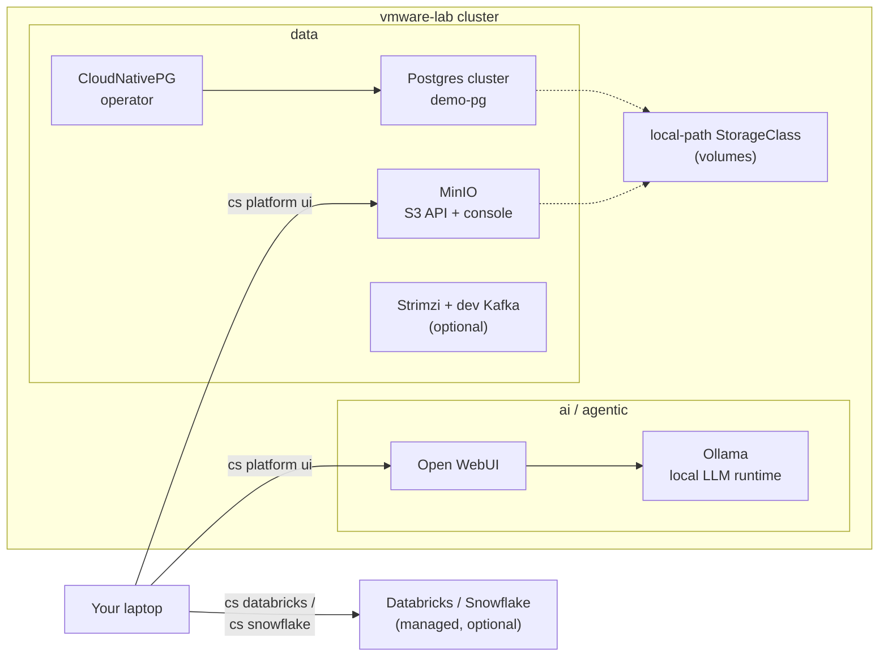

# 07 · Data and AI stack

**Outcome:** S3-compatible object storage (MinIO), a real Postgres database run by an operator (CloudNativePG), an
optional dev Kafka cluster (Strimzi), and a local LLM (Ollama) with a chat UI (Open WebUI), installed item by item
with a small footprint. Then you uninstall what you no longer need and keep your data, and connect managed
Databricks and Snowflake workspaces through the same CLI.

!!! success "Verified live on VMware Fusion 13.6"
    [`tests/scenarios/07-data-and-ai-stack.sh`](https://github.com/nimeshbuilds/cloudseed/blob/main/tests/scenarios/07-data-and-ai-stack.sh)
    installs MinIO, CloudNativePG (with a Postgres cluster), Ollama and Open WebUI on the scenario 05 cluster with
    `CLOUDSEED_LIVE=1`, then uninstalls them. Without it, it plans every item offline and saves the Databricks and
    Snowflake profiles. The optional Kafka step is not part of the automated run.

| :material-clock-outline: Time | :material-cash: Cost | :material-signal-cellular-3: Level | :material-kubernetes: Needs |
|---|---|---|---|
| ~40 min | $0 on the local cluster | Advanced | The cluster from [05](05-local-kubernetes.md), about 6 GB of free node memory |

## What you'll build



## Before you start

- The cluster from [05](05-local-kubernetes.md), selected with `cs env use vmware-lab`.
- For the web UIs: the Gateway from [06](06-platform-in-one-command.md) (or `cs platform ui` installs the Gateway API
  stack after asking).
- For step 7 only: a Databricks workspace or a Snowflake account (and their CLIs: `cs install databricks snow`).

## Step 1: See what the groups bring

```bash
cs platform info data
cs platform info ai
cs platform info agentic
cs explain platform ollama
```

The full groups (`cs platform install data ai`) bring Spark, Trino, StarRocks, Airflow, KubeRay, KServe, JupyterHub,
MLflow and more: great on a big cluster, too much for a laptop. Here you pick single items.

## Step 2: Plan the items

```bash
cs platform plan minio cloudnative-pg ollama open-webui
```

The plan shows the dependencies (`local-path-provisioner` for volumes on VMware), what is already installed, and how
charts are wired together: Open WebUI is pointed at the in-cluster Ollama with its own bundled copy disabled.

## Step 3: Object storage and Postgres

```bash
cs platform install minio --set persistence.size=10Gi
cs platform install cloudnative-pg
```

`--set` goes to the one named item and is remembered: later installs and `--upgrade` apply it again
(`--set persistence.size-` forgets it). Now create a Postgres cluster with the operator:

```bash
cs kubectl create namespace data
cat > demo-pg.yaml <<'EOF'
apiVersion: postgresql.cnpg.io/v1
kind: Cluster
metadata:
  name: demo-pg
  namespace: data
spec:
  instances: 1
  storage:
    size: 1Gi
EOF
cs kubectl apply -f demo-pg.yaml
cs kubectl -n data wait cluster/demo-pg --for=condition=Ready --timeout=300s
cs kubectl -n data get cluster demo-pg
```

??? example "Expected output"
    ```text
    NAME      AGE   INSTANCES   READY   STATUS                     PRIMARY
    demo-pg   95s   1           1       Cluster in healthy state   demo-pg-1
    ```

## Step 4: A dev Kafka cluster (optional)

```bash
cs platform install strimzi
cs kubectl -n kafka get kafka
```

The Strimzi operator plus a one-broker KRaft cluster for development. It needs about 2 GB more node memory.

## Step 5: A local LLM with a chat UI

```bash
cs platform install ollama open-webui
cs kubectl -n ollama exec deploy/ollama -- ollama pull qwen2.5:0.5b
cs kubectl -n ollama exec deploy/ollama -- ollama list
cs platform ui
```

A 0.5B-parameter model runs fine on CPU. `platform ui` prints `https://open-webui.vmware-lab.local` (sign up on the
first visit; the first account is the admin) and `https://minio.vmware-lab.local` (user `minio_root_user`, password
`minio_password`, both generated for this environment in `~/.cloudseed/envs/vmware-lab/platform/secrets.json`).
Ollama keeps pulled models inside its pod (no volume): a restarted pod pulls them again.

## Step 6: Uninstall what you no longer need

```bash
cs platform uninstall open-webui ollama
cs platform status
```

Uninstall never removes shared dependencies and keeps data: MinIO's volume stays after `uninstall minio`, and
CloudNativePG stays installed while a Postgres cluster still exists (delete `demo-pg` first). `cs undo` puts back
what an uninstall removed, including its remembered `--set` values. Unattended: add `--auto-approve` to `uninstall`
(`install` of single items needs no approval).

## Step 7: Managed data platforms (optional)

cloudseed keeps one connection profile per environment (0600, never handed to AI agents) and passes everything else
to the vendor CLI:

```bash
cs databricks connect host=https://dbc-1234abcd-5678.cloud.databricks.com
cs databricks test
cs databricks clusters list
cs snowflake connect --account myorg-myaccount --user analyst --warehouse COMPUTE_WH
cs snowflake test
cs snowflake sql -q "select current_version()"
cs snowflake status
```

Tokens and passwords are asked with hidden input, never on the command line. To hand the vendor CLI its own
`--profile`, put its arguments after `--`: `cs databricks -- clusters list --profile DEFAULT`.

## Use an agent, MCP or the UI

Follow the same numbered steps and verification/cleanup conditions through your chosen interface. Start with the
[interface setup and coverage guide](interfaces-and-coverage.md); replace account/project/subscription and SSH
placeholders before any live request.

**Agent prompt:** “On vmware-lab, inspect the data, AI and agentic catalog. Plan MinIO, CloudNativePG, Ollama and Open WebUI, review storage and model requirements, then install approved items and verify them. Do not expose secret connection details.”

**MCP starter:** `cloudseed_platform` with:

```json
{
  "cloud": "vmware",
  "env": "lab",
  "action": "plan",
  "items": [
    "minio",
    "cloudnative-pg",
    "ollama",
    "open-webui"
  ]
}
```

Use the matching tool for each remaining step in this page; the [command-to-tool map](interfaces-and-coverage.md#command-to-interface-map)
lists the tool family. Keep `vmware-lab` selected. Preview first; add `confirm:true` only to the specific change
you have authorized. Host bootstrap, provider login and interactive applications retain their documented human steps.

**UI:** Select vmware-lab → Platform and filter data, ai or agentic. Inspect, plan and install the named items; apply the page’s storage settings in the install form. Use All actions → Managed platforms for Databricks/Snowflake commands after the human has completed authentication.

## Verify it worked

```bash
cs platform status
cs kubectl get pvc -A
cs databricks status
```

- `platform status` lists `minio`, `cloudnative-pg` (and `strimzi`) as deployed; `ollama` and `open-webui` are gone
  after step 6.
- `get pvc -A` shows the MinIO volume and `demo-pg-1` (plus Kafka's `data-0-...` volume if you did step 4), bound
  through the local-path StorageClass.
- `cs databricks status` (the same view as `cs snowflake status`) lists the saved profiles and whether each CLI is
  installed.

## Clean up

```bash
cs kubectl delete -f demo-pg.yaml
cs kubectl -n data wait --for=delete cluster/demo-pg --timeout=180s
cs platform uninstall cloudnative-pg minio
cs kubectl -n minio delete pvc minio
```

The last line deletes MinIO's data on purpose: uninstall keeps it. Unattended: add `--auto-approve` to the uninstall
commands. If you did step 4, remove Kafka the same way (the
namespace goes with its data volume):

```bash
cs platform uninstall strimzi
cs kubectl delete namespace kafka
```

The step 7 profiles stay in `~/.cloudseed/managed.json` (0600); there is no disconnect command, so to forget them
delete that file and the generated `~/.cloudseed/managed/` directory.

## What just happened

- Each item is a pinned Helm chart with values adapted to the target: on VMware, volumes come from the local-path
  StorageClass, on EKS / GKE / AKS from the cloud's CSI driver.
- Charts that bundle a component another item provides get it disabled and wired to the shared one (Open WebUI uses
  the cluster's Ollama).
- The managed-platform profiles live in `~/.cloudseed/managed.json` (0600); the agent skill `cloudseed-managed`
  explains them to AI agents without ever exposing the secrets.
- Learn more: [Platform guide](../guides/platform.md) · [Platform catalog](../reference/platform-catalog.md) ·
  [Credentials](../guides/credentials.md) · [Explain index](../reference/explain-index.md)

```bash
cs explain managed-data
```

## Next steps

- [08 · Backups you can trust](08-backups-you-can-trust.md): back up the `data` namespace with Velero and restore it.
- [14 · AI agents and MCP](14-ai-agents-and-mcp.md): let an agent drive the platform for you.
- [15 · FinOps](15-web-console-and-finops.md): see what each namespace costs with OpenCost.
