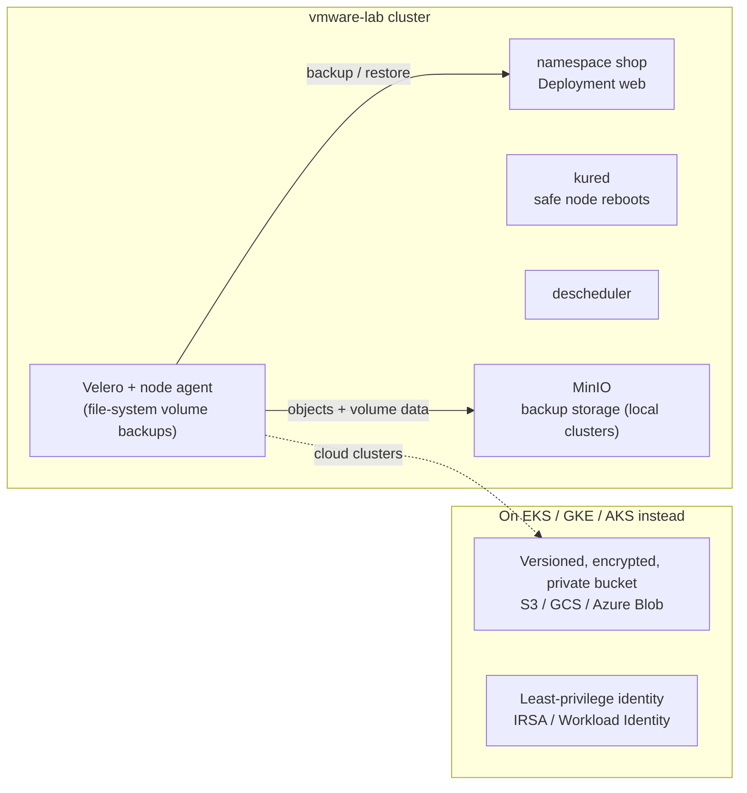

# 08 · Backups you can trust

**Outcome:** Velero protecting your cluster, with its storage and identity created for you; a backup of a real
namespace, a deliberate disaster and a restore; a nightly schedule; and `cs dr test`, an automated drill that backs
up, deletes, restores and verifies a sample workload and prints PASS or FAIL with the measured restore time.

!!! success "Verified live on VMware Fusion 13.6"
    [`tests/scenarios/08-backups-you-can-trust.sh`](https://github.com/nimeshbuilds/cloudseed/blob/main/tests/scenarios/08-backups-you-can-trust.sh)
    runs every command below on the scenario 05 cluster with `CLOUDSEED_LIVE=1`. Without it, it plans the
    resilience group for a local and for an EKS cluster (where Velero's S3 bucket and IAM role come first) and checks
    that every `cs dr` command says the cluster is not created yet.

| :material-clock-outline: Time | :material-cash: Cost | :material-signal-cellular-2: Level | :material-kubernetes: Needs |
|---|---|---|---|
| ~20 min | $0 locally (on a cloud: the backup bucket's storage) | Intermediate | The cluster and the `shop` app from [05](05-local-kubernetes.md) |

## What you'll build



## Before you start

- The cluster from [05](05-local-kubernetes.md) with the `shop` namespace and its `web` Deployment, selected with
  `cs env use vmware-lab`.
- The Velero CLI is fetched for you (matching the server's version) the first time a command needs it.

## Step 1: Understand the moving parts

```bash
cs explain dr
cs help dr
cs platform info resilience
```

## Step 2: Plan and install the resilience group

```bash
cs platform plan resilience
cs platform install resilience
```

??? example "Expected plan on the local cluster"
    ```text
      ╭─ Plan for vmware-lab (vmware/rke2) ─────────────────────────────────────────────╮
      │ + local-path-provisioner install Default StorageClass for local clusters…        │
      │ + minio                  install S3-compatible object storage…                   │
      │ + velero                 install Backup and restore of cluster state and volumes │
      │ + kured                  install Safe rolling node reboots when the OS asks…     │
      │ + descheduler            install Rebalance pods across nodes…                    │
      ╰──────────────────────────────────────────────────────────────────────────────────╯
    ```

??? example "The same plan on an EKS environment: cloud prerequisites first"
    ```bash
    cs platform plan resilience aws --env eks
    ```

    ```text
      ╭─ Plan for aws-eks (aws/eks) ───────────────────────────────────────────────────╮
      │ + velero      install Backup and restore of cluster state and volumes…          │
      │       ↳ cloud prerequisites 'velero' (identity, storage, tags) are applied to   │
      │         the aws stack first                                                     │
      │ + kured       install Safe rolling node reboots when the OS asks for one        │
      │ + descheduler install Rebalance pods across nodes                               │
      ╰─────────────────────────────────────────────────────────────────────────────────╯
    ```

On a cloud cluster the install first applies the environment's Terraform stack (plan + your approval): a
versioned, encrypted, private bucket and a least-privilege identity for Velero's service account. Unattended:
`cs -y platform install resilience --auto-approve`.

## Step 3: Back up, break, restore

```bash
cs dr status
cs dr backup before-change --namespaces shop
cs dr backups
cs kubectl delete namespace shop
cs kubectl wait --for=delete namespace/shop --timeout=180s
cs dr restore before-change --namespaces shop
cs kubectl -n shop get pods
```

??? example "Expected output (abbreviated)"
    ```text
      ✔ Backup before-change Completed. Restore with: cs dr restore before-change
    namespace "shop" deleted
      ✔ Restore before-change-restore-20260924215158 Completed (object list: cs dr describe restore before-change-restore-20260924215158 --details vmware --env lab).
    NAME                   READY   STATUS    RESTARTS   AGE
    web-6c9f8d7b5d-4xk2p   1/1     Running   0          21s
    web-6c9f8d7b5d-9qz8m   1/1     Running   0          21s
    web-6c9f8d7b5d-tt7rn   1/1     Running   0          21s
    ```

Unattended: `cs dr restore before-change --namespaces shop --auto-approve` (without a terminal a restore shows what it
would do and stops with exit 3; `-y` alone never approves it).

Look inside a backup or a restore (its objects, volumes, warnings and Velero's own log):

```bash
cs dr describe backup before-change --details
cs dr logs backup before-change
```

On a local cluster the backups live in the in-cluster MinIO, which only answers inside the cluster, so these run
velero inside the velero pod: no velero CLI is needed on your machine.

Backup names are Kubernetes names (lower-case letters, digits, `-` and `.`). Because Velero is installed, the
`kubectl delete` itself took a safety backup first, so `cs undo` could also have rolled it back.

## Step 4: Prove that restores work

```bash
cs dr test
```

??? example "Expected output"
    ```text
      ╭─ DR drill · vmware-lab · run 20260924-201512 ───────────────────────────────╮
      │ ✔ 1. create sample workload       12.4s   Deployment, ConfigMap, Secret, ... │
      │ ✔ 2. backup                       18.9s                                      │
      │ ✔ 3. delete it (disaster)          6.1s                                      │
      │ ✔ 4. restore from backup          21.7s                                      │
      │ ✔ 5. verify                        3.2s                                      │
      │                                                                              │
      │ PASS - backup and restore are trustworthy   total 62.3s · measured RTO       │
      │ (restore + verify) 24.9s · volumes tested                                    │
      │ report: ~/.cloudseed/envs/vmware-lab/dr/drill-20260924-201512.json           │
      ╰──────────────────────────────────────────────────────────────────────────────╯
    ```

The drill creates a Deployment, ConfigMap, Secret, Service and a 1 Gi volume holding a random file, backs them up,
deletes the namespace, restores it, and checks every object and that the file came back. It exits 1 on FAIL, so it
fits a nightly CI job. `--no-volume` skips the volume; `--keep` leaves the drill namespace and backup for inspection.

## Step 5: Schedule nightly backups

```bash
cs dr schedule nightly --cron "0 2 * * *" --ttl 720h
cs dr status
```

The cron expression is evaluated by Velero in UTC (02:00 UTC here); each backup is kept for 30 days.

## Use an agent, MCP or the UI

Follow the same numbered steps and verification/cleanup conditions through your chosen interface. Start with the
[interface setup and coverage guide](interfaces-and-coverage.md); replace account/project/subscription and SSH
placeholders before any live request.

**Agent prompt:** “On vmware-lab, inspect Velero, plan the resilience group and follow this backup walkthrough. Verify backup storage and a Completed backup, then run a restore drill only after I approve its workload changes. Show volume and cleanup evidence.”

**MCP starter:** `cloudseed_dr` with:

```json
{
  "cloud": "vmware",
  "env": "lab",
  "action": "status"
}
```

Use the matching tool for each remaining step in this page; the [command-to-tool map](interfaces-and-coverage.md#command-to-interface-map)
lists the tool family. Keep `vmware-lab` selected. Preview first; add `confirm:true` only to the specific change
you have authorized. Host bootstrap, provider login and interactive applications retain their documented human steps.

**UI:** Select vmware-lab → Resilience → Disaster recovery. Install prerequisites through Platform, then choose backup, schedule, restore or test and enter the names/namespace/TTL from each step. Confirm changes and inspect report/cleanup results in Activity and Reports.

## Verify it worked

```bash
cs dr backups
cs dr status
```

- `dr backups` lists `before-change` (and the drill's backup while it exists) as Completed.
- `dr status` shows the Velero version, the backup location as Available, the node agents, your backups, the
  `nightly` schedule and the last drill's verdict.
- The drill report (JSON + Markdown) is in `~/.cloudseed/envs/vmware-lab/dr/`.

## Clean up

```bash
cs undo
cs platform uninstall resilience
```

`cs undo` reverts the newest action, the `nightly` schedule (it is deleted); backups can be removed with the Velero
CLI.
Uninstalling the group removes Velero, kured and the descheduler; MinIO and its data stay (it is a shared
dependency). On a cloud cluster the Velero bucket and identity stay too: they hold your backups.

## What just happened

- `cs platform install velero` declares cloud prerequisites that the environment's own Terraform stack applies
  (`terraform/<cloud>/modules/kubernetes`), so the bucket and the IRSA / Workload Identity role are ordinary,
  planned, undoable infrastructure.
- On local clusters, backups go to the in-cluster MinIO and volumes are copied by the node agent (file-system
  backup) from the local-path StorageClass.
- `cs dr status` and `cs dr backups` read Velero's objects with kubectl; the other commands use the velero CLI,
  fetched only on your own run, never from an agent session.
- Learn more: [Resilience guide](../guides/resilience.md) · [Undo and audit](../guides/undo-and-audit.md) ·
  [Explain index](../reference/explain-index.md)

```bash
cs explain prereqs
```

## Next steps

- [09 · Chaos engineering](09-chaos-engineering.md): prove the `shop` app survives pod and network faults.
- [10 · Compliance scans](10-compliance-scans.md).
- [14 · AI agents](14-ai-agents-and-mcp.md): an agent can run `cs dr test` for you; restores always wait for your
  approval.
