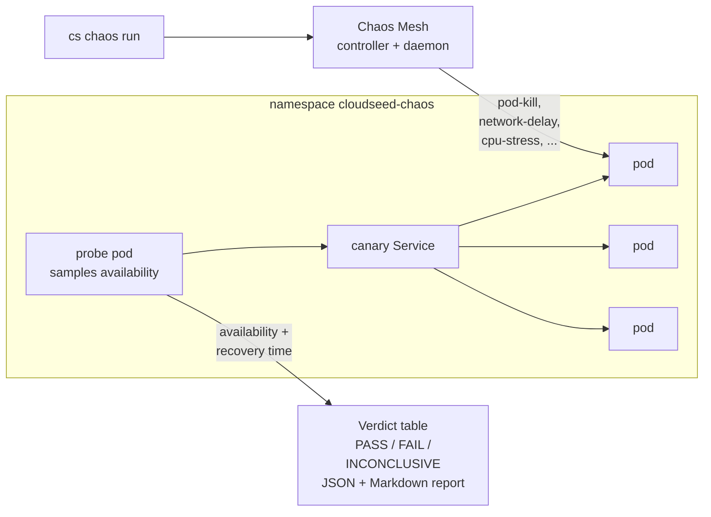

# 09 · Chaos engineering with verdicts

**Outcome:** Chaos Mesh on your cluster and a suite of experiments (pod kill, pod failure, container kill, network
delay, loss and partition, DNS errors, CPU and memory stress, time skew), each with a steady-state hypothesis:
availability is sampled while the fault is injected and recovery is timed. You get a PASS, FAIL or INCONCLUSIVE
verdict per experiment and for the run, first against a canary, then against your own `shop/web` Deployment.

!!! success "Verified live on VMware Fusion 13.6"
    [`tests/scenarios/09-chaos-engineering.sh`](https://github.com/nimeshbuilds/cloudseed/blob/main/tests/scenarios/09-chaos-engineering.sh)
    runs the basic suite against the canary and a network experiment against `shop/web` on the scenario 05 cluster
    with `CLOUDSEED_LIVE=1`. Without it, it lists the experiments and plans the chaos group offline, and checks that
    the run commands say the cluster is not created yet.

| :material-clock-outline: Time | :material-cash: Cost | :material-signal-cellular-2: Level | :material-kubernetes: Needs |
|---|---|---|---|
| ~20 min (basic suite ~5 min) | $0 on the local cluster | Intermediate | The cluster and the `shop` app from [05](05-local-kubernetes.md) |

## What you'll build



## Before you start

- The cluster from [05](05-local-kubernetes.md), selected with `cs env use vmware-lab`, with the `shop/web`
  Deployment (three replicas behind a Service on port 8080).
- Chaos Mesh is installed on first use (it asks; `--auto-approve` says yes). Its daemon runs privileged on every
  node: use a lab or a staging cluster.

## Step 1: See the experiments and their hypotheses

```bash
cs chaos list
cs explain chaos
cs platform plan chaos
```

??? example "Expected output of `cs chaos list` (abbreviated)"
    ```text
      ╭─ Chaos experiments (Chaos Mesh) ───────────────────────────────────────────────╮
      │ basic   cs chaos run basic                                                      │
      │   pod-kill             kill one pod; the Deployment must replace it              │
      │                        >= 50% avail, recover <= 90s                              │
      │   pod-failure          make one pod fail for the duration; the others must serve │
      │                        >= 70% avail, recover <= 90s                              │
      │   container-kill       kill the main container in one pod; kubelet must restart  │
      │ network   cs chaos run network                                                  │
      │   network-delay        add 300ms +-100ms latency to all pods                     │
      │   network-loss         drop 30% of packets to all pods; TCP must retry           │
      │   network-partition    partition the probe from the workload; must recover       │
      │   dns-error            make DNS fail for the probe; service must be back         │
      │ stress   cs chaos run stress                                                    │
      │   cpu-stress / memory-stress / time-skew                                        │
      ╰─────────────────────────────────────────────────────────────────────────────────╯
    ```

## Step 2: Run the basic suite against a canary

=== "Interactive"

    ```bash
    cs chaos run
    ```

=== "Unattended"

    ```bash
    cs -y chaos run basic --auto-approve
    ```

cloudseed deploys a canary (3 replicas, a PodDisruptionBudget, a Service and a probe pod) in `cloudseed-chaos`, holds
each fault for 45 s (one-shot faults such as pod-kill and container-kill are injected once and watched for 15 s),
lifts it and times the recovery.

??? example "Expected output"
    ```text
      ╭─ Chaos results · vmware-lab · cloudseed-chaos/canary · run 20260924-203001 ─────────────────────────╮
      │ ✔ PASS  pod-kill             availability 100%  (min 50%)   recovered in   4s  (max 90s) │
      │ ✔ PASS  pod-failure          availability  98%  (min 70%)   recovered in  12s  (max 90s) │
      │ ✔ PASS  container-kill       availability 100%  (min 50%)   recovered in   6s  (max 90s) │
      │                                                                                         │
      │ PASS - every experiment held its steady-state hypothesis                                │
      │ 3 passed   0 failed   0 skipped, 0 errors                                               │
      │ report: ~/.cloudseed/envs/vmware-lab/chaos/report-20260924-203001.json  ·  ....md       │
      ╰─────────────────────────────────────────────────────────────────────────────────────────╯
    ```

The exit code is 0 only for PASS. A fault Chaos Mesh never injected is an ERROR, never a PASS.

## Step 3: Target your own workload

```bash
cs chaos run network-delay pod-kill --target shop/web:8080 --duration 60s
cs chaos report
```

With `--target`, the probe calls your Service and the faults hit your pods: cloudseed asks before injecting
(`--auto-approve` for unattended runs). Pick experiments by name, or whole suites: `basic`, `network`, `stress`,
`full`.

## Step 4: Watch and stop

```bash
cs chaos status
cs chaos stop
```

`status` shows the experiments Chaos Mesh is running and the last verdict; `stop` deletes every cloudseed chaos
experiment and the canary namespace (use it if you interrupt a run). The Chaos Mesh dashboard is one of the UIs
`cs platform ui` exposes.

## Use an agent, MCP or the UI

Follow the same numbered steps and verification/cleanup conditions through your chosen interface. Start with the
[interface setup and coverage guide](interfaces-and-coverage.md); replace account/project/subscription and SSH
placeholders before any live request.

**Agent prompt:** “Follow the chaos walkthrough on vmware-lab. List experiments and plan the selected suite. Explain its target and steady-state checks before executing the approved experiment; report recovery and cleanup rather than only process success.”

**MCP starter:** `cloudseed_chaos` with:

```json
{
  "cloud": "vmware",
  "env": "lab",
  "action": "list"
}
```

Use the matching tool for each remaining step in this page; the [command-to-tool map](interfaces-and-coverage.md#command-to-interface-map)
lists the tool family. Keep `vmware-lab` selected. Preview first; add `confirm:true` only to the specific change
you have authorized. Host bootstrap, provider login and interactive applications retain their documented human steps.

**UI:** Select vmware-lab → Resilience → Chaos. Choose the suite or experiment and copy the target/duration from the numbered step. Confirm the experiment’s disruption, inspect the report and use Stop only for the intended run.

## Verify it worked

```bash
cs chaos report
ls ~/.cloudseed/envs/vmware-lab/chaos/
```

- `chaos report` prints the last verdict table again, offline.
- The `chaos/` folder holds `report-<run>.json` and `.md` for every run: attach the Markdown to a change review.
- `cs kubectl -n shop get deploy web` is back to 3/3 ready after the run.

## Clean up

```bash
cs chaos stop
cs platform uninstall chaos
```

## What just happened

- Each experiment is a Chaos Mesh resource with a steady-state hypothesis cloudseed checks itself: an availability
  floor sampled by the probe pod during the fault, and a recovery bound after it.
- A run is PASS only when every experiment ran and passed; FAIL when one failed or errored; INCONCLUSIVE otherwise.
  The same verdicts are what the web console and AI agents see.
- `cs undo` after a run stops experiments that are still running and removes the canary.
- Learn more: [Resilience guide](../guides/resilience.md) · [Web console](../guides/web-console.md) ·
  [Explain index](../reference/explain-index.md)

## Next steps

- [10 · Compliance scans](10-compliance-scans.md).
- [08 · Backups you can trust](08-backups-you-can-trust.md): chaos proves availability, a DR drill proves recovery.
- [15 · Web console](15-web-console-and-finops.md): run the same suites from the Resilience page.
