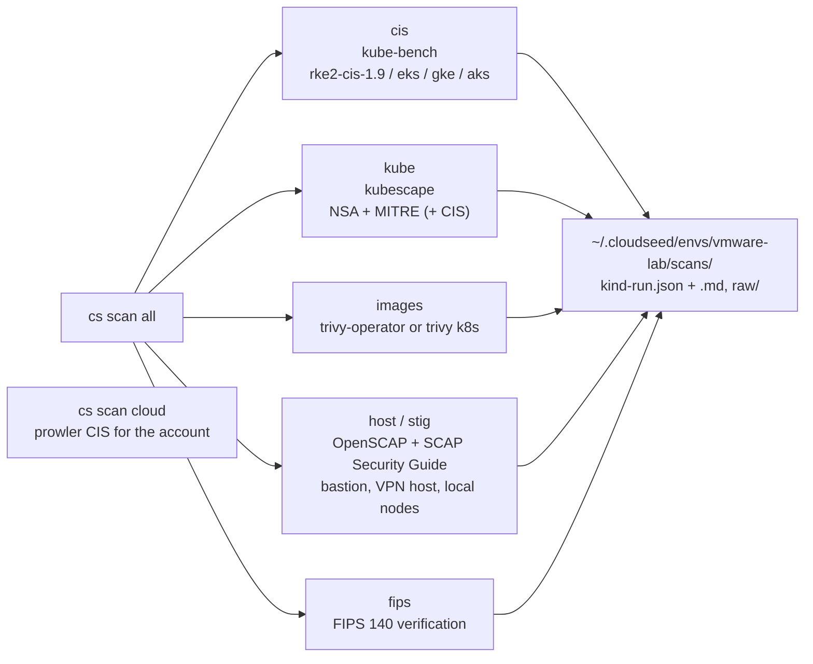

# 10 · Compliance scans

**Outcome:** every scan cloudseed knows run against your cluster and hosts: the CIS Kubernetes Benchmark
(kube-bench, the right profile per distro), NSA + MITRE ATT&CK posture (kubescape), vulnerabilities in running images
(trivy), OpenSCAP CIS and DISA STIG profiles on the bastion and the nodes, and FIPS 140 verification; each with a
verdict, JSON and Markdown reports, and an exit code your CI can use.

!!! success "Verified live on VMware Fusion 13.6"
    [`tests/scenarios/10-compliance-scans.sh`](https://github.com/nimeshbuilds/cloudseed/blob/main/tests/scenarios/10-compliance-scans.sh)
    runs every scan below against the scenario 05 cluster and its hosts with `CLOUDSEED_LIVE=1`. Without it, it runs
    the FIPS verification and the reports list offline and checks that the cluster and host scans say there is
    nothing to scan yet. `scan cloud` needs cloud credentials (see [04](04-azure-private-aks.md)).

| :material-clock-outline: Time | :material-cash: Cost | :material-signal-cellular-2: Level | :material-kubernetes: Needs |
|---|---|---|---|
| ~25 min | $0 on the local cluster | Intermediate | The cluster from [05](05-local-kubernetes.md) |

## What you'll build



## Before you start

- The cluster from [05](05-local-kubernetes.md), selected with `cs env use vmware-lab`. The more you installed in
  [06](06-platform-in-one-command.md) and [07](07-data-and-ai-stack.md), the more there is to scan.
- kubescape and trivy are installed on first use; to fetch them up front:

```bash
cs install kubescape trivy
```

## Step 1: Know what each scan checks

```bash
cs help scan
cs explain scan
```

## Step 2: CIS Kubernetes Benchmark

```bash
cs scan cis
```

kube-bench runs as a Job with the benchmark for the distro (`rke2-cis-1.9` here; `eks-1.8.0`, `gke-1.9.0`, `aks-1.8`
on managed clusters) on the control plane and the nodes. The policy checks (RBAC, service accounts, network policies)
use a temporary read-only ClusterRole that is removed when the scan ends.

??? example "Expected output (abbreviated; your counts differ)"
    ```text
      ╭─ CIS Kubernetes Benchmark · vmware-lab ──────────────────────────────────────╮
      │ benchmark      rke2-cis-1.9                                                  │
      │ distro         rke2                                                          │
      │ pass           86                                                            │
      │ fail           7                                                             │
      │ warn           39                                                            │
      │ info           0                                                             │
      │                                                                              │
      │ top findings (7)                                                             │
      │ FAIL      1.1.12 Ensure that the etcd data directory ownership is ...        │
      │ ...                                                                          │
      │ verdict        FAIL                                                          │
      │ report         ~/.cloudseed/envs/vmware-lab/scans/cis-20260924-204512.json   │
      ╰──────────────────────────────────────────────────────────────────────────────╯
    ```

A lab cluster without `kubernetes_cis_profile=true` does not pass every control: the report lists each failing
control with its remediation. The exit code is 1 when the verdict is FAIL.

## Step 3: Posture and vulnerabilities

```bash
cs scan kube --framework nsa,mitre,cis-v1.10.0
cs scan images
```

- `kube` gives a compliance score per framework and the failing controls by severity. For continuous scanning:
  `cs platform install kubescape-operator`.
- `images` uses trivy-operator's reports when it is installed (`cs platform install trivy-operator`), otherwise a
  one-off `trivy k8s` scan of the running workloads.

## Step 4: The hosts: CIS and DISA STIG with OpenSCAP

```bash
cs scan host vmware --env lab --host bastion,k8s
cs scan stig vmware --env lab --host bastion
```

OpenSCAP and the SCAP Security Guide run on every SSH-reachable host you name (bastion, VPN host, local Kubernetes
nodes) and leave a score, the failed rules and an HTML report per host under `scans/openscap-<run>/`. Ubuntu 24.04
has STIG content; hosts without content for a profile (the AL2023 AWS bastion, the Debian 12 GCP bastion) report n/a.

## Step 5: FIPS verification and everything at once

```bash
cs scan fips vmware --env lab
cs scan all
cs scan reports --last 5
```

`scan fips` on an environment created without FIPS mode reports **N/A** (FIPS is chosen at creation; see
[11](11-fips-140-mode.md)), followed by how many of its checks would fail. On the deployed lab it checks more than the
configuration and the SSH key: every host over SSH (kernel FIPS mode, the OpenSSL FIPS provider, sshd's algorithms,
Ubuntu Pro FIPS), the cluster's nodes and each installed platform item's FIPS class, so most checks fail and the count
depends on what you have installed. `scan all` runs everything applicable and prints a summary; it exits 1 when a
verdict is FAIL or a scan could not run.

??? example "Expected output of `cs scan fips vmware --env lab` on a non-FIPS environment (abbreviated)"
    ```text
      ╭─ FIPS 140 verification · vmware-lab ─────────────────────────────────────────────────╮
      │ ✖ config      fips_mode enabled for the environment   chosen at creation: cs setup    │
      │               <cloud> --var fips_mode=true (new environments only; ...)               │
      │ ✖ ssh         environment SSH key is FIPS-approved (RSA-4096; ECDSA only on GCP/VMware)│
      │ ✖ hosts       bastion: kernel FIPS mode (fips_enabled=1)   fips_enabled=absent         │
      │ ✖ hosts       bastion: OpenSSL FIPS provider active                                    │
      │ ...           (the same host checks for every node, then kubernetes and platform rows) │
      │ ○ platform    argocd: FIPS-compatible   runs on FIPS kernels; ...                      │
      │                                                                                        │
      │ N/A - vmware-lab is not a FIPS environment (FIPS is chosen at creation); N of M checks │
      │ would fail                                                                             │
      ╰────────────────────────────────────────────────────────────────────────────────────────╯
    ```

## Step 6: The cloud account (cloud environments)

```bash
cs scan cloud aws --env prod
```

prowler runs the newest CIS benchmark for the provider against the account, project or subscription of a cloud
environment (in an AWS FIPS environment, only its region, through the FIPS endpoints). `--framework` picks another
prowler compliance id.

## Verify it worked

```bash
cs scan reports
ls ~/.cloudseed/envs/vmware-lab/scans/
```

- `scan reports` lists every report with its verdict and counts.
- `scans/` holds `<kind>-<run>.json` and `.md` per scan, the OpenSCAP HTML reports, and the raw tool output in
  `scans/raw/`. Every scan is also in the audit trail.

## Clean up

Scans change nothing on the cluster except their short-lived Jobs. Reports stay until you delete them; `cs undo`
right after a scan removes that scan's own report files.

## What just happened

- Each scanner runs where it has to: kube-bench and kubescape as Jobs in the cluster, trivy against the images,
  OpenSCAP on the hosts over SSH (installed by the `openscap` Ansible role), prowler from your machine.
- Findings are normalised into one report format, which the web console's reports viewer and AI agents read too.
- Learn more: [Security and FIPS](../guides/security-and-fips.md) · [Resilience and scans](../guides/resilience.md) ·
  [Explain index](../reference/explain-index.md)

## Next steps

- [11 · FIPS 140 mode](11-fips-140-mode.md): an environment where `cs scan fips` passes.
- [14 · AI agents](14-ai-agents-and-mcp.md): ask an agent to summarise the failing controls and propose fixes.
- [13 · Day-2 operations](13-day-2-operations.md).
