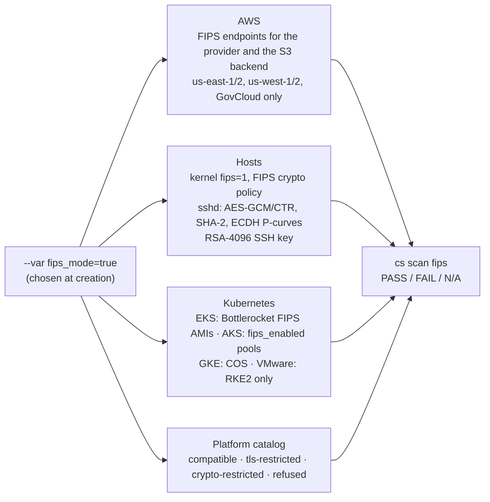

# 11 · FIPS 140 mode

**Outcome:** you see exactly what one switch, `--var fips_mode=true`, changes in an environment, what it refuses,
and how to prove it end to end: an AWS FIPS environment rendered and verified offline, the refusals that keep a
configuration honest, the platform catalog's FIPS tiers, and (with an Ubuntu Pro token) a FIPS lab on VMware whose
kernel, sshd and keys pass `cs scan fips`.

!!! info "Verified with --dry-run (Terraform render + validate); run for real with cloud credentials"
    [`tests/scenarios/11-fips-140-mode.sh`](https://github.com/nimeshbuilds/cloudseed/blob/main/tests/scenarios/11-fips-140-mode.sh)
    renders the AWS and VMware FIPS environments, checks every refusal below and runs `cs scan fips` offline (the
    configuration, key and endpoint checks pass). The live host checks of step 6 are not part of that verification:
    they need an Ubuntu Pro token, and the script runs them on VMware only with `CLOUDSEED_LIVE=1` and
    `UBUNTU_PRO_TOKEN` set.

| :material-clock-outline: Time | :material-cash: Cost | :material-signal-cellular-3: Level | :material-shield-lock-outline: Needs |
|---|---|---|---|
| ~15 min offline, ~45 min with the VMware lab | $0 offline; AWS as in [02](02-aws-landing-zone.md) plus a VPN host | Advanced | For the live lab: an Ubuntu Pro token (free for personal use) |

## What you'll build



## Before you start

- Nothing for steps 1 to 5: they run offline.
- For step 6: VMware Fusion Pro / Workstation Pro as in [01](01-first-lab-vmware.md) and an
  [Ubuntu Pro](https://ubuntu.com/pro) token, because the FIPS-validated modules for Ubuntu come with Ubuntu Pro.

## Step 1: Read what FIPS mode does

```bash
cs help fips
cs explain fips
```

## Step 2: Render an AWS FIPS environment

```bash
cs setup aws -y --env fips --region us-east-1 --allow-ip 203.0.113.7 --var fips_mode=true --var enable_kubernetes=true --var enable_vpn=true --dry-run
```

??? example "Expected output (abbreviated)"
    ```text
      ▲ FIPS mode: the FIPS-validated modules for the VPN host (Ubuntu) come with Ubuntu Pro, and UBUNTU_PRO_TOKEN
        is not set. export UBUNTU_PRO_TOKEN=... or store it with: cloudseed creds set UBUNTU_PRO_TOKEN
      ● FIPS mode: FIPS images/endpoints, kernel fips=1 on every host, FIPS-only SSH/TLS algorithms, RSA-4096 SSH
        keys. Platform items are checked for FIPS capability at install time; verify with: cs scan fips
      ● Generating an RSA-4096 SSH key pair (FIPS mode) at ~/.cloudseed/envs/aws-fips/ssh/id_rsa
      ...
      │ fips_mode                   true                                                        │
      ...
      ✔ Dry run complete. Rendered root(s): ~/.cloudseed/envs/aws-fips/stack, ~/.cloudseed/envs/aws-fips/bootstrap
    ```

A dry run or `--plan-only` only warns about the missing token; a setup that applies (you answer yes in a terminal, or
pass `--auto-approve`) stops before creating anything.

## Step 3: See what FIPS mode refuses

```bash
cs setup aws -y --env fips-eu --region eu-west-1 --allow-ip 203.0.113.7 --var fips_mode=true --dry-run
cs setup vmware -y --env fipslab --var fips_mode=true --var enable_kubernetes=true --var kubernetes_distro=kubeadm --dry-run
cs setup gcp -y --env fipsts --project-id my-gcp-project --allow-ip 203.0.113.7 --var fips_mode=true --var enable_vpn=true --var vpn_type=tailscale --dry-run
```

??? example "Expected output: each one stops, nothing is saved"
    ```text
      ✖ FIPS mode is on, but this configuration cannot be FIPS-compliant:
          - region eu-west-1: AWS has FIPS 140 endpoints for everything this stack uses only in us-east-1,
            us-east-2, us-west-1, us-west-2, us-gov-east-1, us-gov-west-1; pick one of those with --region.

      ✖ FIPS mode is on, but this configuration cannot be FIPS-compliant:
          - kubernetes_distro=kubeadm: upstream kubeadm binaries are not FIPS builds; use kubernetes_distro=rke2
            (FIPS-validated Go crypto).

      ✖ FIPS mode is on, but this configuration cannot be FIPS-compliant:
          - vpn_type=tailscale: WireGuard (ChaCha20-Poly1305) is not a FIPS-approved cipher; use vpn_type=openvpn
            (AES-GCM, TLS 1.2+).
    ```

FIPS mode is chosen at creation (the SSH key type depends on it) and cannot be toggled on an existing environment.

## Step 4: Verify offline

```bash
cs scan fips aws --env fips
```

??? example "Expected output"
    ```text
      ╭─ FIPS 140 verification · aws-fips ────────────────────────────────────────────╮
      │ ✔ config      fips_mode enabled for the environment   fips_mode=true           │
      │ ✔ ssh         environment SSH key is FIPS-approved (RSA-4096; ECDSA only on    │
      │               GCP/VMware)   ssh-rsa (4096 bits)                                │
      │ ✔ cloud       AWS provider uses FIPS endpoints   provider.aws.use_fips_endpoint │
      │                                                                                │
      │ PASS - 3 passed, 0 failed, 0 informational                                     │
      ╰────────────────────────────────────────────────────────────────────────────────╯
    ```

On a deployed environment the same command also checks every host (kernel `fips_enabled`, sshd and OpenSSL
algorithms), the node images, the RKE2 build, the TLS policy on the shared Gateway and the FIPS capability of every
installed platform item.

## Step 5: The platform catalog in a FIPS environment

```bash
cs platform plan basek8s aws --env fips
cs platform plan ai aws --env fips
```

Items come in four tiers: **compatible** (installed), **tls-restricted** (Envoy Gateway, ingress-nginx: installed with
TLS 1.2+ and FIPS cipher suites, flagged by `cs scan fips`), **crypto-restricted** (cert-manager, sealed-secrets,
Velero, CloudNativePG: installed because the platform needs them, and flagged) and the rest (application stacks with
their own crypto, like the `ai` group: skipped unless `--force`).

## Step 6: A FIPS lab on VMware (live)

```bash
cs creds set UBUNTU_PRO_TOKEN
cs setup vmware -y --env fipslab --var fips_mode=true --dry-run
cs setup vmware --env fipslab --var fips_mode=true
cs ssh vmware --env fipslab -- cat /proc/sys/crypto/fips_enabled
cs scan fips vmware --env fipslab
```

`creds set UBUNTU_PRO_TOKEN` asks for the token with hidden input. Every VM attaches Ubuntu Pro, enables
`fips-updates` and reboots into the FIPS kernel, so the SSH check prints `1`. Add
`--var enable_kubernetes=true` for an RKE2 cluster in FIPS mode.

## Verify it worked

```bash
cs scan reports aws --env fips --last 3
```

- `scan fips` ends with **PASS** on a FIPS environment and **N/A** on any other.
- On the live lab: `/proc/sys/crypto/fips_enabled` is `1` and `sshd -T` lists only FIPS-approved ciphers and MACs.

## Clean up

```bash
cs destroy aws -y --env fips --purge --auto-approve
cs destroy vmware -y --env fipslab --purge --auto-approve
cs creds unset UBUNTU_PRO_TOKEN
```

## What just happened

- One variable fans out to every layer: provider endpoints, images, kernel settings, the Ansible `fips` role, SSH key
  type, sshd and OpenVPN cipher lists, the Kubernetes distro, the Gateway's TLS policy and the catalog tiers.
- Setup refuses combinations that can never be compliant instead of silently building something that is not.
- Learn more: [Security and FIPS](../guides/security-and-fips.md) · [Credentials](../guides/credentials.md) ·
  [Explain index](../reference/explain-index.md)

## Next steps

- [10 · Compliance scans](10-compliance-scans.md): `cs scan stig` includes FIPS checks too.
- [12 · Private access with a VPN](12-private-access-vpn.md): OpenVPN is the FIPS-compatible choice.
- [02 · AWS landing zone](02-aws-landing-zone.md): apply the FIPS environment for real.
