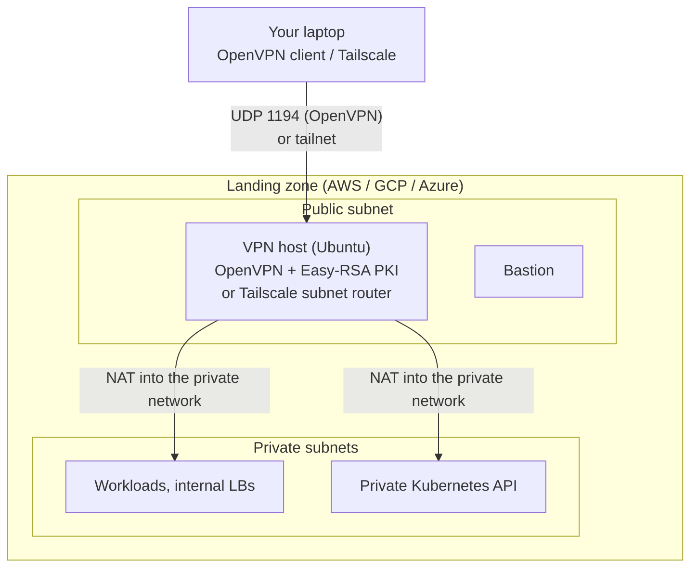

# 12 · Private access with OpenVPN or Tailscale

**Outcome:** a hardened VPN host in your landing zone's public subnet that routes your laptop into the private
network. With **OpenVPN** cloudseed builds the whole PKI itself: you add users, download `.ovpn` profiles, connect and
revoke from the CLI. With **Tailscale** the host joins your tailnet as a subnet router. Either way, private
subnets, internal load balancers and private Kubernetes API endpoints become reachable without an SSH tunnel.

!!! info "Verified with --dry-run (Terraform render + validate); run for real with cloud credentials"
    [`tests/scenarios/12-private-access-vpn.sh`](https://github.com/nimeshbuilds/cloudseed/blob/main/tests/scenarios/12-private-access-vpn.sh)
    renders and validates an AWS environment with OpenVPN and a GCP one with Tailscale, checks the estimate and
    `vpn status`, and checks that the user, connect and provisioning commands stop with a clear message before the VPN
    host exists. The apply, connecting and revoking need a cloud account.

| :material-clock-outline: Time | :material-cash: Cost | :material-signal-cellular-2: Level | :material-cloud-outline: Needs |
|---|---|---|---|
| ~20 min | ≈ $70 / month for the AWS example (`cs finops estimate`); the VPN host adds ≈ $12 | Intermediate | A cloud account; for Tailscale a tailnet |

## What you'll build



## Before you start

- A cloud account as in [02](02-aws-landing-zone.md), [03](03-gcp-private-gke.md) or [04](04-azure-private-aks.md).
- For OpenVPN: the client on your machine (`cs install openvpn`, or any OpenVPN app).
- For Tailscale: a tailnet, a reusable pre-authorized auth key and the Tailscale app.

## Step 1: How the VPN works

```bash
cs help vpn
cs explain vpn
```

## Step 2: A landing zone with an OpenVPN host

```bash
cs setup aws -y --env vpn --region us-west-2 --allow-ip 203.0.113.7 --var enable_vpn=true --dry-run
cs finops estimate aws --env vpn
```

??? example "Expected output (abbreviated)"
    ```text
      │ enable_vpn                true                                               │
      │ vpn_type                  openvpn                                            │
      ...
      ✔ Dry run complete. Rendered root(s): ~/.cloudseed/envs/aws-vpn/stack, ~/.cloudseed/envs/aws-vpn/bootstrap

      │ vpn host t3.micro x1          $7.59                                          │
      │ public IPv4 x3                $10.95                                         │
      │ total / month                 $69.58                                         │
    ```

When the plan looks right, create it (interactive; unattended add `-y --auto-approve`):

```bash
cs setup aws --env vpn --region us-west-2 --allow-ip 203.0.113.7 --var enable_vpn=true
```

Ansible builds the OpenVPN server and an Easy-RSA PKI on the host (EC keys, tls-crypt, a CRL), hardened like the
bastion. The VPN port (UDP 1194) accepts connections from anywhere, so you can connect from any network, but only
clients holding a certificate from this PKI get in; SSH to the VPN host stays limited to your `--allow-ip`.

## Step 3: Add users and connect

```bash
cs vpn add-user aws --env vpn alice
cs vpn users aws --env vpn
cs install openvpn
cs vpn connect aws --env vpn --user alice
cs vpn status aws --env vpn
```

`add-user` issues a client certificate and downloads an inline profile to
`~/.cloudseed/envs/aws-vpn/vpn/alice.ovpn` (0600): any OpenVPN app can import it. `connect` starts the OpenVPN client
on this machine with that profile (and creates one for you when there is none).

??? example "Expected output of `cs vpn status aws --env vpn` while connected"
    ```text
      ╭─ VPN · aws-vpn ────────────────────────────────────────────────╮
      │ Type            openvpn                                        │
      │ Host            198.51.100.20                                  │
      │ Port            1194/udp                                       │
      │ Local profiles  alice                                          │
      │ Connected       yes                                            │
      ╰────────────────────────────────────────────────────────────────╯
    ```

## Step 4: Use the private network, then disconnect

```bash
cs output aws --env vpn --json | jq -r '.private_subnet_ids[]'
cs vpn disconnect aws --env vpn
```

While connected, private IPs answer directly: SSH to workloads, internal load balancers, and a private EKS / GKE /
AKS API (`cs kubectl` then needs no bastion tunnel).

## Step 5: Revoke, re-provision

```bash
cs vpn revoke aws --env vpn alice
cs vpn provision aws --env vpn
cs provision aws --env vpn --host vpn
```

`revoke` adds the certificate to the CRL at once; `cs undo aws --env vpn` would re-issue it. `vpn provision` (or
`provision --host vpn`) re-runs the VPN host's Ansible play: idempotent, safe any time.

## Step 6: Tailscale instead of OpenVPN

```bash
cs creds set TS_AUTHKEY
cs setup gcp -y --env mesh --project-id my-gcp-project --region us-central1 --allow-ip 203.0.113.7 --var enable_vpn=true --var vpn_type=tailscale --dry-run
cs setup gcp --env mesh --project-id my-gcp-project --region us-central1 --allow-ip 203.0.113.7 --var enable_vpn=true --var vpn_type=tailscale
cs vpn status gcp --env mesh
cs vpn connect gcp --env mesh
```

The host joins your tailnet and advertises the network CIDR; approve the route once in the Tailscale admin console.
`vpn connect` runs `tailscale up --accept-routes`. Users are tailnet devices, so `add-user`, `users` and `revoke` are
OpenVPN-only. Tailscale's coordination plane is a SaaS; traffic stays end-to-end encrypted. In FIPS environments only
OpenVPN is allowed ([11](11-fips-140-mode.md)).

## Use an agent, MCP or the UI

Follow the same numbered steps and verification/cleanup conditions through your chosen interface. Start with the
[interface setup and coverage guide](interfaces-and-coverage.md); replace account/project/subscription and SSH
placeholders before any live request.

**Agent prompt:** “Follow the private-access walkthrough for aws-vpn. Inspect the selected OpenVPN or Tailscale topology, then create only the approved user access. Verify routes and revocation while keeping client private keys out of chat and reports.”

**MCP starter:** `cloudseed_vpn` with:

```json
{
  "cloud": "aws",
  "env": "vpn",
  "action": "status"
}
```

Use the matching tool for each remaining step in this page; the [command-to-tool map](interfaces-and-coverage.md#command-to-interface-map)
lists the tool family. Keep `aws-vpn` selected. Preview first; add `confirm:true` only to the specific change
you have authorized. Host bootstrap, provider login and interactive applications retain their documented human steps.

**UI:** Select aws-vpn → Environments → VPN. Use status/users, then the add-user/revoke actions with the page’s user name. VPN connect/disconnect affects your host and may require native prompts; download/use the private client profile locally, never paste it into an agent conversation.

## Verify it worked

```bash
cs vpn status aws --env vpn
cs troubleshoot aws --env vpn
```

- `vpn status` shows `Connected yes` while the client runs; the VPN host's public IP is in `cs output`.
- `troubleshoot` checks the VPN host like the bastion (reachability, allowed IPs, provisioning).

## Clean up

```bash
cs vpn disconnect aws --env vpn
cs destroy aws --env vpn --purge-state --purge
cs destroy gcp --env mesh --purge-state --purge
```

## What just happened

- `enable_vpn=true` adds the `vpn` module of the cloud stack (a host in the public subnet, its firewall rule, a
  static IP) and the `ansible/vpn.yml` play (roles `openvpn` or `tailscale`).
- The PKI never leaves the VPN host except for the client profiles you download; they stay in the environment's
  working directory with 0600 permissions and are never shown to AI agents.
- Learn more: [VPN guide](../guides/vpn.md) · [Security and FIPS](../guides/security-and-fips.md) ·
  [Explain index](../reference/explain-index.md)

## Next steps

- [03 · Private GKE](03-gcp-private-gke.md): reach the private API through the VPN.
- [13 · Day-2 operations](13-day-2-operations.md): update your IP, audit trail, undo.
- [11 · FIPS 140 mode](11-fips-140-mode.md): OpenVPN restricted to AES-GCM.
