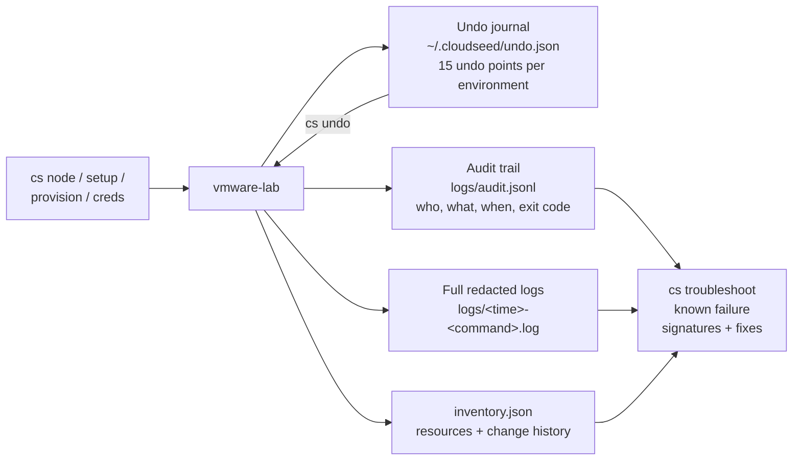

# 13 · Day-2 operations

**Outcome:** the everyday work on a running environment: add and remove nodes, change a setting in place and take it
back with `cs undo`, read what exists and who changed what (inventory and audit trail), diagnose problems without
guessing, re-provision a host, handle a changed public IP, and keep credentials in cloudseed's local vault.

!!! success "Verified live on VMware Fusion 13.6"
    [`tests/scenarios/13-day-2-operations.sh`](https://github.com/nimeshbuilds/cloudseed/blob/main/tests/scenarios/13-day-2-operations.sh)
    runs every command below on the scenario 05 cluster with `CLOUDSEED_LIVE=1`. Without it, it runs the inventory,
    audit, undo journal, troubleshooting and credential vault steps against a rendered environment and checks that
    the node and provisioning commands say the cluster is not created yet.

| :material-clock-outline: Time | :material-cash: Cost | :material-signal-cellular-2: Level | :material-kubernetes: Needs |
|---|---|---|---|
| ~30 min (a new node ~8 min) | $0 locally | Intermediate | The cluster from [05](05-local-kubernetes.md), 4 GB RAM free for one more node |

## What you'll build



## Before you start

- The cluster from [05](05-local-kubernetes.md), selected with `cs env use vmware-lab`.
- Nothing else: everything here works the same on AWS, GCP and Azure environments (the node pool commands then go
  through the cloud API).

## Step 1: What exists, and who changed what

```bash
cs list
cs status vmware --env lab
cs inventory vmware --env lab --last 5
tail -n 3 ~/.cloudseed/envs/vmware-lab/logs/audit.jsonl
```

Every command writes to the environment's working directory: `logs/audit.jsonl` (one JSON line per invocation: who,
what, when, exit code, and `via` = cli, ui, mcp or an agent), a full redacted log per command, and `inventory.json`.

??? example "Expected output of the audit trail"
    ```text
    {"at": "2026-09-24T20:41:07Z", "user": "you", "command": "status", "argv": ["status", "vmware", "--env", "lab"], "exit_code": 0, "duration_s": 0.4, "env": "vmware-lab", "log": ".../logs/20260924-204107-status.log", "via": "cli"}
    ```

## Step 2: Add and remove a node

```bash
cs node add --count 1 vmware --env lab
cs node list
cs node remove cloudseed-lab-wk3 vmware --env lab
```

On VMware, `add` creates the VM with Terraform and Ansible joins it (as an RKE2 agent here); `remove` drains the node,
deletes it from the cluster and deletes its VM when it is the highest-numbered one. Add `--role control-plane` for
another server. Unattended: add `--auto-approve` to `add` and `remove` (without a terminal they show the plan and stop
with exit 3). On EKS, GKE and AKS the managed pool is resized through the cloud API instead, and `scale` sets its
size and autoscaler limits:

```bash
cs node scale aws --env prod --count 3 --max 6
```

## Step 3: Change a setting, then undo it

```bash
cs setup vmware --env lab --var workload_count=1
cs status vmware --env lab
cs undo --list
cs undo vmware --env lab
```

`setup` is idempotent: re-running it with a new `--var` shows the plan and updates the environment in place (here: one
private workload VM). `undo` restores the previous `config.json` and re-applies, so the VM goes away again; `config.json`
is rewritten only once the re-apply worked. Fifteen changes are kept per environment (at most five of one kind, so a
burst of one kind only pushes out older changes of that kind); reports, scans and drills have five slots of their own
and never push changes out. Unattended: `cs setup vmware -y --env lab --var workload_count=1 --auto-approve` and
`cs undo vmware --env lab --auto-approve` (without a terminal both show the plan and stop with exit 3).

??? example "Expected output of `cs undo --list` (abbreviated)"
    ```text
      ╭─ Undo history (newest first) ─────────────────────────────────────────────────╮
      │ 2026-09-24 20:52 UTC  vmware-lab     setup vmware-lab (changed: workload_count) │
      │       ↳ undo: restore the previous configuration of vmware-lab and re-apply    │
      │               the stack (Terraform converges back: workload_count)            │
      │         id 20260924-205210-1c0ffe                                              │
      │ 2026-09-24 20:31 UTC  vmware-lab     node remove cloudseed-lab-wk3             │
      │ ...                                                                            │
      ╰────────────────────────────────────────────────────────────────────────────────╯
    ```

`plan` and `apply` work on the saved configuration directly: `plan` shows drift, `apply` converges it.

```bash
cs plan vmware --env lab
cs apply vmware --env lab
```

A step that can never succeed (for example, undoing something you already fixed by hand) is dropped from the journal
with its id from `--list`:

```bash
cs undo --id 20260924-205210-1c0ffe --drop
```

## Step 4: Diagnose, don't guess

```bash
cs troubleshoot vmware --env lab --log
cs doctor vmware
```

`troubleshoot` is deterministic (no AI involved): it reads the audit log, finds the last failed change and matches its
log against known failure signatures (expired credentials, state locks, a GuardDuty detector that already exists,
missing permissions, a VM without an address ...), then checks reachability, allowed IPs, keys, provisioning, VMware
and disk space, and prints a fix per finding. `--log` adds the tail of the failure log.

## Step 5: Re-provision a host and handle a new IP

```bash
cs provision vmware --env lab --host bastion
cs update-ip vmware --env lab
cs update-ip aws --env prod
```

`provision` re-runs the Ansible hardening (idempotent; `--no-harden` / `--no-firewall` also remove what an earlier run
installed). `update-ip` is for cloud environments: when your ISP gives you a new address it updates only the SSH rule
of the cloud firewall. On VMware it explains why it does not apply and exits 0.

## Step 6: The credential vault

```bash
cs creds set AWS_PROFILE=prod
cs creds set ANTHROPIC_API_KEY
cs creds list
cs creds unset AWS_PROFILE
cs undo --global
cs creds clear --forget
```

- `set KEY` without a value asks with hidden input, so secrets never reach your shell history; `KEY=VALUE` is for
  non-secret settings.
- Values are stored in `~/.cloudseed/credentials.json` (0600), injected into every cloudseed command, the web console
  and the MCP server, masked in `list`, and stripped from AI agents. A variable exported in your shell always wins.
- Names that change how programs start or where they connect (`PATH`, `LD_*`, `*_ENDPOINT*`, proxies, ...) are refused.
- `undo --global` reverts credential, agent, MCP and console changes (you only; agents cannot).

## Use an agent, MCP or the UI

Follow the same numbered steps and verification/cleanup conditions through your chosen interface. Start with the
[interface setup and coverage guide](interfaces-and-coverage.md); replace account/project/subscription and SSH
placeholders before any live request.

**Agent prompt:** “Follow day-2 operations on vmware-lab. Inspect status and inventory, show the requested node change and its undo point, then execute only approved changes. Use audit and troubleshoot for failures; never reveal saved credentials.”

**MCP starter:** `cloudseed_node` with:

```json
{
  "cloud": "vmware",
  "env": "lab",
  "action": "list"
}
```

Use the matching tool for each remaining step in this page; the [command-to-tool map](interfaces-and-coverage.md#command-to-interface-map)
lists the tool family. Keep `vmware-lab` selected. Preview first; add `confirm:true` only to the specific change
you have authorized. Host bootstrap, provider login and interactive applications retain their documented human steps.

**UI:** Select vmware-lab → Environments → Nodes for add/remove/scale. All actions contains plan, provision, inventory, troubleshoot and undo; Activity records each job. Use Credentials to enter secrets directly, then inspect only masked status through agents/MCP.

## Verify it worked

```bash
cs node list
cs undo --list
cs inventory vmware --env lab --last 10
```

- `node list` is back to three nodes; the workload VM is gone.
- The undo list shows each change you made and what its undo does.
- The inventory history lists the node add, the node remove, the setup change and its undo.

## Clean up

Nothing to clean up beyond scenario 05's cluster: `cs destroy vmware --env lab` when you are done with it.

## What just happened

- One journal serves every entry point: the CLI, the web console (↶ Undo), AI agents and the MCP server
  (`cloudseed_undo`, environment actions only).
- Inventory, audit trail and logs are written for every command, even failed ones, and survive
  `destroy --purge` in `~/.cloudseed/logs/purged/`.
- Learn more: [Undo and audit](../guides/undo-and-audit.md) · [Troubleshooting](../guides/troubleshooting.md) ·
  [Credentials](../guides/credentials.md) · [Explain index](../reference/explain-index.md)

```bash
cs explain undo
cs explain audit
cs help troubleshooting
```

## Next steps

- [14 · AI agents and MCP](14-ai-agents-and-mcp.md): let an agent do day-2 work, with approvals.
- [15 · Web console](15-web-console-and-finops.md): the same operations as buttons, with Activity.
- [08 · Backups you can trust](08-backups-you-can-trust.md).
