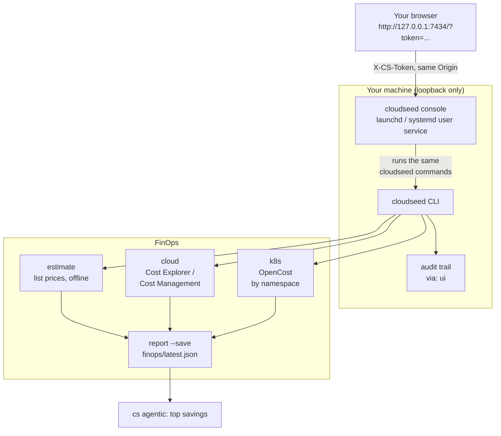

# 15 · Web console and FinOps

**Outcome:** cloudseed's local web console running on your machine (loopback only, token-protected, no CDN or
telemetry), where every CLI capability is a form or a button that streams its output live and lands in the audit
trail; and the three FinOps views: what an environment will cost before you apply it, what the provider actually
billed, and what each Kubernetes namespace costs with OpenCost, saved as one report an AI agent can analyse.

!!! success "Verified live on macOS (local services, no cloud or VMs needed)"
    [`tests/scenarios/15-web-console-and-finops.sh`](https://github.com/nimeshbuilds/cloudseed/blob/main/tests/scenarios/15-web-console-and-finops.sh)
    starts a real console in a throw-away home, drives it through its API exactly like the browser does (the wizard's
    dry run, an estimate, the Activity list), checks the token and Origin protection and the audit trail, and runs
    every FinOps command. The bill and OpenCost views need a cloud account and a cluster.

| :material-clock-outline: Time | :material-cash: Cost | :material-signal-cellular-1: Level | :material-monitor-dashboard: Needs |
|---|---|---|---|
| ~15 min | $0 | Beginner | A browser; for the bill: cloud credentials; for OpenCost: a cluster ([05](05-local-kubernetes.md)) |

## What you'll build



## Before you start

- cloudseed installed. Nothing else for steps 1 to 5, except the real bill (`finops cloud`), which needs cloud
  credentials.
- For step 6: a cluster, for example the one from [05](05-local-kubernetes.md), to install OpenCost on.

## Step 1: Start the console

=== "Opens your browser"

    ```bash
    cs enable ui
    ```

=== "Without a browser (remote shell, scripts)"

    ```bash
    cs enable ui --no-open
    cs ui token
    ```

    `ui token` prints the link with the token; open it in a browser on this machine.

??? example "Expected output"
    ```text
      ● Starting the cloudseed console on http://127.0.0.1:7434/...
      ✔ cloudseed console is up: http://127.0.0.1:7434/   (launchd; starts at login; local only, token-protected)

      ╭─ Open it ─────────────────────────────────────────────────────────────────────────╮
      │ link     http://127.0.0.1:7434/?token=<a random 32-character token>               │
      │ again    cs ui        (opens the browser; `cs ui token` prints the link)          │
      │ manage   cs ui status | stop | restart | logs   ·   cs disable ui                 │
      ╰───────────────────────────────────────────────────────────────────────────────────╯
    ```

The console runs as a launchd (macOS) or systemd user service that starts at login, on 127.0.0.1 only. The token
comes in the link and is kept only in that browser tab (no cookie); the server checks Host and Origin and forbids
framing. Port taken? `cs enable ui --port 7440`.

## Step 2: Create an environment with the wizard

In the console, open **Create** (key `2`), pick **AWS**, and answer the questions: they are the same questions
`cs setup` asks, built from each cloud's definition, with the stack variable behind each field. Choose **Dry run**
(render + `terraform validate`, touches nothing in the cloud) and watch the output stream into **Activity**. The
console ran exactly this:

```bash
cs setup aws -y --env web --region us-west-2 --allow-ip 203.0.113.7 --dry-run
```

Every action card works the same way: status, outputs, troubleshoot, update IP, re-provision, the SSH command, and
destroy (which needs an explicit tick).

## Step 3: Explore the rest of the console

- **Overview** and **Environments**: a card per environment with its actions and chips (Kubernetes, VPN, FIPS).
- **Platform**: the whole catalog by group, with Plan / Install / Uninstall per group or item and UI exposure,
  plus kubectl, helm and nodes.
- **Resilience**: DR drills and backups, chaos suites with their verdict tables, and every scan (CIS, NSA / MITRE,
  vulnerabilities, host CIS, STIG, cloud CIS, FIPS).
- **Reports**: the viewer for scan, drill, chaos and FinOps reports. **All actions**: every CLI capability as a form.
- **Agents & MCP**: enable agentic mode, pick the agent and model, run tasks, install skills; deploy the MCP server
  and connect clients.
- **Credentials**: the same vault as `cs creds`, values masked. **Help**: every help page, and `explain <name>`.
- **Explain**: the **?** beside views, wizard fields, environment chips and platform items opens an Explain panel
  with the same page `cs explain` prints (for example `cs explain vpn` for the VPN chip).
- **Activity**: every job's live output and exit code, and **↶ Undo** for the newest action. Keys `1` to `0`
  switch views.

The same explanations from the terminal:

```bash
cs explain
cs explain ui
cs explain feature finops
```

## Step 4: One audit trail for every entry point

```bash
tail -n 2 ~/.cloudseed/envs/aws-web/logs/audit.jsonl
cs ui logs -n 20
```

Jobs started in the console are recorded with `"via": "ui"`, next to `"cli"`, `"mcp"` and the agents.

## Step 5: FinOps: know the cost before you apply

```bash
cs finops estimate aws --env web
cs finops report aws --env web --save
cs finops cloud aws --env web --days 7
```

- `estimate` prices the environment from its own configuration at on-demand list prices, offline (small-volume
  usage-billed services such as GuardDuty and Log Analytics included).
- `report --save` combines all three views into `~/.cloudseed/envs/aws-web/finops/latest.json` (plus a timestamped
  copy). Views that cannot run yet (no credentials, no cluster) say why instead of failing the report.
- `cloud` reads the real bill by service: AWS Cost Explorer or Azure Cost Management (GCP needs a BigQuery billing
  export; cloudseed tells you how).

??? example "Expected output of `cs finops report aws --env web --save` without credentials or a cluster"
    ```text
      ╭─ Estimate · aws-web  (month, 730h at on-demand list prices) ──────────────╮
      │ bastion t3.micro x1           $7.59                                        │
      │ NAT gateway x1                $32.85                                       │
      │ ...                                                                        │
      │ total / month                 $57.54                                       │
      ╰────────────────────────────────────────────────────────────────────────────╯
      ● Fetching the last 30 days from Amazon Web Services...
      ▲ Cloud bill unavailable: aws: ... Unable to locate credentials ...
      ▲ No Kubernetes cluster in aws-web. Add one: cs setup aws --env web --var enable_kubernetes=true, then
        cs platform install finops
      ✔ Report saved: ~/.cloudseed/envs/aws-web/finops/report-20260924-191859-10a4eb.json
    ```

## Step 6: Kubernetes cost allocation with OpenCost

On a cluster (for example the one from [05](05-local-kubernetes.md)):

```bash
cs platform install finops
cs finops k8s vmware --env lab --by namespace --window 24h
cs finops k8s vmware --env lab --by controller --window 7d
cs agentic "look at my finops report and propose the top 5 savings"
```

`finops` installs OpenCost with the Prometheus stack (reused when [06](06-platform-in-one-command.md) installed it)
and Goldilocks. The `cloudseed-finops` skill knows the report format and the levers: rightsizing with Goldilocks and
VPA, KEDA scale-to-zero, kube-green sleep schedules, node pool sizes, a single NAT gateway, one shared Gateway.

## Step 7: Manage the console

```bash
cs ui
cs ui status
cs ui restart
cs ui stop
cs ui start --no-open
cs ui token --rotate
```

`cs ui` opens it again (starting it if needed). `token --rotate` invalidates the old link at once. To run the console
in a terminal instead of as a login service, stop the service and serve it in the foreground:

```bash
cs ui stop
cs ui serve --port 7440
```

`Ctrl-C` stops the foreground console. Bring the login service back before you verify:

```bash
cs ui start --no-open
```

## Verify it worked

```bash
cs ui status
ls ~/.cloudseed/envs/aws-web/finops/
```

- `ui status` shows Enabled `yes`, Health `running` and the service (launchd / systemd).
- Without the token, `curl http://127.0.0.1:7434/api/state` answers 401; a request with a foreign `Origin` header
  answers 403.
- `finops/` holds `latest.json` and the timestamped reports.

## Clean up

```bash
cs disable ui
cs destroy aws -y --env web --purge --auto-approve
```

`disable ui` stops the console and removes its login item; `cs enable ui` brings it back with the same port.

## What just happened

- The console is a single local process (`cloudseed/webui.py` + `cloudseed/web/`), no build step, no external
  requests. Each button calls the same code path as the CLI, so the console can never do something the CLI cannot.
- FinOps is deterministic: estimates come from cloudseed's own price tables and your configuration, the bill from the
  provider's API, allocation from OpenCost; the agent only reasons over the saved report.
- Learn more: [Web console](../guides/web-console.md) · [FinOps](../guides/finops.md) ·
  [Explain](../guides/explain.md) · [Undo and audit](../guides/undo-and-audit.md) ·
  [Explain index](../reference/explain-index.md)

## Next steps

- [14 · AI agents and MCP](14-ai-agents-and-mcp.md): the Agents page from the terminal.
- [06 · A production platform](06-platform-in-one-command.md): then expose every UI and cost it with OpenCost.
- [01 · Your first lab](01-first-lab-vmware.md): create it from the wizard instead of the terminal.
