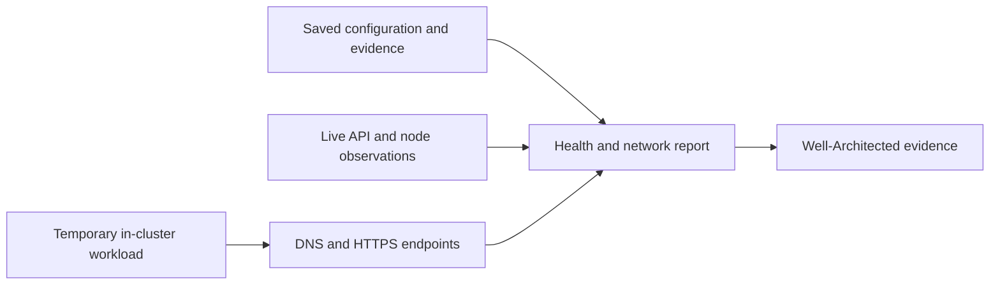

# 16 · Health and private networking

**Outcome:** a report that distinguishes declared configuration, saved evidence and current observations, plus an
optional temporary workload that checks outbound connectivity from inside the cluster.

!!! info "Locally verified; cloud deployment pending"
    [`tests/scenarios/16-health-and-network.sh`](https://github.com/nimeshbuilds/cloudseed/blob/main/tests/scenarios/16-health-and-network.sh)
    verifies local reports and interface contracts. Deterministic fixtures exercise live query and probe failures.
    A fixture pass does not establish connectivity in your deployed cluster.

| :material-clock-outline: Time | :material-cash: Cost | :material-signal-cellular-1: Level | :material-monitor-dashboard: Needs |
|---|---|---|---|
| 10–20 min | Local checks $0; live resources/probe may incur charges | Intermediate | A saved environment; credentials and a reachable cluster for live checks |

## What you'll build



## Before you start

Use `aws-prod` from [02](02-aws-landing-zone.md), a private cluster from [03](03-gcp-private-gke.md) or
[04](04-azure-private-aks.md), or `vmware-lab` from [05](05-local-kubernetes.md). Replace the target in the commands
consistently. For live checks, prepare the cluster connection with the existing kubeconfig/tunnel commands and log in
using your provider's normal authentication. Cloudseed does not obtain credentials for you.

## Step 1: Inspect local evidence

```bash
cs ops list --json
cs ops health aws --env prod --json
cs ops network aws --env prod --json
cs scan architecture aws --env prod --json
```

Missing current observations should produce UNKNOWN/INCOMPLETE, not “healthy.” Read each finding's evidence and
remediation. A private subnet's configured NAT route is a declaration; it does not prove that DNS, routing, firewall
rules and image registries work right now.

## Step 2: Query the current cluster

```bash
cs k8s kubeconfig aws --env prod
cs k8s tunnel aws --env prod
cs ops health aws --env prod --live --json
cs ops network aws --env prod --live --json
```

Live mode performs bounded read-only checks. Review unavailable tools, authentication errors, unreachable API,
node conditions, platform and backup evidence. Do not interpret an unreachable API as proof that nodes lack internet.
The client-to-API path and the node-to-registry path are separate.

## Step 3: Test the node-to-internet path explicitly

```bash
cs ops network aws --env prod --live --active --approve --params '{"timeout":120,"endpoints":["https://registry.k8s.io/v2/","https://example.com/"]}' --json
```

This approved action creates a temporary diagnostic workload and removes its owned resources. Its image pull,
DNS resolution and HTTPS observations test the cluster's actual egress path. Check the cleanup result, including
instructions for any leftovers. Test only endpoints you intend to contact; the probe does not guarantee access to
every chart repository or registry your applications might use.

## Use an agent, MCP or the UI

**Agent prompt:** “On aws-prod, run local health and network checks, then read-only live checks. Explain API failures
separately from node egress. I authorize one temporary active probe to registry.k8s.io and example.com; show its
cleanup result and rerun the architecture assessment.”

**MCP:** call `cloudseed_ops_health` with `{"cloud":"aws","env":"prod","live":true}` and
`cloudseed_ops_network` with `{"cloud":"aws","env":"prod","live":true,"active":true,"timeout":120,"confirm":true}`.
Then call `cloudseed_scan` with `{"kind":"architecture","cloud":"aws","env":"prod","json":true}`.

**UI:** select **aws-prod → All actions → Operations & readiness**. Run **health** and **network** with **live** checked. Repeat network with **live** and **active** checked and **timeout** 120 after reviewing its temporary workload effects and checking confirmation. Inspect Activity and Reports; run the architecture assessment from Resilience.

## Verify it worked

Confirm that live checks identify the intended environment, failures include useful remedies, and the active probe's
cleanup completed. Reports must not contain credential values. Fresh health/network observations can inform the
architecture report; manual recovery, ownership and sustainability reviews can remain UNKNOWN.

## Clean up

The active probe cleans its own temporary resources. Follow any cleanup manifest in a failed report before leaving.
Stop only the tunnel opened for this exercise:

```bash
cs k8s untunnel aws --env prod
```

## What just happened

The same operation contract drove each interface. Saved declarations, live read-only observations and an approved
active test supplied different evidence, so Cloudseed can describe what was checked without promising more.

## Next steps

Use [17](17-profiles-specs-and-guardrails.md) to review topology changes, or [18](18-upgrades-and-recovery.md) to
check drift and validate recovery before upgrading.
