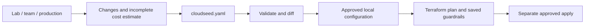

# 17 · Profiles, specs and guardrails

**Outcome:** a reviewed environment specification you can keep in Git, a real topology profile, and clear budget,
destructive-plan and expiry decisions before changing infrastructure.

!!! info "Locally verified; cloud deployment pending"
    [`tests/scenarios/17-profiles-specs-and-guardrails.sh`](https://github.com/nimeshbuilds/cloudseed/blob/main/tests/scenarios/17-profiles-specs-and-guardrails.sh)
    exercises previews, validation, configuration saves and refusal paths without provisioning. Terraform mock-provider
    tests verify regional GKE and AKS tier/zone wiring; real availability and billing still need a sandbox account.

| :material-clock-outline: Time | :material-cash: Cost | :material-signal-cellular-1: Level | :material-monitor-dashboard: Needs |
|---|---|---|---|
| 15–25 min | $0 for previews and local saves | Intermediate | A saved environment; an editor for cloudseed.yaml |

## What you'll build



## Before you start

Use a saved environment from [02](02-aws-landing-zone.md), [03](03-gcp-private-gke.md), [04](04-azure-private-aks.md)
or [05](05-local-kubernetes.md). The examples use `aws-prod`. A dry-run configuration is sufficient for local
profile/spec steps; none of these steps needs a deployed cluster until you explicitly plan or apply with a provider.

## Step 1: Compare deployment profiles

```bash
cs ops profile aws --env prod --profile lab --json
cs ops profile aws --env prod --profile team --json
cs ops profile aws --env prod --profile production --json
```

Read `changes`, `cost.components`, `cost.unpriced` and `notes`. Production changes AWS to three AZs and a NAT gateway
per AZ. On GCP it requests a regional cluster with three node zones; on Azure it requests Standard tier and three
node zones. VMware remains one physical failure domain even with several control-plane VMs. These are deployment
profiles, distinct from the assessment-only profiles in `cs scan architecture`.

## Step 2: Save the reviewed profile and export it

Saving a profile enables Kubernetes and may make the next apply more expensive or replace a cluster. After reviewing:

```bash
cs ops profile aws --env prod --profile production --approve --json
cs ops spec-export aws --env prod --output cloudseed.yaml --json
cs ops spec-validate --input cloudseed.yaml --json
```

The exported file excludes credentials, state, runtime paths and ownership IDs. It contains JSON, valid as YAML 1.2.
The [operations guide](../guides/operations.md#the-portable-document) shows the readable YAML subset and schema.
Backup/platform sections describe intent; follow [08](08-backups-you-can-trust.md) and [06](06-platform-in-one-command.md)
to enact them. For production's desired retention, for example:

```bash
cs dr schedule nightly aws --env prod --cron '0 2 * * *' --ttl 2160h
```

Run the schedule command only after Velero is installed and the cluster is reachable; it is a live change.

## Step 3: Edit, validate, diff and import

Change a harmless tag in `configuration.tags`. Add an explicit reviewed monthly budget under `operations`, keeping
`require_complete_cost: true` if unknown cost coverage should block deployment. Then:

```bash
cs ops spec-validate --input cloudseed.yaml --json
cs ops spec-diff aws --env prod --input cloudseed.yaml --json
cs ops spec-import aws --env prod --input cloudseed.yaml --json
cs ops spec-import aws --env prod --input cloudseed.yaml --approve --json
cs ops policy-check aws --env prod --json
```

Preview/import do not run Terraform. With a budget but only Cloudseed's incomplete offline estimate, BLOCKED is
expected. Missing a plan also blocks a saved `block_destroy: true` policy. An operator-supplied complete estimate
must state its coverage honestly; a budget is not a cloud billing cap.

When ready for a real change:

```bash
cs plan aws --env prod
cs apply aws --env prod
```

Inspect replacement/deletion, cost, quotas and recovery before approving. The apply path checks the actual saved
Terraform plan against saved guardrails. A policy preview with different parameters does not silently rewrite policy.

## Step 4: Preview an explicitly opted-in expiry

For a disposable lab, edit `operations.expires_at` to an ISO timestamp with timezone and set `cleanup_opt_in: true`,
then validate/diff/import as above. Do not set these on production by copying an example. Inspect the saved decision:

```bash
cs ops expiry-plan aws --env prod --json
```

Only after the saved time has elapsed and this exact environment is intended for deletion:

```bash
cs ops expiry-cleanup aws --env prod --approve --json
```

This delegates to Cloudseed's existing destroy workflow. It retains local configuration and remote state storage,
keeps the existing protections for shared cloud settings, and records cleanup evidence. No timer is scheduled.

## Use an agent, MCP or the UI

**Agent prompt:** “Compare lab, team and production settings for aws-prod. Show replacements and unpriced costs.
Export cloudseed.yaml, validate it and show the diff. Save the reviewed profile only; do not deploy or clean up.”

**MCP:** use `cloudseed_ops_profile` with `{"cloud":"aws","env":"prod","profile":"production"}`;
repeat with `confirm:true` only to save. Use `cloudseed_ops_spec_export` to get `spec`, pass that object to
`cloudseed_ops_spec_validate`, `cloudseed_ops_spec_diff` and `cloudseed_ops_spec_import`. Import needs `confirm:true`
to save. `cloudseed_ops_policy_check` and `cloudseed_ops_expiry_plan` are previews; `cloudseed_ops_expiry_cleanup`
requires `confirm:true` and the saved expiry guards.

**UI:** select **aws-prod → All actions → Operations & readiness**. Choose **production** in the profile field; check confirmation only for the save. Export the spec, paste its object into the **spec** field of validate/diff/import, and inspect Activity/Reports. Choose policy-check or expiry-plan to inspect
those decisions. The expiry-cleanup confirmation is a real deletion approval.

## Verify it worked

Confirm exported secrets are absent, the diff shows your intended tag/profile only, `saved` is true only after
approval, incomplete cost coverage is visible, and invalid or foreign-environment specifications are rejected.
A configuration save is not evidence that resources were deployed.

## Clean up

If you only previewed, there is nothing to destroy. Remove temporary exported files when no longer needed. To undo
an experiment with local intent, import the original exported specification after reviewing its diff. Never delete
state or resource files manually. Use approved expiry cleanup only for an environment you intend to decommission.

## What just happened

Cloudseed separated portable desired configuration from credentials and resource ownership, and used the same
validation and approval rules across interfaces. Topology controls reach Terraform; policy checks explain missing
cost/plan evidence instead of granting a false guarantee.

## Next steps

Run [16](16-health-and-network.md) after deployment and use [18](18-upgrades-and-recovery.md) before the next upgrade.
