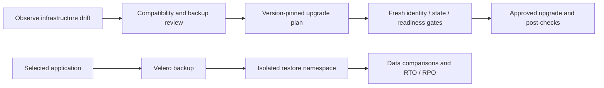

# 18 · Drift, upgrades and application recovery

**Outcome:** a drift report, an upgrade plan tied to the current environment and cluster, and an application recovery
report with explicit data coverage and recovery objectives.

!!! info "Locally verified; cloud deployment pending"
    [`tests/scenarios/18-upgrades-and-recovery.sh`](https://github.com/nimeshbuilds/cloudseed/blob/main/tests/scenarios/18-upgrades-and-recovery.sh)
    verifies reports, blocked prerequisites and interface access. Unit tests exercise provider/local upgrade and
    recovery paths with fixtures. Real cluster upgrades and application recovery need your deployed environment.

| :material-clock-outline: Time | :material-cash: Cost | :material-signal-cellular-1: Level | :material-monitor-dashboard: Needs |
|---|---|---|---|
| 30–90 min for live work | Cluster, backup and temporary restore costs | Advanced | Reachable cluster, provider login, completed Velero backup and maintenance window |

## What you'll build



## Before you start

Use a cluster from [03](03-gcp-private-gke.md), [04](04-azure-private-aks.md) or [05](05-local-kubernetes.md), or an
EKS-enabled environment from [02](02-aws-landing-zone.md). Complete [08](08-backups-you-can-trust.md) first. The examples
use `aws-prod` and an existing application namespace `shop`; substitute your own reviewed namespace.

A release number below is illustrative. Choose a provider-supported target after checking your current version,
charts, CRDs, CNI/CSI drivers, add-ons, deprecated APIs, node capacity and recovery procedure. Cloudseed does not
provide automatic downgrade or promise that every application is upgrade-compatible.

## Step 1: Inspect drift and health

```bash
cs ops drift aws --env prod --json
cs ops health aws --env prod --live --json
cs dr status aws --env prod
cs dr backups aws --env prod
```

Drift compares provider observations, Terraform state and desired configuration without applying. Missing
credentials or uninitialized state must remain incomplete. Resolve unexpected changes before continuing.

## Step 2: Create a pinned upgrade plan

Create or select a recent, Completed Velero backup with zero errors and the application/volume coverage you need:

```bash
cs dr backup before-upgrade aws --env prod --namespaces shop
cs ops upgrade-plan aws --env prod --target-version 1.36 --backup before-upgrade --params '{"compatibility_reviewed":true,"timeout_s":600}' --json
```

Set `compatibility_reviewed:true` only after that review. The plan checks cluster identity, Terraform state,
provider endpoint, forward version step, node readiness, disruption budgets, observed deprecated API use and
backup freshness. RKE2 needs an exact release such as `v1.36.4+rke2r1`; kubeadm needs an exact patch and configured
package repository. Confirm a release exists and is supported before requesting it.

Read every check, coverage limit and the returned `report` path. A blocked/incomplete plan is not executable approval.

## Step 3: Apply the reviewed plan in the maintenance window

Replace the sample path with the plan's actual `report` path:

```bash
cs ops upgrade-apply aws --env prod --plan /path/from/upgrade-plan.json --approve --json
cs ops drift aws --env prod --json
cs ops health aws --env prod --live --json
```

Apply checks that the plan is fresh and belongs to the selected environment, then repeats preflight. A changed
configuration, state or cluster identity invalidates the plan. Local upgrades drain safely and verify nodes before
uncordoning; a failed drained node stays cordoned for inspection. Cloudseed saves the reviewed target version before
starting the upgrade, so a partial failure cannot leave Terraform configured to request the older version.
Inspect provider-specific post-checks and the recorded
recovery instructions if the operation fails. A backup is not an automatic Kubernetes control-plane rollback.

## Step 4: Rehearse an application restore

First inspect a recovery plan. The source namespace is retained; the drill uses a new restricted namespace and
deny-all network policy. Confirm your network plugin enforces NetworkPolicy and that restored controllers cannot
cause external effects. Restricted Pod Security may reject workloads that require privileges; do not bypass it
just to get a green report.

```bash
cs ops recovery-plan aws --env prod --namespace shop --params '{"isolation_reviewed":true,"verify_data":true,"with_volumes":true,"rto_seconds":600,"rpo_seconds":3600}' --json
cs ops recovery-test aws --env prod --namespace shop --approve --params '{"isolation_reviewed":true,"verify_data":true,"with_volumes":true,"rto_seconds":600,"rpo_seconds":3600}' --json
```

`verify_data` compares selected ConfigMap/Secret content in memory without exposing it. Volume verification also
checks Velero's file-system backup/restore evidence. For a stable, known application file, add `pod`, `container` and
`data_file` to compare its checksum before/after; a Deployment's generated Pod name may differ after restore, so
use a workload whose named pod can be matched and inspect the report. Fixed `filesystem-sync` or
`postgres-checkpoint` hooks are available with an explicit pod/container; neither proves consistency under ongoing
writes. Arbitrary shell hooks are not accepted.

## Use an agent, MCP or the UI

**Agent prompt:** “Inspect drift and upgrade readiness for aws-prod. Use backup before-upgrade and the provider-supported
version I selected. Review charts and deprecated APIs with me, then save the plan. Separately plan recovery for shop;
show isolation, data and cleanup coverage before executing either change.”

**MCP:** `cloudseed_ops_drift` takes `{"cloud":"aws","env":"prod"}`. Call `cloudseed_ops_upgrade_plan` with
`target_version`, `backup` and `compatibility_reviewed`; after review call `cloudseed_ops_upgrade_apply` with the
returned `plan` path and `confirm:true`. `cloudseed_ops_recovery_plan` and `cloudseed_ops_recovery_test` accept the
same namespace/recovery parameters as above; the test also needs `confirm:true`.

The MCP server's default total deadline is one hour; your client can stop sooner. For an eight-hour maintenance
window, run `CLOUDSEED_MCP_TOOL_TIMEOUT=28800 cs setup mcp`, then reconnect clients with that same environment
setting. The allowed range is 60–86400 seconds. Setup writes matching Codex/Gemini client deadlines; other clients
need their own setting. See [MCP timeout configuration](../guides/operations.md#choose-an-interface) for exact commands.
`timeout_s` remains a per-stage bound. After interruption, inspect provider/cluster status and any temporary recovery
resources before retrying; submitted remote work may still be running and cleanup can need manual review. A partially
completed upgrade requires inspection and completion of the remaining steps, not an automatic retry of the stale plan.

**UI:** select **aws-prod → All actions → Operations & readiness**. Run drift; enter the upgrade target and backup in their named fields and check **compatibility_reviewed** only after review. Copy its returned plan path into upgrade-apply and confirm only in the
maintenance window. For recovery-plan/test enter namespace `shop` and set the named recovery fields to the values above; compare the reports
and inspect cleanup before leaving the job.

## Verify it worked

A successful upgrade reports the intended control-plane version, Ready nodes and healthy workload controllers.
A recovery report must show completed backup/restore, measured objectives, the requested data/volume checks and
cleanup. Missing data coverage or asynchronous cleanup is a limitation to resolve, not evidence of a complete DR plan.

## Clean up

Recovery requests deletion of only its owned temporary namespace/restore/backup, unless `keep:true` was selected.
Deletion can be asynchronous. If restore completion is unknown, artifacts remain for inspection; follow the exact
report names. Keep the pre-upgrade backup through your recovery window. Do not delete the original application or
manually remove Terraform state to hide drift.

## What just happened

Cloudseed tied an upgrade to real environment identity and repeated its health gates before mutation. Application
recovery used a separate namespace and recorded what it verified, so an object restore cannot silently stand in
for data recovery.

## Next steps

Run [19](19-acceptance-and-releases.md) in a dedicated sandbox before adopting changes in production, then keep
[16](16-health-and-network.md) in your operational checks.
