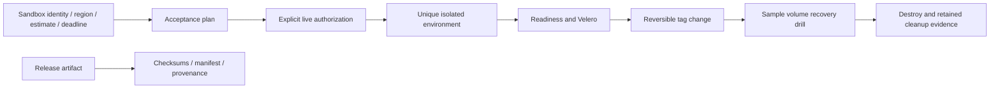

# 19 · Acceptance and trusted releases

**Outcome:** a reviewable acceptance plan, durable cleanup evidence for an authorized live sandbox run, and a clear
release/credential verification workflow before relying on a runtime.

!!! info "Locally verified; cloud deployment pending"
    [`tests/scenarios/19-acceptance-and-releases.sh`](https://github.com/nimeshbuilds/cloudseed/blob/main/tests/scenarios/19-acceptance-and-releases.sh)
    exercises no-account previews, invalid guard refusal and release verification fixtures. It does not claim a
    successful deployment in AWS, GCP or Azure. Supply dedicated sandbox credentials to execute those steps.

| :material-clock-outline: Time | :material-cash: Cost | :material-signal-cellular-1: Level | :material-monitor-dashboard: Needs |
|---|---|---|---|
| 10 min preview; 30–360 min live | Preview $0; live cloud charges | Advanced | Dedicated sandbox identity, region, estimate, public SSH source and authorized credentials |

## What you'll build



## Before you start

You can complete the preview without any cloud account. A live run requires an explicitly authorized sandbox,
working provider login, Terraform and cluster tools, resource quotas, a reviewed cost estimate and a real public
IPv4 `/32` for bastion access. GCP APIs must already be enabled. Never paste credentials into operation parameters,
agent prompts or documentation examples.

The lifecycle tests a small cluster, one pinned chart, a configuration change and a sample volume restore. It does
not certify all 73 catalog items, all instance types or every region. A cost estimate and deadline are not a cloud
billing cap; cleanup and retained resources can still incur charges.

## Step 1: Review each cloud's acceptance plan

```bash
cs ops acceptance aws --json
cs ops acceptance gcp --json
cs ops acceptance azure --json
```

Expect INCOMPLETE with missing identity/region/cost/SSH prerequisites and a readable lifecycle plan. No provider
is contacted and no resources are created. This is the correct result when you do not yet have sandbox accounts.

## Step 2: Fill in sandbox guards, then review again

Create `acceptance.json` locally with the parameters below. Replace every placeholder and supply your own reviewed
cost/time values. This file contains identifiers and estimates, never credentials:

```json
{
  "identity": "YOUR_SANDBOX_ACCOUNT_PROJECT_OR_SUBSCRIPTION",
  "region": "YOUR_REGION",
  "max_budget_usd": 25,
  "estimated_hourly_usd": 2,
  "max_duration_minutes": 120,
  "allow_ip": "YOUR_PUBLIC_IPV4/32"
}
```

The estimated runtime plus a 50% cleanup reserve must fit the budget. The numbers above illustrate the fields;
they are not a quote. Pass the JSON object using `--params`, not `--input` (which is reserved for portable specs):

```bash
cs ops acceptance aws --params "$(cat acceptance.json)" --json
```

## Step 3: Run only after live authorization

Add `"live":true` and `"allow_cloud_changes":true` to the reviewed parameters, then approve this lifecycle:

```bash
cs ops acceptance aws --params "$(cat acceptance.json)" --approve --json
```

Cloudseed verifies the selected provider identity, creates a unique environment in an isolated home, records its
ownership/cleanup manifest before work, then runs create → node readiness → Velero install → tag change → sample
volume restore → destroy. Failure/interruption triggers bounded cleanup attempts. Inspect the retained cleanup
manifest and Terraform state before deciding cleanup succeeded; empty state alone is not a provider inventory or
billing audit. Keep the manifest until the provider-side resources and costs have been reviewed.

## Step 4: Inspect credential storage

```bash
cs ops credentials-backend --json
cs ops credentials-backend --params '{"backend":"os-keychain"}' --json
cs ops credentials-backend --params '{"backend":"os-keychain"}' --approve --json
```

The first command inspects, the second previews migration, and the third writes to and verifies the native keychain
before selecting it. If the keychain service/dependency is unavailable, migration stops and the previous store stays
usable. Keychain storage protects data at rest; it does not isolate code running as your logged-in user. Existing
SDK key files and old undo copies have their own lifecycle. Use the explicit credential clear/forget flow when
retiring those copies; do not print or search them.

## Step 5: Verify release evidence

Use the release manifest, SHA-256 checksums, dependency inventory and provenance shipped with the runtime you
intend to use. A matching checksum establishes correspondence to that manifest, not publisher identity by itself.
Verify GitHub's attestation against this repository and the expected release workflow before trusting provenance.
Use the installed release verifier with the artifact path and a digest obtained from the trusted release manifest:

```bash
cs ops release-verify --params '{"artifact":"/path/cloudseed-linux-amd64","sha256":"REPLACE_WITH_TRUSTED_64_HEX_DIGEST","verify_attestation":true}' --json
```

It never executes or extracts the artifact. A mismatch fails; a matching digest without verified provenance remains
INCOMPLETE. With `gh` installed, attestation verification checks this repository, the release workflow, a version tag
and a hosted runner. The MCP tool is `cloudseed_ops_release_verify` with the same fields; in the UI choose
**Operations & readiness → release-verify**. A newly implemented release workflow is not evidence that a signed
release has already been published.

The [runtime acceptance guide](../development/acceptance.md) explains what the packaged-runtime CI exercises.

## Use an agent, MCP or the UI

**Agent prompt:** “Preview AWS, GCP and Azure acceptance without cloud changes. List missing sandbox guards. Do not
invent credentials or claim live acceptance. Once I supply a reviewed sandbox and budget, show the exact lifecycle
and cleanup evidence before a live run. Also inspect credential backend and explain keychain migration.”

**MCP:** use `cloudseed_ops_acceptance` with `{"cloud":"aws"}` for preview. A live request supplies the reviewed
parameters plus `live:true`, `allow_cloud_changes:true`, and `confirm:true`. Use
`cloudseed_ops_credentials_backend` with `{"backend":"os-keychain"}` for preview and `confirm:true` to migrate.
Provider login/keychain unlock remain human authentication steps when required.

**UI:** in **All actions → Operations & readiness**, select acceptance, choose the cloud and enter the reviewed
parameters in their named fields. Leave live false for preview. Check confirmation only for the authorized live run. Inspect Activity and
the returned cleanup location. Choose **os-keychain** in credentials-backend for migration preview,
then confirm the reviewed change. Never put cloud secret values into this form.

## Verify it worked

Without accounts, success means the preview is honest about unexecuted steps and rejects invalid live guards.
After a live run, inspect every lifecycle step, backup/volume verification, destroy result, retained state and
provider inventory/billing. For releases, record the manifest digest and attestation verification result; do not
execute a downloaded artifact merely because its filename looks right.

## Clean up

The live runner attempts its own unique environment cleanup and preserves recovery evidence. Follow the returned
cleanup manifest for remaining resources. Do not reuse its environment name or destroy an unrelated current environment.
Delete the local identifiers-only acceptance file when finished. Keychain migration has no cloud resources to remove.

## What just happened

One interface contract exposed a controlled lifecycle harness, while separate identity, spending-estimate and cleanup
checks made its limits visible. Local test success and a release checksum stayed distinct from real cloud acceptance
and publisher provenance.

## Next steps

Repeat the authorized lifecycle in each cloud you use, retain its reports with your release evidence, and run
[16](16-health-and-network.md) against the resulting deployment patterns.
